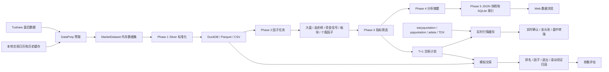

# A股短线复盘与因子筛选系统

> 当前系统的端到端逻辑、模块优缺点、实测基线与收益优化路线见：
> [当前系统详细逻辑与收益优化计划](docs/当前系统详细逻辑与收益优化计划.md)

## 当前生产模式：精简规则交易体系

生产链路已冻结模型训练，只运行三类核心规则策略：

1. `mainline_leader`：主线龙头。
2. `weak_to_strong`：弱转强。
3. `first_board_launch`：首板启动。

日常顺序为“盘后取数 -> 因子计算 -> 三策略选股 -> 次日分钟确认 -> 模拟交易”。
资金流、龙虎榜和量价指标仅作为增强证据或否决项，不再直接主导股票排名。
候选股、盘中确认与回测共享同一个策略 ID、`strategy_execution` 和分钟买点条件。
涨停数据、龙虎榜和策略组合页面继续保留，其中策略组合与模型功能属于研究域，
不会混入生产选股任务。

具体使用与验收口径见：
[精简规则交易体系使用说明](docs/精简规则交易体系使用说明.md)。

### 研究域：模型训练与诊断

以下流程仅用于策略研究和对照实验，不是日常生产任务。策略模型使用真实买点标签，
训练器不会临时联网。首次训练或分钟缓存不完整时，先统计并补齐候选股 `T+1`
分钟行情、竞价与板块同伴行情：

```bash
python3 scripts/prefetch_strategy_minutes.py --start 20250603 --end 20260714 --profiles all --dry-run
python3 scripts/prefetch_strategy_minutes.py --start 20250603 --end 20260714 --profiles all
```

低内存服务器可按月拆分日期区间执行预取。数据会写入 `CACHE_DIR/stock/tick` 和 `CACHE_DIR/stock/auction`，已有完整缓存自动跳过。完成前置取数后，再按策略独立、串行训练：

```bash
python3 scripts/train_factor_library.py --start 20250603 --end 20260714 --all-strategies --walk-forward --train-months 12
```

若前置数据不足，命令会将对应策略标记为 `skipped`，并输出 `missing_minutes`、`missing_sector_minutes` 等审计原因，不会伪造标签或打印误导性的异常堆栈。训练完成后先在“策略实验室”检查数据覆盖、真实成交样本、OOS 月份和发布闸门，再运行回测。回测页面的“候选到成交漏斗”用于定位候选未成交的具体原因；每批结果同时保存运行清单和漏斗 CSV，保证不同批次可以按同一口径比较。

> 面向 A 股短线复盘、候选股筛选、盘中确认和模拟交易验证的一体化系统。
>
> 当前 `main` 分支以“数据预取 -> 标准化仓库 -> 因子计算 -> 指标筛选 -> 实时确认 -> 模拟交易 -> 归因反馈”为唯一产品主线，不再依赖旧的四策略选股流程。

## 1. 系统定位

本项目解决的不是单一的“选股”问题，而是把短线复盘拆成一条可重复、可追溯、可回测的数据链路：

1. 盘后一次性获取当日和必要历史数据。
2. 统一股票代码、板块代码、交易日期、金额单位和数据来源。
3. 将大盘、情绪、板块、个股、资金流、龙虎榜等信息指标化。
4. 使用可配置的硬过滤、优先过滤、分位排名和加减分生成候选股。
5. 次日只对已经生成的候选股和近期龙头做实时行情确认。
6. 使用真实历史日线、交易成本、T+1、止损和移动止盈规则进行模拟交易。
7. 通过排名归因、因子归因、退出归因和滚动验证反哺参数，而不是凭单次收益手工调参。

系统适用于：

- 每日盘后市场复盘。
- 短线候选股排序和交易计划生成。
- 热点板块、主线持续性、涨停梯队和龙虎榜观察。
- 候选股与近期龙头的盘中转强确认。
- 区间回测和按日接力模拟交易。
- 多用户只读访问、订阅到期控制和后台管理。

系统不包含：

- 券商自动下单。
- 收益承诺或投资建议。
- 依赖大模型才能运行的核心分析链路。
- 人工编造的游资信誉、白名单、黑名单或主观风格评分。

## 2. 当前设计原则

### 2.1 历史数据预取，页面只读结果

除实时行情外，计算所需的数据应在“生成数据”阶段提前获取并缓存。普通数据浏览页读取本地 JSON、SQLite、DuckDB 或缓存文件，不应因为多个用户打开页面而重复调用 Tushare。

当前主流程还会在候选股生成后预热：

- 当日候选股的日线数据。
- 上一交易日计划股在当日的日线数据。

这样回测、交易计划和次日确认可以优先读取本地缓存，降低接口频率超限和网络抖动的影响。

### 2.2 计算层与展示层分离

- 数据获取失败由数据层记录和降级。
- 因子任务只读取标准化表。
- 筛选引擎只读取因子表。
- 页面只读取筛选结果、快照和只读查询结果。
- 实时模块只叠加实时价格，不重算盘后因子。

### 2.3 选股和交易是两套决策

候选股质量高，不等于次日任何价格都可以买。系统明确区分：

- **选股层**：回答“哪些股票值得进入观察池”。
- **买点层**：回答“次日是否出现允许成交的开盘或盘中信号”。
- **组合层**：回答“当前市场、现金、持仓数和板块集中度是否允许开仓”。
- **退出层**：回答“何时止损、何时按高点回落保护利润”。

### 2.4 严格遵守时间可得性

盘后才能知道的数据，只能参与下一交易日决策：

- `T` 日收盘后生成的候选股用于 `T+1`。
- `T` 日龙虎榜只能参与 `T+1` 的排序和交易。
- 回测在交易日 `T+1` 读取上一交易日 `T` 的交易计划。
- 因子计算不允许偷看未来日线或未来榜单。

### 2.5 涨跌停以官方名单为准

正式涨停、跌停家数和股票集合来自 Tushare `limit_list_d`，不得使用 `pct_chg >= 9.5/19.5/29.5` 或 `pct_chg <= -9.5/-19.5/-29.5` 之类的硬编码推断。

动态涨跌停幅度仍用于以下场景：

- 计算个股距离涨停的进度。
- 判断主板、ST、创业板、科创板、北交所的理论涨停价。
- 判断涨停开盘是否不可成交。

当前动态幅度规则为：普通主板 10%、ST 5%、创业板和科创板 20%、北交所 30%。它不替代官方涨跌停名单。

### 2.6 客观数据优先

龙虎榜、机构、游资、资金流等因子只来自可追溯数据。项目不再使用手工维护的游资信誉分、风格分和主观名单。

## 3. 总体架构


```mermaid
flowchart LR
    A["Tushare 盘后数据"] --> B["DataPrep 预取"]
    A2["本地交易日历和历史缓存"] --> B
    B --> C["MarketDataset 内存数据集"]
    C --> D["Phase 1 Silver 标准化"]
    D --> E["DuckDB / Parquet / CSV"]
    E --> F["Phase 2 因子任务"]
    F --> G["大盘 / 龙虎榜 / 资金信号 / 板块 / 个股因子"]
    G --> H["Phase 3 指标筛选"]
    H --> I["Phase 4 分析摘要"]
    I --> J["Phase 5 JSON 快照和 SQLite 索引"]
    J --> K["Web 数据浏览"]
    H --> L["T+1 交易计划"]
    R["easyquotation / pqquotation / adata / TDX"] --> M["实时行情缓存"]
    L --> M
    M --> N["实时确认 / 龙头池 / 盘中转强"]
    L --> O["模拟交易"]
    E --> O
    O --> P["排名 / 因子 / 退出 / 滚动验证归因"]
    P --> Q["参数评估"]
```

主入口：

- Web 产品入口：`run_web.py`
- 页面数据生成：`core/etl/daily_pipeline.py`
- 模拟交易入口：`run_backtest.py` 或 Web 的“模拟交易”页面
- 桌面封装入口：`run_manager.py`

`main.py` 和部分旧 Layer 配置仍保留用于历史工具兼容，但不是当前 Web 产品的主执行链路。

## 4. 目录与模块职责

```text
a_stock_sentiment_system/
├─ backtest/                    # 模拟交易、计划转换、归因、滚动验证
├─ config/
│  ├─ factors/                  # 因子注册表与分层配置
│  ├─ screening_profiles.yaml   # 指标筛选 profile
│  ├─ risk_control.yaml         # 组合、退出、成本等统一风控配置
│  ├─ settings.py               # 路径、Token、可覆盖运行配置
│  └─ config_registry.py        # Web 参数配置元数据
├─ core/
│  ├─ data/                     # 数据源、缓存、DataPrep、MarketDataset
│  ├─ etl/                      # Silver 标准化、质量检查、每日五阶段流水线
│  ├─ factors/jobs/             # 当前使用的批量因子任务
│  ├─ realtime/                 # 实时行情、板块行情、龙头池、盘中转强
│  ├─ screening/                # 筛选引擎、解释、Gold 摘要
│  └─ utils/                    # 日期、代码、涨跌停幅度等公共逻辑
├─ desktop/                     # Web/桌面共用的任务控制器和状态聚合
├─ scripts/                     # 独立运行数据、因子、筛选、实时叠加的脚本
├─ snapshot/                    # 页面快照写入器
├─ tests/                       # 当前主链路回归测试
├─ web/
│  ├─ app.py                    # FastAPI 页面、API、中间件、后台实时任务
│  ├─ auth_store.py             # SQLite 用户、会话、登录日志
│  ├─ permissions.py            # 菜单、页面和 API 权限矩阵
│  ├─ realtime_cache.py         # 线程安全实时缓存和并发折叠
│  ├─ templates/                # Jinja2 页面
│  └─ static/                   # CSS、JS、静态资源
├─ webdata/                     # 本地运行数据库与页面产物，默认不提交生成数据
├─ run_web.py                   # Web 启动入口
├─ run_backtest.py              # 回测命令行入口
└─ README.md
```

## 5. 数据时间模型

### 5.1 交易日约定

系统统一使用 `YYYYMMDD`，例如 `20260629`。标准化层将字符串、整数或带分隔符日期统一为该格式。

交易日判断优先读取本地交易日历。实时刷新窗口由 `core/realtime/trading_session.py` 计算：

- 仅交易日。
- 09:30 到 15:00。
- 当前实现将午间休市也包含在该连续窗口内。
- 非交易日、开盘前和收盘后不自动请求实时数据。

### 5.2 日度决策时点

假设 `T=20260629`：

1. `T` 日收盘后运行“生成数据”。
2. 生成 `T` 日 Silver、因子、筛选结果和页面快照。
3. `screening_20260629.json` 表示 `T` 日盘后可知的候选信息。
4. `T+1` 日盘前和盘中读取该候选集。
5. `T+1` 日使用当日分钟线，按弱转强、强势延续或高开加速规则确认，不再用“低开即放弃”的粗糙判定。

### 5.3 价格和金额单位

- 股票代码在内部标准格式中使用 `000001.SZ`、`600000.SH` 等后缀形式。
- 页面可显示六位代码，但查询和关联前会统一标准化。
- Silver 金额字段统一到明确的元单位字段，例如 `amount_yuan`、`net_amount_yuan`。
- 原始来源单位在标准化时转换，不在因子公式中临时猜测。
- 页面交易价格统一显示两位小数，内部计算保留浮点精度。

## 6. 数据来源

### 6.1 Tushare 盘后数据

主要使用：

| 数据域 | 典型接口 | 用途 |
| --- | --- | --- |
| 股票日线 | `daily` / 全市场日线封装 | 开高低收、涨跌幅、成交量、成交额 |
| 股票基础 | `stock_basic` | 股票名称、市场和基础信息 |
| 每日指标 | `daily_basic` | 换手率、流通市值等 |
| 指数日线 | `index_daily` | 上证、深证、创业板趋势和量能 |
| 涨跌停名单 | `limit_list_d` | 官方涨停、跌停集合和连板属性 |
| 最强板块 | `limit_cpt_list` | 当日强势概念辅助数据 |
| 同花顺板块 | `ths_index` / `ths_daily` | 行业、概念板块行情和历史强度 |
| 资金流 | `moneyflow_summary`、`moneyflow_ths`、`moneyflow_dc` | 市场、个股和多源资金流共识 |
| 热度 | `ths_hot`、`dc_hot` | 双平台关注度共识和拥挤风险 |
| 龙头标签 | `kpl_list` | 开盘啦涨停与龙头质量确认 |
| 融资 | `margin_detail` | 融资净买入变化 |
| 大宗交易 | `block_trade` | 折价和事件风险 |
| 龙虎榜个股 | `top_list` | 上榜原因、买卖额和净买入 |
| 机构席位 | `top_inst` | 机构买卖、席位数和净买入 |
| 知名游资 | `hm_list` / `hm_detail` | 官方游资名称、营业部和每日交易明细 |

龙虎榜知名游资明细通常需要较高积分权限。接口无权限或无数据时，龙虎榜因子按缺失或中性降级，不阻断主流程。

### 6.2 实时行情来源

实时个股和板块行情通过本地已安装的行情包获取，当前支持：

- `easyquotation`
- `pqquotation`
- `adata`
- `eltdx` 兜底

不同环境的数据可用性取决于网络、包版本、上游站点策略和本地缓存。服务器与本地即使代码相同，若 Python 包、网络出口或缓存不同，实时价格也可能不同。

### 6.3 本地历史数据

以下内容也属于计算输入：

- 交易日历。
- 已缓存的历史日线。
- 历史涨停、跌停、板块和龙虎榜数据。
- 前序交易日的 Silver 和因子表。
- 前序筛选结果与龙头日期。

## 7. 盘后三阶段解耦流水线

盘后处理不再由一个“生成数据”按钮绑定执行，而是拆成三个可独立运行的任务：

```text
盘后取数 -> 因子计算 -> 选股策略
```

- “盘后取数”负责远端接口、本地原始缓存和 Silver 标准层。
- “因子计算”只读 Silver，不允许隐式访问行情接口。
- “选股策略”只读因子表，生成候选、摘要和页面快照，不会重新取数或重算因子。
- 三个任务均支持单日和交易日区间批量运行。
- 后置任务缺少前置分区时直接停止，并提示应先运行哪个阶段。
- 已存在完整取数清单、质量报告和核心 Silver 分区的日期默认跳过，不重复请求远端接口。

### 7.1 阶段一：盘后取数和 Silver 标准化

`DataPrep.build()` 一次性构造只读 `MarketDataset`，主要预取：

1. 当日全市场股票日线。
2. 股票基础信息。
3. 当日 `daily_basic`。
4. 最近 16 个交易日涨停池。
5. 当日官方跌停池。
6. 行业、概念板块列表和近 10 日板块日线。
7. 当日及必要历史的板块最强榜和资金流。
8. 上证、深证、创业板指数的趋势和量能窗口。
9. 龙虎榜个股、机构和知名游资明细。
10. 多源资金流、热榜、KPL、融资和大宗交易信号。

主路径不再对全市场逐股循环请求历史日线，而是优先使用全市场日线、缓存和已有 Silver 窗口。这是控制 Tushare 频率和服务器内存的重要设计。

标准化结果写入 DuckDB，同时尝试落 Parquet；Parquet 不可用时降级为 CSV。质量报告单独写入 `webdata/etl_quality/`。

每次新取数还会写入接口级执行清单：

```text
webdata/fetch_status/fetch_YYYYMMDD.json
```

清单记录股票日线、基础资料、涨跌停、指数、板块、龙虎榜、多源资金流、热榜、融资融券和大宗交易等接口的成功状态、行数和异常。合法空数据与接口失败分开记录；下次运行仅在完整日期上直接跳过，不完整日期会利用底层缓存补取失败项。

### 7.2 阶段二：批量因子计算

任务固定按依赖顺序运行：

1. `market`
2. `lhb`
3. `signals`
4. `sector`
5. `stock`

原因：

- 个股因子需要市场、板块、龙虎榜和短线增强因子。
- 板块因子需要资金流和龙虎榜板块聚合。
- 因子任务只读 Silver 表，不直接请求网页或行情接口。

### 7.3 阶段三：选股策略

`ScreeningEngine` 从 `factor_stock_wide` 读取候选源，执行：

1. 硬过滤。
2. 按优先级执行可降级过滤。
3. 在候选池内部计算分位分数。
4. 执行目标区间惩罚。
5. 叠加龙虎榜和可选增强项。
6. 输出 Top N、淘汰项、执行轨迹和解释文本。

#### 策略组合

管理员在 `/strategies` 管理 `config/strategy_combinations.yaml`。策略组合只引用已经计算好的因子，不会触发取数或因子计算。每个组合可以独立设置：

- 股票池范围：全量、流动性合格、涨停或接近涨停。
- 必选条件与排除条件。
- 排序因子及其冷启动权重。
- 权重来源：人工、IC/IR、LightGBM、XGBoost挑战模型。
- 龙虎榜与资金流共识增强。
- 强市、震荡市、弱市适用范围。
- 冰点、回暖、活跃、高潮、退潮五个情绪阶段适用范围。
- 输出候选数量。

市场状态由 `factor_market_wide` 统一生成，筛选、今日决策池、实时确认和回测共享同一份
`MarketStateSnapshot`。三档市场强弱用于模型分层，五档情绪阶段用于策略启停和仓位约束：

| 情绪阶段 | 默认启用策略 | 账户总仓位上限 | 主要约束 |
| --- | --- | ---: | --- |
| 冰点 | 弱市逆势试仓 | 16% | 最多两只，单票不超过 8% |
| 回暖 | 首板启动、弱转强修复 | 45% | 等待低位扩散与分钟确认 |
| 活跃 | 主线龙头、首板启动、弱转强修复 | 80% | 主线优先，允许集中于确认标的 |
| 高潮 | 主线龙头、超短打板接力 | 55% | 周期超过 5 天后主动降仓 |
| 退潮 | 弱转强修复 | 12% | 极低仓或空仓，只做分歧修复 |

阶段判断显式消费以下市场因子：

- `F1_cycle_duration`：当前强周期持续天数。
- `F2_market_emotion_divergence`：大盘走势与短线情绪的背离程度。
- `echelon_integrity`：1 至最高板之间的梯队覆盖和数量递减健康度。
- `prev_limit_up_premium`：昨日涨停股在今日开盘的平均溢价。
- `prev_limit_up_positive`：昨日涨停股今日收红比例。
- `prev_first_board_gap_up`：昨日首板股今日高开比例。

这些指标不是页面提示项，而是实际执行闸门。情绪背离会压缩首板和接力仓位；梯队断层会
停用超短接力并回避高位股；昨日涨停平均溢价低于 -1% 会降低打板仓位；昨日首板高开
比例低于 40% 会停用首板启动。所有策略继续统一排除高 `stk_behavior_decay` 的衰退标的。

`/screening-run` 支持一次勾选多个组合，并指定一个主发布方案。主方案继续写入原有候选、龙头和页面快照，其他方案隔离保存用于对比：

```text
webdata/screening/screening_YYYYMMDD.json
webdata/screening/combinations/<strategy_id>/screening_YYYYMMDD.json
webdata/screening/combinations/strategy_runs_YYYYMMDD.json
```

模型来源不可用时不会伪装成功：LightGBM 或 XGBoost 缺少已发布版本会在结果的 `weight_metadata.fallback_reason` 中记录降级原因，并回退到当日可用的 IC/IR 权重或冷启动先验。

内置初始模板包括：

| 模板 | 核心用途 | 默认市场 |
| --- | --- | --- |
| 默认短线综合 | 综合候选基准 | 全部状态 |
| 量价修复 | 量价修复与阶段强势 | 强市、震荡市 |
| 趋势主升 | 趋势结构、板块持续和相对强度 | 强市、震荡市 |
| 首板启动 | 注意形成、板块首次异动和低身位封板 | 强市、震荡市 |
| 超短打板接力 | 封板质量、身位、一致加速和板块共振 | 强市、震荡市 |
| 弱转强修复 | 盘后修复基础，次日仍需分钟信号确认 | 强市、震荡市 |
| 主线龙头 | 主线地位、持续性、相对强度和资金认可 | 强市、震荡市 |
| 资金共振 | 多源资金流、机构与龙虎榜共振 | 强市、震荡市 |
| 震荡防守 | 高流动性、相对强度和少量观察标的 | 震荡市、弱市 |

结果写入：

```text
webdata/screening/screening_YYYYMMDD.json
```

#### 分析摘要

Phase 4 汇总大盘、板块、个股和筛选结果，生成页面直接使用的分析摘要：

```text
webdata/screening/analysis_YYYYMMDD.json
```

该摘要避免概览和交易计划页面临时拼接大量表。

#### 页面快照

将最终结果写入：

- 每日完整 JSON 快照。
- `app.sqlite` 中的结构化索引。
- `factors.duckdb` 中的定量表。

典型文件：

```text
webdata/snapshots/YYYYMMDD.json
```

快照包含：

- 元信息和交易日。
- 市场情绪和综合评分。
- 交易计划。
- 指标筛选结果。
- 板块和涨停数据。
- 已启用因子标识。
- 数据质量和生成信息。

### 7.6 失败与降级策略

- 单个非核心数据源失败时记录警告，并以空表或中性因子继续。
- 核心股票日线或关键仓库写入失败时，阶段结果标记失败。
- DuckDB 写入失败时允许文件落盘，但质量页会显示异常。
- 页面应展示已经完成的最近数据，不应因某个辅助接口失败而整体不可用。
- 历史页面的数据不会自动等于最新代码重新计算后的结果，需要重新跑对应交易日。

## 8. 数据仓库设计

### 8.1 Bronze / 原始缓存

原始缓存位于 `CACHE_DIR`，默认是 `data/cache/`。它保留接口返回的日级数据，减少重复请求。

常见子目录包括：

- `market/`
- `sector/`
- `concept/`
- `moneyflow/`
- `lhb/`
- `summary/`

原始缓存允许保留来源字段，但不能直接作为跨模块业务口径。

### 8.2 Silver / 标准化表

Silver 表是数据计算的统一入口：

| 表 | 含义 |
| --- | --- |
| `stock_daily_silver` | 全市场标准日线和日度基础字段 |
| `sector_daily_silver` | 行业、概念板块标准日线 |
| `index_daily_silver` | 指数标准日线 |
| `limit_up_pool_silver` | 官方涨停池 |
| `limit_down_pool_silver` | 官方跌停池 |
| `lhb_daily_silver` | 龙虎榜个股汇总 |
| `lhb_institution_silver` | 机构席位交易 |
| `lhb_hot_money_silver` | 知名游资交易明细 |
| `stock_capital_flow_silver` | 多源个股资金流 |
| `sector_capital_flow_silver` | 板块资金流 |
| `stock_attention_silver` | 同花顺、东方财富热度 |
| `stock_leader_signal_silver` | KPL 龙头与涨停信号 |
| `stock_margin_silver` | 融资明细 |
| `stock_event_silver` | 大宗交易等事件信号 |

写入策略按交易日分区替换：先删除目标交易日，再插入本批次标准化数据。日期列和代码列在写入前统一类型，避免 DuckDB 中 INTEGER 与 VARCHAR 比较错误。

### 8.3 Gold / 因子表

| 表 | 粒度 | 用途 |
| --- | --- | --- |
| `factor_market_wide` | 交易日 | 大盘环境和市场总分 |
| `factor_sector_wide` | 交易日、板块 | 热度、持续性、主线和资金共振 |
| `factor_stock_wide` | 交易日、股票 | 个股筛选主表 |
| `factor_value_long` | 交易日、实体、因子 | 页面展示命中因子和归因 |
| `factor_lhb_stock_wide` | 交易日、股票 | 龙虎榜个股因子 |
| `factor_lhb_sector_wide` | 交易日、板块 | 龙虎榜板块共振 |
| `factor_signal_stock_wide` | 交易日、股票 | 资金流、热度、KPL、融资、事件增强 |
| `factor_signal_sector_wide` | 交易日、板块 | 板块资金流增强 |

宽表用于高效筛选，长表用于通用展示、命中指标说明和回测归因。

### 8.4 SQLite

`webdata/app.sqlite` 同时承担：

- 用户和会话管理。
- 登录日志。
- 角色权限覆盖。
- 页面快照和结构化索引。

它是运行期可写数据库。部署时目录所有者必须与 systemd 服务用户一致。

## 9. 因子体系

### 9.1 大盘环境因子

当前市场总分由四个维度等权合成：

```text
market_score = 25% * trend_score
             + 25% * volume_score
             + 25% * width_score
             + 25% * emotion_score
```

主要输入：

- `mkt_avg_pct_chg`：全市场或代表性趋势强度。
- `mkt_amount_ratio_5d`：成交额相对近 5 日。
- `mkt_width_up_ratio`：上涨股票占比。
- `mkt_limit_up_count`：官方涨停家数。
- `mkt_limit_down_count`：官方跌停家数。
- `mkt_market_score`：市场综合分。

概览中的涨停、跌停必须来自官方 Silver 表。市场量能来自全市场日线成交额汇总及历史对比。

### 9.2 板块因子

板块只保留“概念”和“行业”，过滤特色板块。主要因子包括：

- 当日涨跌幅和动量。
- 成交额横截面分位。
- 近 5 日成交额强度。
- 热点持续性。
- 资金流强度。
- 价格与资金方向共振。
- 龙虎榜板块共振。
- 主线评分。

页面中“热点概念”和“主线主题”不是同义词：

- **热点概念**：强调当日强度排名。
- **主线主题**：强调近多日持续活跃、当日仍有确认、资金和个股形成共振。

因此，当日排名靠前的板块不一定进入主线；主线也不会直接复制热点列表。

### 9.3 个股基础因子

主要包括：

- `stk_pct_chg_1d`：当日涨跌幅强度。
- `stk_limit_progress`：相对所属市场理论涨停幅度的进度。
- `stk_vol_ratio_5d`：成交量相对近 5 日均值。
- `stk_amount_ratio_5d`：成交额相对近 5 日均值。
- `stk_new_high_20d`：20 日强势位置。
- `stk_liquidity_percentile`：全市场流动性分位。
- `stk_board_height`：连板高度。
- `stk_seal_time_quality`：封板时间和炸板质量。
- `stk_float_mv_fit`：流通市值适配。
- `stk_board_position`：打板身位综合分。

### 9.4 板块到个股的映射因子

- `stk_sector_heat_score`：所属板块当日热度。
- `stk_sector_persistence_score`：所属板块持续性。
- `stk_sector_mainline_score`：所属板块主线程度。
- `stk_sector_resonance_score`：个股强度与板块强度共振。

个股页面会展示所属行业、概念及命中的板块相关因子，避免只看一个接近 100 的总分。

### 9.5 短线资金和事件增强

- `stk_capital_flow_consensus`：同花顺与东方财富资金流共识。
- `stk_capital_flow_persistence`：资金流持续性。
- `stk_attention_consensus`：双平台热度共识。
- `stk_attention_crowding_risk`：热度过高但资金未确认的拥挤风险。
- `stk_kpl_leader_quality`：开盘啦龙头和涨停质量。
- `stk_margin_acceleration`：融资净买入加速度。
- `stk_block_trade_risk`：大宗交易折价风险。

增强因子不是强制入池门槛。它们用于加减分、同分排序和回测分组比较。

### 9.6 龙虎榜因子

原始层保存：

- 每日龙虎榜个股。
- 机构交易。
- 知名游资席位明细。

因子层生成：

- `stk_lhb_net_buy_score`：龙虎榜净买入强度。
- `stk_lhb_institution_score`：机构净买入强度。
- `stk_lhb_institution_consensus`：机构席位方向共识。
- `stk_lhb_repeat_persistence`：近 5 日上榜和净买入持续性。
- `stk_lhb_sector_resonance`：龙虎榜与所属板块共振。
- `stk_lhb_composite_score`：客观龙虎榜综合分。
- `stk_lhb_crowding_risk`：席位集中、重复上榜和高换手形成的风险。

使用原则：

- 普通候选股不上榜也可以入选。
- 龙虎榜主要用于排序增强，不作为硬门槛。
- 龙头池中的龙虎榜权重更高，用于确认资金认可和接力风险。
- `T` 日榜单只影响 `T+1`。
- 不使用人工信誉名单或主观游资风格。

### 9.7 因子注册表与因子面板

`config/factors/factor_registry.yaml` 保存因子名称、分类、说明、值域、默认权重、启用状态和参数。

因子面板按以下类别展示：

- 大盘环境。
- 情绪周期。
- 板块。
- 个股技术。
- 资金流。
- 龙虎榜。
- 跨周期。

注意：注册表是配置目录，Gold 因子任务的实际输出表才是当前计算事实。旧注册项即使仍在 YAML 中，也只有被当前任务读取或产出时才真正参与筛选。

## 10. 默认指标筛选逻辑

配置文件：`config/screening_profiles.yaml`。

### 10.1 候选源

默认 profile 从 `factor_stock_wide` 读取目标交易日股票，不再读取旧四策略结果。

### 10.2 硬过滤

硬过滤不可放宽。默认规则：

```text
stk_liquidity_percentile >= 35
```

即成交额横截面至少达到基础流动性要求。

### 10.3 优先过滤

优先过滤按顺序执行，但必须保证每日有足够候选，避免某个严格阈值使整日结果为空。

优先级 1：

```text
limit_progress >= 0.95
min_keep = 8
max_drop_ratio = 0.75
```

优先级 2：

```text
stk_new_high_20d >= 70
min_keep = 5
max_drop_ratio = 0.70
```

若某条优先规则导致保留数量低于 `min_keep`，或一次删除比例超过 `max_drop_ratio`，引擎会放宽该层并记录 trace，而不是生成空结果。

### 10.4 候选池分位排名与动态权重

默认不直接拿高度压缩在 90 到 100 的绝对分相加，而是在当日候选池内部转换为分位后加权：

YAML 中的数值现在只是冷启动先验，不再直接等同于生产权重：

| 因子 | 先验权重 |
| --- | ---: |
| 技术综合分 `tech_score` | 20% |
| 流动性分位 `stk_liquidity_percentile` | 5% |
| 20 日强势位置 `stk_new_high_20d` | 15% |
| 5 日成交额比 `stk_amount_ratio_5d` | 20% |
| 5 日成交量比 `stk_vol_ratio_5d` | 5% |
| 打板身位 `stk_board_position` | 10% |
| 主线强度 `stk_sector_mainline_score` | 10% |
| 板块持续性 `stk_sector_persistence_score` | 5% |
| 板块共振 `stk_sector_resonance_score` | 10% |

成交额评分在 1.15 倍附近达到峰值，区间内不再全部固定为 100；20 日位置在温和突破时最优，过度乖离会降分；非涨停股票的打板身位固定为中性 50，不再由流通市值制造伪身位差异。分位排名因此既保留横截面差异，也避免绝对分集中在 100 附近。

生产运行由 `core/factors/factor_library.py` 管理权重：

1. T 日因子只对应未来第 3 个交易日收盘收益，标签未来日期必须落在训练结束日内。
2. 每个交易日做横截面秩相关，得到因子的日度 IC、平均 IC、IC 标准差、IC-IR、正 IC 占比和覆盖率。
3. 负 IC 因子不会被武断反向使用，而是把学习权重压低；YAML 先验仍提供收缩保护。
4. 在训练窗口最后一个月，对 `先验收缩比例 × 单因子权重上限` 做网格搜索。
5. 目标同时考虑 Top10 相对全市场的未来收益、稳定性和 Rank IC。
6. 发布物带 `effective_date`，筛选某个历史日期时只能加载不晚于该日期的版本。
7. 最终仍在当日候选池内做分位加权，动态权重只改变相对贡献，不改变硬过滤和优先过滤语义。

权重发布到：

```text
webdata/models/factor_weights/<profile>/weights_<effective_date>.json
```

发布物包含训练区间、预测周期、样本数、IC/IR、网格搜索明细、先验权重和最终权重。`FACTOR_WEIGHT_MODE=prior` 可强制关闭动态权重；默认 `dynamic`。生成数据流程会在每月首个交易日使用上一交易日及更早的数据训练本月版本，失败时回退冷启动先验，不阻断日常跑批。

### 10.5 成交额目标区间惩罚

成交额不是越大越好：

- `amount_ratio < 0.8`：成交额偏弱，线性扣分，最大扣 10 分。
- `amount_ratio > 1.5`：成交额过热，线性扣分，最大扣 15 分。
- 目标是保留有承接但不过热的量能区间。

“接近涨停但成交额相对 5 日偏弱”是风险扣分项，不再只作为提示文本。

### 10.6 龙虎榜增强

默认开启，单票总调整绝对值最多 8 分，拥挤风险最多额外扣 3 分。组成包括：

- 净买入。
- 机构净买入。
- 机构共识。
- 上榜持续性。
- 板块共振。

### 10.7 输出数量与解释

默认输出 Top 10。每条结果包含：

- 股票名称和代码。
- 行业和概念。
- 候选排名、总分和计划评分。
- 主要筛选理由。
- 命中的因子及其原始值、分数和排名含义。
- 成交额惩罚和龙虎榜调整。
- 每一步过滤 trace。

输出 JSON 同时保留：

- `final`：最终候选。
- `candidate_pool`：参与排序的候选。
- `rejected`：硬过滤淘汰项。
- `traces`：过滤执行和降级记录。
- `scenarios`：增强因子对照结果。

## 11. 页面数据产品

### 11.1 概览

概览展示：

- 情绪周期和市场综合评分。
- 上证、深证、创业板表现。
- 官方涨停、跌停数量。
- 上涨、下跌和平盘家数。
- 全市场成交额及相对历史量能状态。
- 小票、中票、大票分群情绪。
- 连板晋级率和高位晋级情况。
- 当日指标候选数量。

概览是每日快照的结果，不会因代码更新自动重算历史日期。服务器与本地概览不同，通常是因为 `WEB_DATA_DIR` 中快照、DuckDB 或缓存不同，而不是页面模板不同。

### 11.2 交易计划

交易计划由筛选结果直接生成，不再有旧策略 Tab。计划包含：

- 候选股票。
- 计划评分。
- 建议仓位。
- 入场条件。
- 止损和移动止盈说明。
- 次日预期与风险提示。
- 筛选理由和命中指标。

计划只是 `T+1` 的观察清单，实际成交仍需次日买点确认。

### 11.3 指标筛选

仅展示指标筛选结果。折叠标题显示股票名称和代码，详情不重复代码和名称。详情重点展示：

- 行业和概念。
- 计划相关的入场、退出、风险信息。
- 筛选理由。
- 命中因子。

### 11.4 板块热度

- 只展示概念和行业。
- 折叠标题显示板块名称和代码。
- 详情不重复板块名称、代码、交易日和计算时间。
- 展示动量、成交额、量能、持续性、主线和命中因子。
- “热点概念”和“主线主题”分开计算。

### 11.5 涨停数据

- 涨停股票来自官方涨停池。
- 按连板高度展示梯队。
- 展示首次封板时间、炸板次数、行业等。
- 概念连板梯队依赖本地股票到概念成员缓存。

若服务器没有概念连板梯队，应先检查 `CACHE_DIR/concept/members/` 和板块元数据是否已经生成，而不是修改涨停统计口径。

### 11.6 龙虎榜

提供两个标签页：

- 按股票展示：个股榜单、机构、游资席位和金额。
- 按知名游资展示：游资 -> 股票 -> 营业部明细，支持收起和展开。

展示内容全部来自官方数据字段，不显示人工信誉等级。

## 12. 实时行情设计

### 12.1 为什么使用后台缓存

多个用户同时访问时，不能让每个浏览器都直接触发行情接口。Web 进程启动后创建后台线程：

1. 每 5 秒刷新默认实时载荷。
2. 只在交易日 09:30 到 15:00 工作。
3. 缓存默认 TTL 为 `max(刷新间隔 * 3, 15 秒)`。
4. 并发请求同一个 key 时只允许一个加载器访问上游，其余请求等待同一结果。
5. 新请求失败时可返回尚可使用的旧缓存，并标记 stale。
6. 数据生成任务运行期间优先返回缓存，避免行情与跑批争抢资源。

环境变量：

```env
REALTIME_REFRESH_SECONDS=5
REALTIME_CACHE_TTL_SECONDS=15
```

### 12.2 缓存内容

后台默认预热：

- 上一交易日候选池在当日分钟行情上的实时确认结果。
- 同花顺概念和行业板块行情。
- 实时数据源健康状态。

单只股票详情可按需请求，但候选列表和多人共用页面应优先使用批量缓存。

### 12.3 实时确认状态

基础状态：

- `确认`：弱转强、强势延续或高开加速的分钟条件已满足。
- `观察`：仍在 10:00 前确认窗口，或分钟/竞价数据尚不完整。
- `无法成交`：信号成立，但涨停锁死或下一分钟无可成交量。
- `取消`：低开超过 3%、跌破开盘结构，或 10:00 前未完成确认。

盘后筛选分不会被实时价格重算。实时层只决定计划是否确认、继续观察或取消。

### 12.4 Redis 共享缓存

配置 `REDIS_URL` 后，实时载荷不再保存在单个 Web Worker 的字典中：

- 所有 Worker 读取同一份 JSON 缓存。
- 每个缓存 key 使用带 token 的 Redis 分布式锁，只有一个 Worker 请求上游行情。
- 锁释放使用 Lua 校验 token，避免误删其他 Worker 续接的锁。
- 刷新期间优先返回旧值；没有旧值时短暂等待同一加载结果。
- 缓存载荷和新鲜时间一起保存，Redis TTL 只负责最终回收。
- Redis 未配置或启动失败时自动降级进程内存，适合本地单进程开发，但生产会打印明确警告。

数据生成和回测的状态、增量日志也写入 Redis；任务启动使用全局租约并定期续期，因此多个 Web Worker 不会重复启动同一类任务。当前计算线程仍由接到请求的 Worker 执行，Worker 被强杀时计算会中止，但租约过期后可重新运行；需要跨进程断点续跑时再接独立任务队列。

## 13. 龙头池和盘中转强

### 13.1 龙头池来源

龙头池读取最近 10 个交易日的候选池，但候选名次不参与龙头评分和身份判定。它保留：

- 当日通过独立地位证据门槛的核心龙头。
- 各主线板块中通过门槛的板块龙头，同一板块只保留评分最高代表。
- 最近 10 日曾被正式识别、当前仍值得观察的近期龙头。

每只股票记录：

- 来源日期。
- 最后一次成为龙头的日期。
- 距今交易日数。
- 入选次数。
- 最佳排名和最近排名。
- 当前是否仍是当日候选。

### 13.2 龙头评分

独立龙头评分由以下维度组成：

```text
30% 板块地位：主线、持续性、个股板块共振
25% 市场辨识度：真实身位、封板质量、KPL、涨停进度、热度
20% 身份持续性：过去正式龙头事件和连续辨识度
15% 资金认可：龙虎榜、机构、多源资金流
10% 接力安全：量能健康、拥挤安全和事件风险
```

身份门槛同时要求：

- 至少具备涨停、连板、KPL、强热度或强板块中的显著涨幅之一。
- 核心龙头评分不低于 72，板块地位不低于 62，市场辨识度不低于 60，至少三个维度形成证据。
- 板块龙头评分不低于 64，板块地位不低于 62，至少两个维度形成证据。
- 严重量能失衡或安全度不足时不授予龙头身份。

候选名次仅在页面显示为“观察顺序”，不能创造龙头身份。近期龙头继承的也是过去正式通过证据门槛的事件，并显示“上一交易日龙头”或“N 个交易日前龙头”。

### 13.3 盘中转强

盘中转强页面观察近期龙头，而实时行情页面观察上一交易日生成的最新指标筛选结果。两者用途不同：

- **实时行情**：确认最新交易计划能否执行。
- **盘中转强**：观察近期龙头是否重新获得价格和资金强度。

页面显式区分两个日期：

- `candidate_date`：候选股/龙头池的生成日，正常为当日的上一交易日。
- `market_date`：分时、集合竞价和实时快照所属的当日交易日。

盘中转强与实时行情共用第 14.5 节的三类分钟入场模型，不再使用“低开直接取消 / 涨幅达到固定值即确认”的旧逻辑。个股详情页的分时图读取 `market_date`，指标信号和交易计划读取 `candidate_date`。未取得实时行情时保持观察，不使用虚构价格。

## 14. 模拟交易设计

### 14.1 数据源

当前回测计划只来自：

```text
webdata/snapshots/*.json 中的 trade_plans
webdata/screening/screening_*.json
```

`backtest/plan_source.py` 将 JSON 结果转换为回测所需的临时计划文件。旧四策略计划不再是主数据源。

### 14.2 时间对齐

回测在交易日 `T` 加载上一交易日 `T-1` 生成的计划：

```text
T-1 收盘后选股 -> T 日判断开盘和盘中买点 -> T+1 起允许卖出
```

缺少上一交易日计划、当日日线或前收价时，该股票跳过，不使用随机价格兜底。

### 14.3 候选范围

默认 `max_plan_rank=0`，表示不按固定名次截断。所有候选先按评分排序，再逐只执行买点、现金、持仓数和组合风控校验。

因此系统不是“固定只买前三名”，也不是“所有候选都买”。是否成交由后续条件共同决定。

### 14.4 市场分层

当前回测引擎实际使用：

| 市场分 | 新开仓规则 |
| --- | --- |
| `< 60` | 停止开仓 |
| `60 - 65` | 只保留计划评分不低于 80 的高确信候选 |
| `65 - 70` | 只保留计划评分不低于 76 的候选 |
| `>= 70` | 所有候选进入买点检查 |

这里的阈值以 `backtest/backtest_engine.py` 为实际执行口径。`risk_control.yaml` 中的全局市场阈值可用于页面配置和其他模块，但当前回测通过 `from_risk_config()` 保留了上述已验证策略阈值。

### 14.5 三类分钟入场模型

开盘涨跌幅只负责分流，不再直接决定买卖。三类入场都是独立模式；默认 `entry_mode=hybrid` 只合并弱转强和强势延续，高开加速需显式选择：

| 模式 | 开盘参考 | 点时确认 |
| --- | ---: | --- |
| 弱转强 | -3% 到 +1% | 10:00 前收复昨收、站上当时 VWAP、突破前 5 分钟高点、板块同步、成交额进度合理 |
| 强势延续 | +1% 到 +5% | 竞价成交额和竞价量比达标，回踩 VWAP 获承接或突破前 5 分钟高点 |
| 高开加速 | +5% 到涨停附近 | 仅独立龙头或主线核心；出现继续突破且下一分钟存在可成交量 |

弱转强若在确认前跌破开盘前 5 分钟低点立即取消。所有模式超过 10:00 未确认均取消。

确认发生在分钟 `t` 时，只能使用 `t` 及之前的数据；模拟成交价取下一分钟开盘价并叠加滑点。不能再使用整日 `high` 证明早盘转强。

接近涨停开盘、确认后下一分钟仍封涨停、成交量为零或缺少下一分钟数据时，记录为 `signal_unfilled`，即“信号正确但无法成交”，不会创建持仓。

### 14.6 分钟数据和板块同步

执行某交易日前，回测会先为当日全部候选预取并缓存一分钟行情和竞价数据：

```text
data/cache/stock/tick/<ts_code>_<trade_date>.csv
data/cache/stock/auction/<ts_code>_<trade_date>.json
```

历史分钟优先使用 eltdx，失败后才使用公共分钟源。缺少完整的开盘前 5 分钟或确认窗口时，该票标记 `missing_minutes`，不允许退回日线最高价撮合。

历史板块同步不读取收盘后才知道的 T 日板块因子，而是使用 T-1 的板块共振先验，加上同板块候选在确认时刻的分钟红盘比例。这样不会把当日收盘结果偷渡进入 09:35 的决策。

回测页面可选择：原固定区间、只做弱转强、只做强势延续、只做高开加速、弱转强＋强势延续和四组对照。四组对照严格比较“原固定区间 / 只做弱转强 / 只做强势延续 / 弱转强＋强势延续”，输出候选覆盖、信号数、未成交信号、胜率、平均收益、止损率、最大回撤、MFE 和 MAE。

### 14.7 仓位和组合约束

默认值：

- 初始资金：100 万。
- 单票最大仓位：20%。
- 总仓位上限：80%。
- 最多同时持仓：8 只。
- 单一板块最大仓位：40%。
- 至少保留 20% 现金。

计划仓位基础映射：

- 轻仓：10%。
- 中性：15%。
- 重仓：20%。

热点共振可放大计划仓位，但最终仍受组合上限约束。

### 14.8 止损和移动止盈

当前没有固定止盈价。退出顺序：

1. 硬止损。
2. 分阶段高点回落止盈。
3. 时间止损。

硬止损：

- 实际回测线为买入成本下方 4%。
- 若次日开盘已经跳空跌破止损价，按开盘价成交并标记“跳空止损”。
- 若盘中最低价触及止损价，按止损价成交。
- 遵守 T+1，买入当日不做正常卖出撮合。

移动止盈：

| 持仓最高盈利 | 从最高点回落 |
| --- | ---: |
| 5% 到 10% | 4% 退出 |
| 10% 到 20% | 6% 退出 |
| 20% 以上 | 10% 退出 |

只要股票持续创新高就继续持有，不设置固定 10%、20% 止盈。

时间止损：

- 持仓达到 5 个交易日。
- 当前收益仍低于 2%。
- 触发退出。

### 14.9 撮合和成本

- 买卖滑点：0.2%。
- 佣金：0.03%。
- 印花税：卖出时 0.1%。
- 最小持仓：1 个交易日。
- 使用真实历史 OHLC，不使用随机模拟价格。
- 分钟入场使用下一分钟开盘价，不使用确认分钟自身价格。
- 除权除息时根据官方 `pre_close` 对买入价、最高价、止损价和股数做连续性修正。

OHLC 无法知道日内高低点先后顺序，因此移动止盈以当日最高价更新峰值，但使用收盘价确认高点回落，避免虚构日内路径。

MFE 为持仓期间相对买入价的最大有利波动，MAE 为最大不利波动；入场日只统计成交时间之后的分钟数据。买入当日即使跌破止损线也受 A 股 T+1 限制，只记录风险，不虚构当日卖出。

### 14.10 未平仓收益

回测结束时仍持有的股票按最后有效收盘价进行盯市：

- 计入期末总资产和总收益率。
- 在持仓明细中显示浮动盈亏。
- 不计入已完成交易胜率。

### 14.11 “逐笔记录”和“交易笔数”

- **逐笔记录**：每次买入和每次卖出各占一行。
- **交易笔数**：一组完整买入和卖出形成一笔已平仓交易。
- 仍持仓股票只有买入行，不计为已平仓交易。

因此逐笔记录数量通常大于已完成交易笔数，二者不应直接相等。

### 14.12 区间重算和单日接力

支持两种运行方式：

- **区间重算**：从初始资金开始，按日期重新执行整个区间。
- **单日接力**：读取上一次保存的账户状态，只运行指定交易日，例如直接运行 `20260623` 并承接 `20260622` 的现金和持仓。

单日接力应连续执行交易日；若中间缺日或需要重置，使用页面的重置状态选项。

## 15. 回测对照与因子反哺

### 15.1 可选增强组合

回测页面支持选择基线和增强项组合，例如：

- 基线。
- 基线 + 资金流共识。
- 基线 + 热度共识。
- 基线 + 龙头质量。
- 基线 + 龙虎榜。
- 多个增强项组合。

增强组合只改变回测使用的候选排序或准入增强，不重写原始筛选文件。

### 15.2 龙虎榜四组比较

建议固定比较：

1. 不使用龙虎榜。
2. 仅净买入。
3. 机构净买入。
4. 龙虎榜 + 板块共振。

重点指标：

- 覆盖率。
- 胜率。
- 平均收益。
- 止损率。
- 最大回撤。
- 总盈亏和资金占用。

### 15.3 排名归因

按候选排名统计：

- 样本数。
- 胜率。
- 总盈亏。
- 止损率。
- 移动止盈率。

排名只用于归因，不应根据同一批历史样本直接固定“只买第几名”。

### 15.4 因子归因

对每个命中因子比较强项和弱项样本：

- 强项样本总盈亏和胜率。
- 弱项样本总盈亏和止损率。
- 强弱差。
- 结论：正向、弱项导致止损或中性观察。

### 15.5 退出归因

退出原因统一中文展示：

- 硬止损。
- 跳空止损。
- 移动止盈。
- 时间止损。
- 持仓中。

通过退出归因区分“选股错误”和“交易管理错误”。如果高质量候选大量触发跳空止损，问题更可能出在隔夜风险和买点；如果高盈利股票过早退出，问题更可能出在移动止盈参数。

### 15.6 滚动训练和验证

系统提供按月 walk-forward 结果。交易撮合报告仍可按短窗口观察近期策略，而因子/可信度模型默认使用约 12 个完整月份训练，下 1 个月做样本外验证：

1. 训练窗口只比较预先声明的入场组合。
2. 验证月不参与组合选择。
3. 每次向前滚动 1 个月并重新训练。
4. 入场组合包含不按名次截断的全候选方案，同时保留前 3 名作为对照组。

参数只有在多个验证折中方向一致、样本量足够、最大回撤可接受时才值得进入默认配置。禁止只根据某一批 97 笔或 125 笔交易反复调参。

除入场规则 walk-forward 外，因子库还有独立的按月权重验证：

```bash
python scripts/train_factor_library.py \
  --start 20260105 --end 20260630 \
  --profile default --walk-forward --train-months 3
```

每一折只用之前约 12 个月估计 IC/IR 和选择收缩参数，再将权重发布给下一个完整月；历史不足时不会伪造完整折。查看指标因子页面可以看到当前生效权重、先验权重、平均 IC、IC-IR 和正 IC 占比。若需要发布下一期正式版本：

```bash
python scripts/train_factor_library.py \
  --start 20260301 --end 20260630 \
  --profile default --effective-date 20260701
```

## 16. Web 页面与权限

### 16.1 菜单

当前菜单由 `web/permissions.py` 统一定义，`base.html` 循环渲染当前用户可见项，不再写死。

| 分组 | 页面 |
| --- | --- |
| 常用 | 概览、交易计划 |
| 数据浏览 | 指标筛选、板块热度、涨停数据、龙虎榜、龙头池、盘中转强、实时行情 |
| 回测 | 模拟交易、回撤分析 |
| 系统 | 用户管理、权限配置、生成数据、参数配置、指标因子、日志、关于 |

### 16.2 角色

当前角色：

- `admin`：超级管理员。
- `viewer`：只读用户。

`/admin/permissions` 可配置每个角色的：

- 菜单是否显示。
- 页面和 API 是否允许访问。

以下功能永久为管理员专属，权限矩阵不能开放给只读用户：

- 用户管理。
- 权限配置。
- 生成数据。
- 参数配置。
- 指标因子。
- 日志。

中间件同时检查页面路径和 API 前缀。隐藏菜单不等于授权，后端仍会拦截直接访问。

### 16.3 用户数据库

用户、会话和登录日志保存在 `webdata/app.sqlite`：

- 密码使用 PBKDF2-SHA256 加盐哈希。
- 账号状态支持启用和禁用。
- 支持到期日。
- 每个用户可设置 1 到 5 个最大会话，产品建议 1 到 2 个。
- 记录登录 IP、User-Agent、时间、成功状态和失败原因。
- 后台可创建用户、延期、禁用、重置密码、调整会话数和强制下线。
- 到期用户跳转 `/expired`。

### 16.4 会话策略

```env
APP_SESSION_POLICY=kick_oldest
```

- `kick_oldest`：新设备登录时踢掉最早会话，也是默认策略。
- `reject_new`：在线设备数达到上限时拒绝新会话。
- 默认 Cookie 有效期 7 天，但不会超过用户订阅到期时间。

### 16.5 限流和水印

- 默认每个普通用户/IP 每分钟 240 个请求。
- 管理员最低允许 600 个请求。
- 登录接口单独限制为每分钟 40 次。
- 页面角落显示账号和到期日水印。
- 导出或截图型页面应复用相同水印层。

```env
APP_RATE_LIMIT_PER_MINUTE=240
APP_COOKIE_SECURE=1
```

生产环境启用 HTTPS 后应设置 `APP_COOKIE_SECURE=1`。

## 17. 配置系统

### 17.1 路径配置

`config/settings.py` 支持将运行数据移出代码仓库：

```env
CACHE_DIR=/srv/a-stock/cache
WEB_DATA_DIR=/srv/a-stock/webdata
OUTPUT_DIR=/srv/a-stock/output
```

派生路径：

```text
SNAPSHOT_DIR = WEB_DATA_DIR/snapshots
APP_DB_PATH  = WEB_DATA_DIR/app.sqlite
FACTOR_DB_PATH = WEB_DATA_DIR/factors.duckdb
```

这样 Git 拉取、删除仓库和重新部署时，不会删除线上用户、因子仓和历史快照。

### 17.2 Token

Tushare Token 只从环境变量或 `.env` 读取：

```env
TUSHARE_TOKEN=replace_with_your_token
```

不要把真实 Token 写入代码、README、GitHub Actions 日志或前端 JavaScript。

### 17.3 初始管理员

仅在用户表为空时，系统使用以下环境变量创建初始账号：

```env
APP_ADMIN_USER=admin
APP_ADMIN_PASSWORD=change_this_password
```

`APP_VIEWER_USER` 和 `APP_VIEWER_PASSWORD` 也只用于首次初始化。数据库已有用户后，应在 `/admin/users` 管理账号，不要期待修改 `.env` 自动覆盖现有密码。

### 17.4 YAML 配置

- `config/screening_profiles.yaml`：筛选 profile、过滤、权重、惩罚、Top N。
- `config/risk_control.yaml`：账户、仓位、止损、移动止盈、成本。
- `config/factors/factor_registry.yaml`：因子元数据和启用状态。
- `config/factors/*.yaml`：历史分层和因子配置。

### 17.5 Web 运行期覆盖

参数配置页将允许修改的 settings 写入：

```text
webdata/config_overrides.json
```

`settings.py` 在默认值定义完成后应用该覆盖。删除或重置覆盖后才会回到源码默认值。

生产环境修改参数前应保存当前回测批次和配置快照，以便复现。

## 18. 安装与本地启动

### 18.1 Python 版本

推荐 Python 3.10 或 3.11。当前生产服务器使用 Python 3.10。

### 18.2 Windows

```powershell
cd G:\a_stock_sentiment_system
python -m venv .venv
.\.venv\Scripts\Activate.ps1
python -m pip install --upgrade pip
python -m pip install -r requirements.txt
python -m pip install duckdb PyYAML python-multipart
python run_web.py --host 127.0.0.1 --port 8000
```

访问：

```text
http://127.0.0.1:8000/
```

### 18.3 Linux

```bash
cd /opt/a_stock_sentiment_system
python3 -m venv .venv
.venv/bin/python -m pip install --upgrade pip
.venv/bin/python -m pip install -r requirements.txt
.venv/bin/python -m pip install duckdb PyYAML python-multipart
.venv/bin/python run_web.py --host 127.0.0.1 --port 8000
```

Ubuntu 未安装 `python-is-python3` 时，系统命令可能只有 `python3`。激活虚拟环境后应优先直接使用 `.venv/bin/python`，避免解释器混用。

### 18.4 开发模式

```powershell
python run_web.py --host 127.0.0.1 --port 8000 --reload
```

生产环境不要使用 `--reload`。

## 19. 盘后任务

### 19.1 Web 页面

管理员按需要进入三个独立菜单：

| 菜单 | 页面 | API | 输入 | 输出 |
| --- | --- | --- | --- | --- |
| 盘后取数 | `/fetch` | `/api/fetch` | 远端接口/本地缓存 | Silver、质量报告、接口清单 |
| 因子计算 | `/run` | `/api/run` | Silver | 因子宽表、长表、模型状态 |
| 策略组合 | `/strategies` | `/api/strategies` | 因子目录、组合配置 | 可版本管理的筛选组合 |
| 选股策略 | `/screening-run` | `/api/screening-run` | 因子表 | 候选池、分析摘要、页面快照 |

每个页面都支持指定单日或日期区间批量运行，并通过各自的 `/status` API 显示增量日志和进度。

同一时刻只允许一个生成任务。2 核 2 GB 服务器建议串行运行历史日期，不要并发启动多个 Python 进程。

### 19.2 独立脚本

仅运行 Phase 1：

```bash
.venv/bin/python scripts/run_etl_daily.py --date 20260629 --prev-date 20260626
```

运行因子任务：

```bash
.venv/bin/python scripts/run_factor_jobs.py --date 20260629 --jobs market,lhb,signals,sector,stock
```

运行筛选：

```bash
.venv/bin/python scripts/run_screening.py --date 20260629 --profile default
```

运行一次实时叠加：

```bash
.venv/bin/python scripts/run_realtime_overlay.py --date 20260629
```

不重新请求数据，仅重算历史评分曲线和筛选结果：

```bash
.venv/bin/python scripts/recompute_screening_factors.py --start 20260105 --end 20260630
```

使用本地缓存运行基线回测，并生成按月样本外验证：

```bash
.venv/bin/python scripts/run_validation_backtest.py --start 20260105 --end 20260630
```

日常运行顺序为“盘后取数 -> 因子计算 -> 选股策略”。修改因子实现后，只需重新运行后两个阶段；修改筛选参数后，只需重新运行“选股策略”，不会重复请求 Tushare。

## 20. 生产部署

### 20.1 推荐目录

```text
/opt/a_stock_sentiment_system   # Git 代码，只读为主
/srv/a-stock/cache              # 高频缓存，可写
/srv/a-stock/webdata            # 用户、因子、快照，可写
/srv/a-stock/output             # 回测产物，可写
```

### 20.2 systemd

先安装并启动 Redis：

```bash
sudo apt update
sudo apt install -y redis-server
sudo systemctl enable --now redis-server
redis-cli ping
```

`.env` 至少增加：

```env
REDIS_URL=redis://127.0.0.1:6379/0
REDIS_KEY_PREFIX=a_stock
TASK_LOCK_TTL_SECONDS=180
FACTOR_WEIGHT_MODE=dynamic
FACTOR_WEIGHT_DIR=/srv/a-stock/webdata/models/factor_weights
```

Redis 只监听服务器本机，不要把 6379 端口开放到公网。

`/etc/systemd/system/a-stock.service`：

```ini
[Unit]
Description=A Stock Sentiment System
After=network.target

[Service]
Type=simple
User=astock
Group=astock
WorkingDirectory=/opt/a_stock_sentiment_system
EnvironmentFile=/opt/a_stock_sentiment_system/.env
ExecStart=/opt/a_stock_sentiment_system/.venv/bin/python run_web.py --host 127.0.0.1 --port 8000 --workers 1
Restart=always
RestartSec=5

[Install]
WantedBy=multi-user.target
```

注意 `[Unit]`、`Description=` 等必须分行，不能写在同一行。

```bash
sudo systemctl daemon-reload
sudo systemctl enable --now a-stock
sudo systemctl status a-stock
```

systemd 已运行时，不要再手工执行 `python run_web.py`，否则会出现 8000 端口被占用。

确认 Redis 和共享目录稳定后，可将 `--workers 1` 调整为 `--workers 2`。程序会拒绝在未配置 `REDIS_URL` 时启动多 Worker，避免重复刷新行情和重复执行任务。2 GB 服务器建议最多 2 个 Worker，并且历史跑批期间保持 1 个。

### 20.3 目录权限

```bash
sudo mkdir -p /srv/a-stock/cache /srv/a-stock/webdata /srv/a-stock/output
sudo chown -R astock:astock /srv/a-stock
sudo chmod -R u+rwX /srv/a-stock
```

如果服务用户是 `www-data`，将示例中的 `astock` 替换为 `www-data`。SQLite 不仅需要数据库文件可写，还需要所在目录可写，因为它会创建 journal 或 WAL 文件。

### 20.4 Nginx

```nginx
server {
    listen 80;
    server_name astockreview.cn;

    location / {
        proxy_pass http://127.0.0.1:8000;
        proxy_set_header Host $host;
        proxy_set_header X-Real-IP $remote_addr;
        proxy_set_header X-Forwarded-For $proxy_add_x_forwarded_for;
        proxy_set_header X-Forwarded-Proto $scheme;
        proxy_read_timeout 300;
    }
}
```

配置 HTTPS 后同步设置 `APP_COOKIE_SECURE=1`。

### 20.5 日志

```bash
sudo journalctl -u a-stock -f
sudo journalctl -u a-stock --since "30 minutes ago"
sudo journalctl -u a-stock -n 300 --no-pager
```

若进程被 `status=9/KILL` 杀死，优先检查 OOM：

```bash
free -h
sudo dmesg -T | grep -Ei "out of memory|killed process|oom"
```

2 GB 服务器建议配置 Swap，并串行跑历史数据。

## 21. Git 与运行数据边界

当前 `.gitignore` 的原则：

提交：

- Python 源码。
- 模板、静态资源。
- YAML 配置。
- 测试。
- 文档。
- 可选的脱敏、仅结构 bootstrap 数据库。

忽略：

- `data/`
- `output/`
- `webdata/snapshots/`
- `webdata/screening/`
- `webdata/warehouse/`
- `webdata/realtime/`
- `webdata/output/`
- `webdata/etl_quality/`
- 运行期 SQLite 和 DuckDB。

只有 `webdata/bootstrap/*.sqlite` 可用于发布脱敏的初始化结构。不要提交线上 `app.sqlite`，其中包含用户、会话和登录信息。

代码部署与数据部署应分离：删除 `/opt/a_stock_sentiment_system` 后重新拉 Git，不应影响 `/srv/a-stock/` 下的生产数据。

## 22. 测试与验证

运行全部测试：

```powershell
python -m pytest
```

当前测试覆盖：

- 五阶段数据流水线。
- Silver 写入和日期类型统一。
- 大盘、板块、个股、龙虎榜和短线信号因子。
- 指标筛选、分位排名和每日候选保底。
- 主板、ST、创业板、科创板、北交所涨跌停幅度。
- 实时缓存、交易时间窗口、行情服务和实时叠加。
- 龙头池和近期龙头。
- 早盘高开买入规则。
- 移动止盈和价格显示。
- 回测归因和滚动验证。
- 用户权限矩阵。
- 路径环境变量。
- 概览数据聚合。

修改以下模块时必须至少运行对应测试：

| 修改范围 | 重点测试 |
| --- | --- |
| 涨跌停口径 | `test_price_limit_utils.py`、`test_status_overview.py` |
| 筛选配置 | `test_screening_engine_phase3.py`、`test_factor_profile.py` |
| 实时模块 | `test_realtime_*.py` |
| 龙头池 | `test_leader_pool_service.py` |
| 龙虎榜 | `test_lhb_factor_pipeline.py`、`test_lhb_view.py` |
| 回测 | `test_simulation_open_gap_rule.py`、`test_backtest_trailing_stop.py`、`test_walk_forward.py` |
| 权限 | `test_permissions.py` |

## 23. 常见问题

### 23.1 服务器和本地页面数据不同

同一 Git 分支只保证代码相同，不保证数据相同。检查：

1. 两边 `.env` 的 `CACHE_DIR`、`WEB_DATA_DIR`、`OUTPUT_DIR`。
2. 对应日期的 `snapshot` 是否重新生成。
3. `factors.duckdb` 是否包含同一日期和同一表。
4. Tushare 权限和接口返回是否一致。
5. 服务器是否缺少实时行情 Python 包。
6. 概念成员、板块名称等本地缓存是否完整。

### 23.2 SQLite readonly

错误：

```text
sqlite3.OperationalError: attempt to write a readonly database
```

原因通常是服务用户对 `WEB_DATA_DIR` 或数据库所在目录没有写权限。修复目录所有权后重启服务。

### 23.3 缓存 Permission denied

错误路径通常位于 `CACHE_DIR`。不要只修改单个 CSV 权限，应让 systemd 服务用户拥有整个缓存目录。

### 23.4 DuckDB INTEGER 与 VARCHAR 比较错误

旧表可能把 `trade_date` 建成 INTEGER，新批次是 VARCHAR。当前仓库写入已统一关键列类型。已有旧数据库若仍冲突，应备份后迁移列类型，或在可重建场景删除旧因子仓并按历史日期重跑。

### 23.5 Parquet 扩展重复注册

若出现 `pandas.period already defined`，通常是 PyArrow/Pandas 扩展类型重复注册。系统会降级 CSV，但应统一虚拟环境中的 Pandas、PyArrow 版本并避免热重载重复导入。

### 23.6 页面报 `Unexpected token '<'` 或 `Internal S...`

前端期待 JSON，但后端返回了 HTML 错误页或纯文本 500。应查看 `journalctl` 中对应 API 的 Python traceback。页面已尽量先检查 HTTP 状态和 Content-Type，但真正原因仍在后端日志。

### 23.7 8000 端口被占用

```bash
sudo ss -ltnp | grep :8000
sudo systemctl status a-stock
```

systemd 正在运行时不要重复手工启动。

### 23.8 Tushare 频率超限

- 优先从 Web 生成完整日期，不要在多个终端并行跑。
- 确认候选日线预热已经完成。
- 页面历史查询应读取本地数据。
- 批量历史按交易日串行执行。
- 不要删除缓存后立即并行重跑长区间。

### 23.9 服务器实时行情为空

依次检查：

1. `easyquotation`、`pqquotation`、`adata`、`eltdx` 是否安装在 systemd 使用的虚拟环境。
2. 服务器能否访问上游行情站点。
3. 当前是否在交易日 09:30 到 15:00。
4. `/api/realtime/health` 的数据源状态。
5. 候选代码是否已经标准化。
6. 是否错误启动多个 Uvicorn worker。

## 24. 当前边界和后续扩展

### 24.1 已明确不进入主流程

- 旧四策略选股。
- 复盘演示和图文卡片。
- 手机端独立接口。
- 微信推送主链路。
- 依赖云向量的 KB 入库。
- 人工游资信誉和主观风格。

仓库中若仍存在相应兼容文件，不代表它们参与当前每日数据生成。

### 24.2 当前技术边界

- Redis 负责共享实时缓存、任务状态和分布式锁，但重计算仍在启动任务的 Web Worker 内执行。
- 退出撮合仍主要基于日线 OHLC；三类入场已使用候选股 T+1 一分钟行情和下一分钟开盘成交，但无法还原逐笔委托队列。
- 历史结果不会随代码升级自动重算。
- 概念梯队依赖本地成员映射缓存。
- 第三方实时行情可能受上游接口变更影响。
- 系统只生成研究和复盘结果，不连接券商交易柜台。

### 24.3 推荐扩展顺序

1. 把长时间运行的历史跑批迁入独立 Worker 队列，增加断点续跑和资源配额。
2. 为每个每日产物写入代码版本、配置哈希和数据版本。
3. 在现有 IC/IR 表之上增加分层收益、换手率和稳定性时间序列图。
4. 持续积累新样本，按月复核 LightGBM 与 IC/IR 基线的样本外差异，失效时自动降级。
5. 为回测加入分钟级数据，改善盘中转强和止损撮合。
6. 将用户订阅、支付订单和授权记录独立成服务。

## 25. 信号可信度体系

### 25.1 候选股多目标标签

`FactorLibraryTrainer` 不再以信号日收盘到未来收盘的简单收益作为唯一目标。训练严格遵循 T 日盘后选股、T+1 才能成交的点时口径，并生成：

| 字段 | 口径 |
| --- | --- |
| `next_3d_excess_return` | 从 T+1 开盘到未来第3个交易日收盘，相对全市场和所属板块的综合超额收益 |
| `mfe_3d` | 从 T+1 开盘计算的未来3日最大有利波动 |
| `mae_3d` | 从 T+1 开盘计算的未来3日最大不利波动 |
| `stop_before_profit` | 是否先触及 4% 风险线，再达到 6% 盈利线；同一日同时触及两端且无法判断顺序时记为未知，不参与止损模型 |
| `tradable_next_day` | T+1 是否有成交量且不是全天封死在涨停价 |
| `label_strong_buy` | MFE 至少 8%、超额收益为正且 T+1 可成交 |
| `label_hold` | 未达到明确机会或明确回避条件，保留观察价值 |
| `label_avoid` | MAE 不高于 -4%，且 MFE 未达到 2% |

标签写入 DuckDB 的 `signal_outcome_wide`。权重版本只能使用生效日前已经成熟的标签，禁止未来数据参与当日排序。

### 25.2 动态因子模型

- 因子允许正向或反向，反向因子在排序时自动翻转分位贡献。
- Spearman 相关性绝对值达到 0.85 的因子只保留历史 IC 更稳定的一项。
- 强市、中性市场、弱市分别训练；样本不足或收益分层不单调时不发布对应市场模型。
- 每个模型执行十分位校准。最高三个分组的预期收益必须单调，否则生产权重回退 YAML 先验。
- IC/IR 参数搜索目标以 Profit Factor、Calmar、覆盖率和 Rank IC 组合为主，不再只追求排序相关性。
- `LGBMRanker` 使用连续超额收益学习排序；Meta-Label 使用“明确机会/观察/回避”三分类，止损概率由另一套独立二分类器训练。
- LightGBM、IC/IR 分位和同市场相似样本按 `40%/35%/25%` 集成；任何组件缺失时其权重按比例分给剩余组件，并在结果中保留组件值和实际权重。
- LightGBM Ranking、Meta-Label 和稳健收益回归已经接入；依赖缺失、发布闸门失败或漂移超限时自动回退 IC/IR + 相似样本集成，并明确显示降级原因。
- 模型版本位于 `WEB_DATA_DIR/models/factor_weights/<profile>/weights_YYYYMMDD.json`。

增量特征包括封板综合质量、板块轮动动量、近5日拥挤衰减和个股相对板块强度。它们只读取系统已有的点时日线、涨停池、板块因子和历史映射。`T+1` 开盘缺口、盘口挂单变化及海外/期货夜盘偏离尚无完整历史源，因此当前不参与训练，避免未来信息泄漏或编造数据。

首次升级后应对已有历史仓库补算一次新增因子；命令只重跑因子层，不重新请求 Tushare：

```powershell
.venv\Scripts\python.exe scripts\run_factor_jobs.py --start 20260105 --end 20260703 --jobs sector,stock
```

补算可分月执行。未补算的历史日期会以缺失值进入训练，新因子不会贡献模型信息，但不影响旧因子和日常筛选继续运行。

候选结果新增：候选概率、预期收益、止损概率、类似样本数、可信等级及完整校准明细。综合评分仍保留作排序诊断，不再等同于成功概率。

### 25.3 龙头生命周期

龙头识别宇宙由指标候选、全量涨停和强主线板块成分共同组成，不再局限于候选前几名。候选名次只用于页面观察顺序。

生命周期包括：萌芽龙头、确认龙头、分歧龙头、衰退龙头。历史信号写入 `leader_signal_history`，未来标签成熟后回填超额收益、MFE、MAE和成功标记。当前龙头概率只能读取信号日前已经成熟的同阶段样本。

### 25.4 三种盘中信号

- 弱转强、强势延续、高开加速分别统计历史概率，不共享成功率。
- 板块确认优先读取真实板块指数和成分股实时涨跌宽度；不可用时最多使用同板块候选作半完整降级，不能凭盘后板块分数直接确认。
- 成交额进度来自 `WEB_DATA_DIR/models/minute_amount_profiles.json`，按历史日成交额分层学习同一分钟累计成交占比，不再使用固定 U 型曲线。
- 信号记录突破后的 VWAP 停留分钟、假突破次数、回踩质量；行情源具备主动买卖额时同时记录主动买入占比。
- 缺分钟、竞价、板块或成交进度模型时返回“数据不足”；涨停封死时返回“信号正确但无法成交”。两者都不计为买入。

### 25.5 统一可信度

`core/signals/confidence_service.py` 统一生成：

```text
可信度 = 校准概率 × 数据完整度 × 市场适配度 × 样本可靠度 × 可成交系数
```

等级含义：A 为样本充分且当前环境匹配；B 为具备历史优势但仍需确认；C 仅观察；D 为样本不足、数据不完整或模型不适用。没有历史样本时，即使规则评分很高也只能是 D。

### 25.6 统计校准与防泄漏

| 算法 | 当前用途 |
| --- | --- |
| Beta-Binomial | 为3日强势成功率生成后验可信区间，避免小样本胜率虚高 |
| Brier Score / ECE | 检验预测概率与真实频率是否一致；模型页展示校准曲线 |
| Purged Walk-Forward | 清除与验证期重叠的未来3日标签，并设置3个交易日 embargo |
| Conformal Prediction | 依据独立校准期残差生成80%预期超额收益区间 |
| Block Bootstrap | 按交易日分块重采样，估算平均超额收益的 P10/P50/P90 |
| PSI / KS / ADWIN | 检测因子分布漂移和日度校准误差变点 |

校准集和最终评估集按交易日再次分离。Platt 校准器只在较早的校准期拟合，Brier、ECE、排序 IC、前十分位超额收益和 Conformal 覆盖率只在更晚的评估期计算。模型只有同时优于历史基准、排序 IC 为正且前十分位超额收益为正时才允许发布。

因子漂移不会把当日横截面直接与全部历史行情混合比较。训练工件按同一套三状态 HMM 保存强市、中性、弱市三组因子分布，运行时仅使用当前市场状态对应的 PSI/KS 基准，并记录基准状态、样本量和交易日数。旧模型没有分层分布时才回退全局基准；即使已经分层，若当前因子仍显著偏离同类市场，模型依然会降级，避免把真实漂移误当成行情切换。

### 25.7 轻量模型与解释

- `LGBMRanker` 学习同一交易日候选间的非线性排序。
- `LGBMClassifier` 作为 Meta-Label，判断规则候选本次是否值得真正交易。
- `LGBMRegressor` 输出个股3日预期超额收益；Conformal 给出80%区间。
- 独立总收益回归器输出个股未来3日收益；超额收益则在总收益中扣除同期大盘与所属板块基准，两者不得混用。
- “3日先触发-4%概率”表示从次日可成交价起，先触及 -4% 且未先达到 +6% 的独立模型概率，不等于最终亏损概率。同日同时触及两端、无法确认先后顺序的日线样本不参与标签训练。
- TreeSHAP 使用 LightGBM `pred_contrib`，在候选明细中列出每只股票主要加分和减分来源。
- 三状态 Gaussian HMM 识别强市、中性和弱市；训练失败时回退可审计阈值模型。
- IC/IR 仍是生产基线。LightGBM 不是强制替代，任何依赖、校准、漂移或样本外闸门失败都会降级。

默认训练回看 300 个交易日，手工脚本默认约 12 个月滚动训练。正式发布还要求最近3个样本外月份至少2个月 Rank IC 为正，并检查强市、中性、弱市验证期各至少10个交易日；数据历史不足时系统会明确拒绝发布，而不是降低标准制造“有效模型”。

模型文件位于：

```text
WEB_DATA_DIR/models/factor_weights/<profile>/weights_YYYYMMDD.json
WEB_DATA_DIR/models/factor_weights/<profile>/lgb_rank_YYYYMMDD.txt
WEB_DATA_DIR/models/factor_weights/<profile>/lgb_meta_YYYYMMDD.txt
WEB_DATA_DIR/models/factor_weights/<profile>/lgb_return_YYYYMMDD.txt
```

### 25.8 四层可信度与拒绝交易

每个候选不再只有一个综合等级，而是同时输出：

1. 数据可信度：因子覆盖、快照完整度、数据时点和来源一致性。
2. 模型可信度：样本外概率、Beta区间、Brier/ECE、有效样本和漂移状态。
3. 交易可信度：T+1 是否可成交，盘中分钟条件是否确认。
4. 组合可信度：加入后是否突破单票、板块、相关性和 CVaR 风险预算。

`decision_label` 允许明确返回“数据不足”“模型失效，暂停采用”“无样本外优势”或“具备优势，等待盘中确认”。D 级或模型漂移降级的候选仍可用于复盘观察，但不应作为主动买入依据。

### 25.9 仓位和组合算法

- 固定风险仓位：`单笔账户风险 / 止损距离`，再受单票和组合上限约束。
- 1/4保守凯利：使用 Beta 后验胜率下界、折价盈亏比和数据/市场/可成交质量；历史已平仓样本不足时回退固定风险，负期望时拒绝开仓。
- 风险平价：按波动率倒数配置基础权重。
- 历史 CVaR：监控组合尾部亏损，和板块集中度、相关持仓共同形成组合可信度。

模拟交易页面的“仓位算法”支持“固定账户风险”“1/4保守凯利”和“两组对照”。两组对照结果保存为 `backtest_position_sizing_<run_id>.csv`。

### 25.10 模型训练与日常使用

日常生成数据时，月初会检查模型版本，只使用上一交易日之前已经成熟的标签。需要手动重训时运行：

```powershell
python scripts/train_confidence_models.py `
  --start 20260105 `
  --end 20260630 `
  --effective-date 20260701 `
  --walk-forward
```

Linux 命令相同，只需将 PowerShell 换行符改为 `\`。`effective-date` 必须晚于训练截止日，否则脚本直接拒绝运行。

页面使用顺序：

1. `/run`：先生成或补齐每日数据，保证未来3日标签已经成熟。
2. `/factors`：查看 Brier/ECE、校准曲线、十分位单调性、月度样本外表现、HMM 状态、PSI/KS/ADWIN 和发布闸门。
3. `/data/strategy/<交易日>`：展开候选，查看概率及区间、预期收益及区间、MFE/MAE、SHAP、四层可信度和系统结论。
4. `/backtest`：选择入场模型、增强组合和仓位算法；先跑对照，再决定生产默认值。

盘中页面的“历史成功率”和“同模式历史样本”按弱转强、强势延续、高开加速分别统计。分钟条件尚未完成分类，或行情日期与观察日不一致时显示 `--`，不会再套用空白信号的公共统计。

### 25.11 Agent 证据接口与风格 Skill

Agent 只能调用标准化、可追溯的只读证据接口，不允许自行请求行情或凭提示词猜测：

| 接口 | 证据 |
| --- | --- |
| `/api/agent/candidate` | 候选概率、区间、因子和可信度 |
| `/api/agent/leader` | 龙头生命周期和历史身份 |
| `/api/agent/intraday` | 共享实时缓存中的分钟信号；缓存缺失时拒绝判断 |
| `/api/agent/sector` | 真实板块因子和涨跌宽度证据 |
| `/api/agent/similar` | 历史因子向量最近邻样本，不按未来收益倒推相似样本 |
| `/api/agent/position-budget` | 固定风险或保守凯利仓位预算 |
| `/api/agent/explain` | SHAP、规则理由和模型结论 |
| `/api/agent/skills` | 版本化风格 Skill 清单和当前证据就绪状态 |

`config/style_skills.yaml` 定义盘前计划、弱转强观察、龙头生命周期、风险审查和盘后复盘五类 Skill。每个 Skill 必须声明股票池、所需证据、入场模式、否决规则、退出规则、仓位算法和历史样本外指标；它们是可回测模板，不模仿或编造任何具体人物行为。

### 25.12 复盘助手

`/assistant` 是普通用户的默认决策入口。它把候选股、模型状态、预期收益和风险翻译成“重点观察、等待确认、只观察、暂不参与”，专业概率和因子只在展开依据时显示。

助手支持询问“今天能不能出手”“哪只风险最低”“股票名称或代码怎么看”“看看当前龙头”。当前版本是确定性的证据助手，不调用大模型，也不自行抓取行情；回答来自已落盘候选、龙头生命周期和共享实时缓存。后续接入 LLM 或交易 Agent 时，仍必须通过 `/api/agent/*` 证据接口读取数据，不允许绕过数据完整性、可成交性和风险闸门。

### 25.13 内置自动任务

Web 应用启动时会同时启动 `core/automation/internal_scheduler.py`，不依赖 `crontab` 或 `systemd timer`：

| 时间 | 任务 |
| --- | --- |
| 交易日 09:25:10 | 读取上一交易日候选，生成竞价异常和三类入场观察预警 |
| 交易日 18:30 | 顺序运行盘后取数、因子计算、选股策略，生成复盘日记，再回测最近约3个月 |

三个盘后阶段共用 `post_close_pipeline` 任务锁，避免同时写 DuckDB。生产环境配置 Redis 后，即使 Uvicorn 启动多个 Worker，也只会有一个 Worker 真正执行；未配置 Redis 时只保证单进程内不重复。状态可在对应任务页面或 `/api/automation/status` 查看。

```dotenv
AUTOMATION_ENABLED=true
AUTOMATION_DAILY_TIME=18:30
AUTOMATION_AUCTION_TIME=09:25:10
AUTOMATION_AUTO_BACKTEST=true
AUTOMATION_CAPITAL=100000
```

时间采用服务器本地时区，生产服务器应设置为 `Asia/Shanghai`：

```bash
sudo timedatectl set-timezone Asia/Shanghai
```

每日自动产物：

```text
WEB_DATA_DIR/realtime/auction_alert_YYYYMMDD.json
WEB_DATA_DIR/reports/journals/journal_YYYYMMDD.md
WEB_DATA_DIR/reports/strategy_health/strategy_health_YYYYMMDD.json
WEB_DATA_DIR/reports/strategy_health/strategy_health_YYYYMMDD.md
WEB_DATA_DIR/models/health/model_health_YYYYMMDD.json
```

### 25.14 手机通知

通知服务只消费已缓存的实时确认结果，不会为了推送重复请求行情。一个信号在同一交易日只推送一次，支持企业微信、钉钉和 Server酱，可只配置其中一种：

```dotenv
WECOM_WEBHOOK_URL=https://qyapi.weixin.qq.com/cgi-bin/webhook/send?key=...
DINGTALK_WEBHOOK_URL=https://oapi.dingtalk.com/robot/send?access_token=...
SERVERCHAN_SENDKEY=SCT...
APP_PUBLIC_URL=https://astockreview.cn
```

个人微信使用 `SERVERCHAN_SENDKEY`，企业微信群使用 `WECOM_WEBHOOK_URL`；两者可以同时配置。`APP_PUBLIC_URL` 可选，用于在买点消息中附加盘中详情链接。修改 `.env` 后需要重启 Web 服务：

```bash
sudo systemctl restart a-stock
```

推送包括 09:25 竞价预警、盘中弱转强/强势延续/高开加速确认、每日生成完成或失败。盘中通知由服务器后台任务触发，不要求浏览器保持打开；只推送真实“确认”状态，观察、取消和无法成交不会推送。同一交易日、同一股票、同一入场模式只发送一次，多 Worker 部署时使用 Redis 锁防止重复发送。

管理员可进入“参数配置 → 微信买点提醒”查看渠道状态并点击“发送测试”。页面只显示是否配置，不会返回或展示 webhook、SendKey 等密钥。未配置任何渠道时服务静默跳过，不影响行情和数据生成。

### 25.15 小资金账户方案

回测和复盘助手共用 `risk/capital_presets.py`：

| 账户 | 最多持股 | 单票上限 | 总仓上限 |
| --- | ---: | ---: | ---: |
| 5万 | 3只 | 35% | 85% |
| 10万 | 4只 | 30% | 85% |
| 20万 | 5只 | 25% | 80% |
| 标准账户 | 8只 | 20% | 80% |

这是风险上限，不代表必须满仓。候选未通过盘中确认、模型降级、板块转弱或无法成交时，参考仓位为零。

### 25.16 模型健康与自动降级

每日筛选先按强市、震荡、弱市选择对应漂移基准。LightGBM 特征漂移超限、模型文件缺失或运行失败时，系统自动切换到同市场状态下的 IC/IR 规则权重，并把原因写入模型健康文件。页面显示“同市场规则模式”，不会把失效的机器学习结果包装成可交易信号；原始 PSI/KS 仍保留用于审计。

自动回测报告用于回答“策略最近是否还有效”，重点展示最近3个月胜率趋势、总收益、最大回撤和市场状态分布。它是健康检查，不会自动修改生产参数。

### 25.17 行为周期因子

系统将短线群体行为统一为五个可回测状态：注意形成、一致加速、分歧释放、弱转强修复和拥挤衰退。实现位于 `core/factors/behavior_cycle.py`，遵循“原子证据 → 状态证据分 → 状态概率”的结构，不把状态名称直接写死为交易结论。

板块原子证据包括首次转强、排名变化、动量加速度、成交额异常、连续活跃天数和资金承接；个股原子证据包括封板综合质量、炸板回封韧性、封板时间延迟、相对板块强度、拥挤程度和低开修复质量。结果分别写入 `factor_sector_wide`、`factor_stock_wide` 和 `factor_value_long`：

```text
sec_behavior_attention / acceleration / divergence / repair / decay
stk_behavior_attention / acceleration / divergence / repair / decay
```

五个状态概率相近、最高证据分不足60或最高概率不足35%时，主状态返回“状态不明确”，避免强迫每只股票归类。当前冷启动证据分默认不进入候选综合权重，只作为模型输入候选、龙头生命周期证据和页面解释；必须完成历史补算、样本外状态转移验证后才能赋予生产权重。

盘中弱转强、强势延续和高开加速复用同一行为词典。VWAP突破停留、假突破、回踩质量、主动买入、成交进度和板块同步会生成实时状态概率。分钟数据不完整时仍受原有数据完整度与可成交闸门约束，行为状态不能绕过买入确认。

## 26. 使用提醒

本系统用于数据研究、市场复盘和策略验证。历史回测存在样本偏差、幸存者偏差、撮合简化和过拟合风险，不代表未来收益。任何真实交易决策都应由使用者独立判断并承担风险。
## 27. 策略独立训练与真实买点标签

候选模型按策略隔离训练，不再使用全市场样本训练一个通用收益模型。当前模型档案包括：

| 模型档案 | 默认预测周期 | 允许的分钟入场 |
| --- | ---: | --- |
| `mainline_leader` | 3日 | 弱转强、强势延续、高开加速 |
| `ultra_short_board` | 2日 | 强势延续、高开加速 |
| `first_board_launch` | 2日 | 弱转强、强势延续 |
| `capital_resonance` | 3日 | 弱转强、强势延续 |
| `momentum_repair` | 3日 | 弱转强、强势延续 |
| `weak_to_strong` | 3日 | 弱转强 |
| `trend_follow` | 5日，预留10日扩展 | 强势延续 |

训练标签严格遵守时间顺序：T日盘后候选，T+1分钟条件确认，下一分钟开盘价成交。缺少分钟线、竞价、板块同步数据，信号未确认，或者封板无成交的记录都不会进入已成交训练样本。收益、MFE、MAE均从真实模拟成交价起算。

模型的概率和收益校准只使用逐月滚动样本外预测：验证月只允许使用之前月份的数据训练，并剔除标签终点跨入验证月的样本。评分超过历史最高或最低校准桶时使用端点值，不做无证据外推。

训练单个策略：

```powershell
.\.venv\Scripts\python.exe scripts\train_factor_library.py --start 20250601 --end 20260706 --profile mainline_leader
```

依次训练全部策略：

```powershell
.\.venv\Scripts\python.exe scripts\train_factor_library.py --start 20250601 --end 20260706 --all-strategies
```

训练失败时不会用日线开盘价伪造真实入场样本，也不会发布训练集内校准结果。页面继续使用该策略的规则回退，并把模型状态标记为“已回退”。需要优先补齐历史候选股票T+1的分钟线、竞价数据及至少3只同板块股票的同期分钟线。

页面同时展示预测周期、预计总收益、相对大盘与所属板块的预计超额收益，以及总收益80%区间。超额收益解释标准：0%–0.3%仅观察，0.3%–0.8%具备交易优势，0.8%–1.5%为较强机会，超过1.5%需要检查样本量、可成交性和过拟合。

## 28. 低内存服务器运行因子任务

2核4GB服务器必须让取数、因子、选股和模型训练保持独立。因子计算只生成因子宽表和长表，不再在月初隐式训练策略模型；模型训练应在历史分钟数据完整后通过策略训练入口单独执行。

从Web页面运行单日或批量因子任务时，每个交易日使用独立子进程。当天结束后子进程退出，Pandas、LightGBM和DuckDB占用由操作系统整体回收，避免同一Web进程连续计算数月后RSS只升不降。

服务器 `.env` 推荐配置：

```dotenv
DUCKDB_MEMORY_LIMIT=1400MB
DUCKDB_THREADS=1
DUCKDB_TEMP_DIR=/srv/a-stock/duckdb_tmp
```

`DUCKDB_TEMP_DIR` 必须位于空间充足且systemd运行用户可写的目录。4GB内存机器建议额外配置4GB swap作为最后保护，但swap不能替代上述内存限制和任务解耦。批量补算时建议按月运行；发生失败后只重跑失败日期，无需从2025年重新开始。

## 29. 收益优化改造的运维入口

### 29.1 因子长表归档与瘦身

所有维护命令默认只预演，不改数据库。先查看影响行数：

```powershell
.\.venv\Scripts\python.exe scripts\maintain_factor_store.py --archive-before 20260101 --compact-live
```

确认清单后才执行归档、校验和裁剪：

```powershell
.\.venv\Scripts\python.exe scripts\maintain_factor_store.py --archive-before 20260101 --compact-live --prune --apply
```

归档写入 `WEB_DATA_DIR/archive/factor_value_long/`，使用ZSTD Parquet。只有归档行数校验一致时才允许从在线长表删除；训练仍优先读取因子宽表。

### 29.2 退出策略对照

回测页面的“退出模型”可选择按策略参数、固定止损、ATR止损、结构止损、分段回撤或样本外优选。批量比较同一候选、成本和区间：

```powershell
.\.venv\Scripts\python.exe scripts\compare_exit_policies.py `
  --start 20260105 --end 20260706 `
  --strategies mainline_leader,weak_to_strong
```

结果写入 `WEB_DATA_DIR/experiments/`。生产使用 `oos_selected` 时只读取交易日前已经生效且 `oos_passed=true` 的版本；没有合格版本自动回退策略参数。

### 29.3 低内存自动任务保护

```dotenv
AUTOMATION_DAILY_TIMEOUT=21600
AUTOMATION_WORKER_MEMORY_MB=2400
OMP_NUM_THREADS=1
OPENBLAS_NUM_THREADS=1
MKL_NUM_THREADS=1
```

每日隔离进程会在取数、因子、选股和报告阶段更新心跳。超过时间或RSS限制时调度器终止工作进程，Web继续服务，已完成阶段和日志仍保留用于续跑。

### 29.4 完成口径

18个模块的工程验收矩阵见 `docs/当前系统详细逻辑与收益优化计划.md` 第4.1节。工程功能已经齐全并不代表模型必然有效；策略模型、退出模型和龙头角色概率仍必须由真实分钟数据通过滚动样本外闸门后才能发布。
