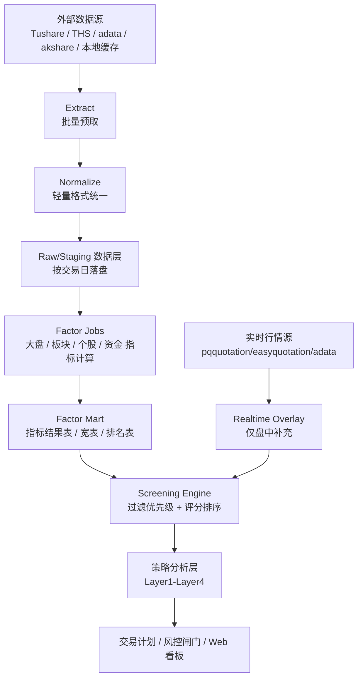

# ETL 化数据与因子指标体系设计 Brainstorming

日期：2026-06-16  
目标：把当前系统从“分析过程中按需取数 + 即时计算”逐步升级为“预取标准化数据 -> 提前计算指标 -> 分析阶段组合指标筛选”的 ETL/指标数仓式架构。

## 1. 核心结论

你的思路是对的，而且非常适合当前项目：

1. **除实时行情外，所有盘后数据尽量提前预取。**
   分析阶段不再直接打 Tushare、adata、akshare、pqquotation 等外部源，而是只读本地标准化数据集。

2. **预取时先做轻量标准化。**
   统一股票代码、板块代码、交易日、时间戳、金额单位、成交量单位、字段命名、空值规则，避免后续策略层反复做脏数据兼容。

3. **因子指标化，提前批量计算。**
   大盘、情绪、板块、个股、资金、跨周期等指标先落成“指标结果表”，策略筛选只组合这些结果。

4. **分析层变薄。**
   Layer1-Layer4 不再负责重取数和重复算指标，而是变成：
   `读取指标 -> 应用筛选规则 -> 排序 -> 生成解释 -> 输出交易计划`。

5. **筛选优先级显式配置化。**
   先做硬过滤，再做优先过滤，再评分排序。不同市场周期可切换不同指标优先级。

最推荐的落地方式不是推倒重写，而是在现有结构上升级：

| 当前已有能力 | 推荐演进 |
|---|---|
| `DataPrep` | 升级为盘后 ETL 入口 |
| `MarketDataset` | 升级为标准化数据集 / 数据快照 |
| `StockRepository` | 升级为只读指标仓库门面 |
| `FactorRegistry` | 保留为因子注册与权重配置中心 |
| `FactorComputer` | 拆成大盘/板块/个股批量指标计算任务 |
| `webdata/factors.duckdb` | 升级为指标结果主存储 |

## 2. 推荐目标架构



目标是把系统拆成 4 层：

| 层级 | 名称 | 职责 | 是否可复现 |
|---|---|---|---|
| Bronze | 原始/近原始层 | 保存外部接口返回，少量清洗，不做业务判断 | 高 |
| Silver | 标准化层 | 统一代码、时间、字段、单位、交易日窗口 | 高 |
| Gold | 指标层 | 计算大盘/板块/个股指标、排名、分位数 | 高 |
| Serving | 筛选分析层 | 按策略组合指标，输出信号、解释、计划 | 高 |
| Realtime Overlay | 实时叠加层 | 只处理盘中快照、竞价、分时确认 | 低，但可记录快照 |

## 3. 数据预取设计

### 3.1 预取原则

除实时数据外，盘后分析依赖的数据都提前预取：

1. 全市场日线 `all_daily`
2. 个股日线窗口 `stock_daily_window`
3. 每日基本面 `daily_basic`
4. 涨停池、跌停池、连板梯队
5. 同花顺板块列表、板块日线、板块成分股
6. 板块资金流
7. 个股资金流、龙虎榜、北向、两融、筹码
8. 指数日线、市场宽度、成交额
9. 历史竞价数据或 T+1 竞价确认数据

实时数据不提前预取，只做盘中临时覆盖：

1. 个股最新价、开盘价、昨收、盘口
2. 板块实时行情
3. 指数实时行情
4. 集合竞价 09:25 快照
5. 分时序列

### 3.2 统一标准字段

预取落地前先做轻量标准化，不做复杂业务计算。

#### 股票代码

| 字段 | 标准 |
|---|---|
| `code` | 6 位纯数字，如 `000001` |
| `ts_code` | Tushare 格式，如 `000001.SZ` |
| `exchange` | `SH/SZ/BJ` |
| `asset_type` | `stock/index/sector/concept` |

规则：

1. 所有表必须至少有 `code` 或业务主键。
2. 股票表同时保留 `code` 与 `ts_code`。
3. 板块表保留原始 `sector_code`，不要强行转成股票代码。

#### 时间

| 字段 | 标准 |
|---|---|
| `trade_date` | `YYYYMMDD` 字符串 |
| `trade_time` | `HH:MM:SS` |
| `timestamp` | ISO 字符串或本地时间戳 |
| `as_of_date` | 数据视角日期，防未来函数 |
| `source_update_time` | 数据源返回时间 |
| `ingested_at` | 本地入库时间 |

关键规则：

1. 所有盘后指标必须带 `as_of_date`。
2. 回测只能读取 `as_of_date <= 当前回测日` 的结果。
3. 实时数据必须带 `received_at` 和 `is_stale`。

#### 金额与成交量

| 字段 | 标准单位 |
|---|---|
| `amount_yuan` | 元 |
| `amount_wan` | 万元，仅展示可派生 |
| `vol_hand` | 手 |
| `volume_share` | 股 |
| `turnover_rate` | 百分比数值，如 `12.3` 表示 12.3% |
| `pct_chg` | 百分比数值，如 `3.5` 表示 3.5% |

建议内部统一使用：

1. 金额：`amount_yuan`
2. 成交量：股票用 `vol_hand`，必要时保留 `volume_share`
3. 涨跌幅：统一百分比数值，不使用小数比例

### 3.3 数据质量检查

每次 ETL 都生成一份数据质量报告：

| 检查项 | 示例 |
|---|---|
| 完整性 | 全市场日线是否超过 5000 行 |
| 唯一性 | `trade_date + code` 是否唯一 |
| 非空 | `open/high/low/close/pre_close` 是否有效 |
| 范围 | 涨跌幅是否超出合理区间 |
| 单位 | 成交额是否疑似万元/元混用 |
| 延迟 | 数据源更新时间是否过旧 |
| 未来函数 | 是否出现晚于 `as_of_date` 的数据 |

落地文件建议：

```text
webdata/etl_quality/
  quality_20260616.json
  quality_20260616.md
```

## 4. 数据存储分层

当前已有 `webdata/factors.duckdb`，建议把 DuckDB 作为指标和标准化数据的主存储。

### 4.1 推荐目录

```text
webdata/
  warehouse/
    bronze/
      tushare_daily/
      ths_daily/
      moneyflow/
    silver/
      stock_daily/
      sector_daily/
      market_daily/
      stock_moneyflow/
    gold/
      factor_market/
      factor_sector/
      factor_stock/
      factor_cross/
      screening_result/
  etl_quality/
  realtime/
```

如果短期不想引入太多目录，也可以先全部落 DuckDB：

```text
webdata/factors.duckdb
```

### 4.2 推荐 DuckDB 表

#### 标准化日线表

```sql
stock_daily_silver(
  trade_date,
  code,
  ts_code,
  name,
  open,
  high,
  low,
  close,
  pre_close,
  pct_chg,
  vol_hand,
  amount_yuan,
  source,
  as_of_date,
  ingested_at
)
```

#### 板块日线表

```sql
sector_daily_silver(
  trade_date,
  sector_code,
  sector_name,
  sector_type,
  open,
  high,
  low,
  close,
  pre_close,
  pct_chg,
  amount_yuan,
  member_count,
  source,
  as_of_date,
  ingested_at
)
```

#### 指标长表

```sql
factor_value_long(
  trade_date,
  entity_type,      -- market / sector / stock
  entity_id,        -- market / sector_code / code
  factor_id,
  raw_value,
  score,
  rank_value,
  percentile,
  direction,        -- higher_better / lower_better / neutral
  source_version,
  computed_at
)
```

#### 指标宽表

```sql
factor_stock_wide(
  trade_date,
  code,
  tech_D1_n_day_high_low,
  tech_D2_vol_price_coord,
  tech_D3_seal_strength,
  tech_D4_turnover_health,
  tech_D5_ma_bull_align,
  mf_E1_main_net_ratio,
  mf_E2_retail_net_ratio,
  sector_score,
  market_regime_score,
  total_score,
  computed_at
)
```

建议：**长表做审计和灵活查询，宽表做策略筛选性能优化。**

## 5. 因子指标化设计

### 5.1 因子注册表升级

当前已有 `config/factors/factor_registry.yaml`，建议扩展成“因子契约”：

```yaml
factor_id:
  name: "N日新高低"
  entity_type: "stock"
  category: "stock_tech"
  sub_category: "trend"
  input_tables:
    - stock_daily_silver
  lookback_days: 20
  output:
    raw_value: float
    score: float
  direction: "higher_better"
  missing_policy: "neutral"
  compute_stage: "daily_after_close"
  owner_layer: "layer3"
  default_weight: 0.20
  enabled: true
```

关键新增字段：

| 字段 | 用途 |
|---|---|
| `entity_type` | 指标属于大盘、板块还是个股 |
| `input_tables` | 明确依赖哪些标准化表 |
| `lookback_days` | 预取窗口依据 |
| `direction` | 排名/分位数方向 |
| `missing_policy` | 缺失时跳过、置零、中性分 |
| `compute_stage` | 盘后、盘前、盘中 |
| `owner_layer` | 主要消费层 |

### 5.2 因子类别

建议分成 5 大类：

| 大类 | entity_type | 说明 |
|---|---|---|
| 大盘指标 | `market` | 指数趋势、市场宽度、量能、涨跌停情绪 |
| 情绪指标 | `market` 或 `cross` | 连板高度、炸板率、晋级率、冰点/高潮 |
| 板块指标 | `sector` | 板块涨幅、持续性、资金、连板贡献 |
| 个股指标 | `stock` | 技术、量价、形态、流动性、资金 |
| 交叉指标 | `stock_sector` / `cross` | 个股与板块共振、周期适配、策略适配 |

## 6. 大盘指标清单

大盘指标主要服务 Layer1 和情绪周期判断。

| 指标 ID | 说明 | 原始数据 | 输出 |
|---|---|---|---|
| `mkt_index_trend_score` | 多指数趋势得分 | 指数日线 | 0-100 |
| `mkt_volume_ratio` | 全市场成交额较 5 日均量 | 全市场日线 | ratio/score |
| `mkt_width_up_ratio` | 上涨家数占比 | 全市场日线 | pct/score |
| `mkt_limit_up_count` | 涨停数量 | 涨停池 | count/score |
| `mkt_limit_down_count` | 跌停数量 | 跌停池 | count/score |
| `mkt_broken_board_rate` | 炸板率 | 涨停/炸板数据 | pct/score |
| `mkt_promotion_rate` | 连板晋级率 | 历史涨停池 | pct/score |
| `mkt_max_board_height` | 最高连板高度 | 涨停池 | count/score |
| `mkt_emotion_phase` | 情绪阶段标签 | 多指标组合 | label |

输出建议：

```text
factor_market_wide(trade_date, market_score, trend_score, volume_score, width_score, emotion_score, phase_label)
```

## 7. 板块指标清单

板块指标主要服务 Layer2、Layer3 的板块共振和热点筛选。

| 指标 ID | 说明 | 原始数据 |
|---|---|---|
| `sec_pct_chg_1d` | 板块当日涨幅 | 板块日线 |
| `sec_pct_chg_3d` | 3 日板块涨幅 | 板块日线 |
| `sec_amount_rank` | 成交额排名 | 板块日线 |
| `sec_amount_ratio_5d` | 成交额较 5 日均值 | 板块日线 |
| `sec_limit_up_count` | 板块内涨停数 | 涨停池 + 成分股 |
| `sec_limit_up_density` | 涨停密度 | 成分股数 |
| `sec_leading_stock_count` | 龙头/连板贡献数量 | 涨停梯队 |
| `sec_persistence_days` | 热点持续天数 | 历史热点 |
| `sec_capital_net_inflow` | 板块资金净流入 | 板块资金 |
| `sec_member_strength_avg` | 成分股平均强度 | 个股指标聚合 |
| `sec_mainline_score` | 主线得分 | 多板块指标组合 |

输出建议：

```text
factor_sector_wide(
  trade_date,
  sector_code,
  sector_name,
  sector_type,
  momentum_score,
  capital_score,
  limit_score,
  persistence_score,
  mainline_score,
  rank
)
```

## 8. 个股指标清单

个股指标主要服务 Layer3 选股、Layer4 交易计划。

| 指标 ID | 说明 | 原始数据 |
|---|---|---|
| `stk_pct_chg_1d` | 当日涨跌幅 | 个股日线 |
| `stk_pct_chg_3d` | 3 日涨跌幅 | 个股日线 |
| `stk_new_high_20d` | 20 日新高强度 | 个股日线 |
| `stk_vol_ratio_5d` | 成交量比 | 个股日线 |
| `stk_amount_ratio_5d` | 成交额量比 | 个股日线 |
| `stk_turnover_health` | 换手健康度 | 日线 + daily_basic |
| `stk_ma_bull_score` | 均线多头排列 | 日线 |
| `stk_limit_seal_strength` | 封板强度 | 涨停池/盘口 |
| `stk_break_board_count` | 开板次数 | 涨停池 |
| `stk_liquidity_score` | 流动性 | amount/vol/市值 |
| `stk_moneyflow_main_ratio` | 主力净流入占比 | 资金流 |
| `stk_big_order_ratio` | 大单买入占比 | 资金流 |
| `stk_sector_resonance` | 所属板块共振 | 个股 + 板块指标 |
| `stk_pattern_fit_wts` | 弱转强适配度 | 个股指标组合 |
| `stk_pattern_fit_second_board` | 二板定龙适配度 | 个股指标组合 |
| `stk_pattern_fit_first_breakout` | 首板突破适配度 | 个股指标组合 |
| `stk_pattern_fit_dragon_wave2` | 龙头二波适配度 | 个股指标组合 |

输出建议：

```text
factor_stock_wide(
  trade_date,
  code,
  ts_code,
  name,
  sector_code,
  sector_name,
  tech_score,
  moneyflow_score,
  liquidity_score,
  sector_resonance_score,
  pattern_wts_score,
  pattern_second_board_score,
  pattern_first_breakout_score,
  pattern_dragon_wave2_score,
  total_score,
  rank
)
```

## 9. 筛选优先级设计

### 9.1 筛选分三层

不要把所有指标都混成一个总分。推荐：

1. **硬过滤 Hard Filter**
   不满足就直接淘汰。

2. **优先过滤 Priority Filter**
   按优先级逐层缩小候选池。

3. **评分排序 Score Ranking**
   对剩余标的打分排序，输出解释。

### 9.2 示例配置

```yaml
screening_profiles:
  weak_to_strong:
    hard_filters:
      - factor: stk_liquidity_score
        op: ">="
        value: 60
      - factor: mkt_emotion_phase
        op: "not_in"
        value: ["强退潮", "系统性风险"]

    priority_filters:
      - priority: 1
        name: "板块共振优先"
        factor: stk_sector_resonance
        op: ">="
        value: 70
        min_keep: 30
      - priority: 2
        name: "资金承接优先"
        factor: stk_moneyflow_main_ratio
        op: ">="
        value: 50
        min_keep: 15
      - priority: 3
        name: "形态适配优先"
        factor: stk_pattern_fit_wts
        op: ">="
        value: 65
        min_keep: 8

    ranking:
      weights:
        stk_pattern_fit_wts: 0.35
        stk_sector_resonance: 0.25
        stk_moneyflow_main_ratio: 0.20
        stk_liquidity_score: 0.10
        mkt_emotion_score: 0.10
      top_n: 5
```

### 9.3 优先级语义

| 机制 | 含义 |
|---|---|
| `priority` | 数字越小越先过滤 |
| `min_keep` | 防止某层过滤过严导致候选全没 |
| `max_drop_ratio` | 单层最多剔除多少，避免过拟合 |
| `profile` | 不同策略/周期使用不同规则 |
| `explain` | 输出每层过滤保留/淘汰原因 |

筛选引擎输出应该包含：

```json
{
  "trade_date": "20260616",
  "profile": "weak_to_strong",
  "input_count": 320,
  "after_hard_filter": 180,
  "after_priority_filters": [
    {"priority": 1, "name": "板块共振优先", "kept": 62},
    {"priority": 2, "name": "资金承接优先", "kept": 24},
    {"priority": 3, "name": "形态适配优先", "kept": 9}
  ],
  "final": [
    {
      "code": "000001",
      "score": 82.5,
      "rank": 1,
      "reasons": ["板块共振强", "主力资金流入", "形态适配弱转强"]
    }
  ]
}
```

## 10. 与现有五层流水线的关系

### 10.1 当前 Layer 责任调整

| 当前层 | 现状 | ETL 化后 |
|---|---|---|
| L1 大盘 | 拉数据 + 算大盘 | 读 `factor_market_wide`，解释市场状态 |
| L2 板块 | 拉板块数据 + 算热点 | 读 `factor_sector_wide`，筛主线板块 |
| L3 选股 | 多处按需取个股数据 | 读 `factor_stock_wide` + screening profile |
| L4 计划 | 计算价格/仓位/条件 | 基于指标结果生成交易计划 |
| L4.5 风控 | 校验组合风险 | 保持，但输入指标化 |
| L5 复盘 | 汇总产物 | 读取指标、筛选、交易计划结果 |

### 10.2 分析阶段应该变成这样

```text
1. 读取当日 Gold 指标表
2. 根据情绪周期选择 screening profile
3. 对全市场/候选池应用硬过滤
4. 按优先级过滤
5. 评分排序
6. 生成策略信号解释
7. 生成交易计划
8. 进入风控闸门
9. 写快照和 Web 看板
```

## 11. 实时数据如何融合

实时数据不应污染盘后指标表。推荐作为 Overlay：

```text
盘后指标结果 + 实时行情快照 = 实时确认/取消/观察
```

实时只做三件事：

1. **确认**
   例如竞价高开、放量、板块同步上涨。

2. **取消**
   例如低开、平开、竞价缩量、板块跳水。

3. **更新展示**
   现价、涨幅、板块实时强度、是否过期。

实时 Overlay 表：

```sql
realtime_overlay(
  trade_date,
  code,
  received_at,
  last_price,
  open_price,
  pre_close,
  pct_chg,
  sector_rt_score,
  confirm_status,  -- confirmed / cancelled / observe
  reason
)
```

这个设计能避免一个大坑：盘后回测和实时提示混在一起，导致结果不可复现。

## 12. 落地路线

### Phase 1：标准化预取增强

目标：先把数据层干净起来。

任务：

1. 新增 `core/etl/normalizers.py`
   - `normalize_stock_code`
   - `normalize_trade_date`
   - `normalize_amount`
   - `normalize_pct`

2. 扩展 `DataPrep`
   - 预取更多稳定盘后数据
   - 输出数据质量报告
   - 所有预取结果带 `as_of_date`

3. 扩展 `MarketDataset`
   - 保存标准化后的表
   - 记录 `schema_version`
   - 保存 `source` 和 `ingested_at`

交付物：

```text
webdata/etl_quality/quality_YYYYMMDD.json
webdata/warehouse/silver/*.parquet 或 factors.duckdb silver 表
```

### Phase 2：指标计算批处理

目标：把现有因子计算从策略层前移。

任务：

1. 新增 `core/factors/jobs/market_factor_job.py`
2. 新增 `core/factors/jobs/sector_factor_job.py`
3. 新增 `core/factors/jobs/stock_factor_job.py`
4. 写入 `factor_value_long` 和各类 wide 表
5. Web 因子面板读取指标结果而不是临时计算

交付物：

```text
webdata/factors.duckdb
  factor_market_wide
  factor_sector_wide
  factor_stock_wide
  factor_value_long
```

### Phase 3：筛选引擎

目标：把选股逻辑从散落代码迁到配置化筛选。

任务：

1. 新增 `config/screening_profiles.yaml`
2. 新增 `core/screening/screening_engine.py`
3. 支持 hard_filters / priority_filters / ranking
4. 输出筛选解释
5. L3 改为调用 ScreeningEngine

交付物：

```text
webdata/screening/screening_YYYYMMDD.json
```

### Phase 4：分析层瘦身

目标：Layer1-Layer4 只做组合与解释。

任务：

1. L1 从 `factor_market_wide` 读取市场状态
2. L2 从 `factor_sector_wide` 读取主线板块
3. L3 从 `factor_stock_wide` + screening profile 选股
4. L4 根据指标结果生成计划
5. 保持当前快照结构兼容 Web

### Phase 5：实时 Overlay

目标：盘中页面只做确认/取消，不重算盘后因子。

任务：

1. `/realtime` 页面读取盘后候选池
2. 叠加实时个股/板块行情
3. 生成 `confirmed/cancelled/observe`
4. 支持 SSE 或轻轮询

## 13. 最小可落地 MVP

建议先做一个两周内能完成的 MVP：

### 第一步

把 `DataPrep` 输出写入 DuckDB 的 silver 表。

最低要求：

1. `stock_daily_silver`
2. `sector_daily_silver`
3. `market_daily_silver`

### 第二步

先计算 10 个高价值指标：

| 类别 | 指标 |
|---|---|
| 大盘 | 市场宽度、成交额量比、涨停数、跌停数 |
| 板块 | 板块涨幅、板块成交额排名、板块涨停密度 |
| 个股 | 个股涨幅、量比、板块共振 |

### 第三步

新增一个简单筛选 profile：

1. 硬过滤：流动性、非 ST、非退市、非强风险周期
2. 优先级 1：板块共振
3. 优先级 2：量价强度
4. 优先级 3：资金或形态适配
5. 排序输出 top 10

### 第四步

让 L3 先试运行新筛选结果，与旧 L3 并行对比，不立即替换。

输出：

```text
output/etl_screening_compare/screening_compare_YYYYMMDD.json
```

对比项：

1. 新旧候选交集
2. 新增候选
3. 旧逻辑保留但新逻辑剔除
4. 次日表现对比

## 14. 风险与注意事项

### 14.1 不要一开始追求全量指标

先把最常用、最稳定、最影响筛选的指标前移。比如资金流和竞价类数据稳定性较差，可以第二批再做。

### 14.2 不要让实时数据进入盘后 Gold 表

实时数据天然不可复现，应单独做 Overlay。否则回测、复盘、实盘页面会互相污染。

### 14.3 指标口径必须版本化

每个指标要有：

1. `factor_id`
2. `version`
3. `input_tables`
4. `lookback_days`
5. `missing_policy`

否则后续回测结果会解释不清。

### 14.4 筛选优先级要可解释

每只股票最终入选或淘汰，都要能解释：

1. 过了哪些硬过滤
2. 卡在哪个优先级
3. 哪些指标贡献最高
4. 哪些指标拖累最大

### 14.5 旧逻辑要并行一段时间

不要马上替换当前 Layer3/L4。推荐并行跑 10-20 个交易日，比较：

1. 命中率
2. 次日高开率
3. 最大回撤
4. 平均收益
5. 候选数量稳定性

## 15. 推荐新增文件

```text
core/etl/
  __init__.py
  normalizers.py
  schemas.py
  quality.py
  warehouse.py

core/factors/jobs/
  market_factor_job.py
  sector_factor_job.py
  stock_factor_job.py

core/screening/
  __init__.py
  screening_engine.py
  screening_models.py

config/
  screening_profiles.yaml

scripts/
  run_etl_daily.py
  run_factor_jobs.py
  run_screening_compare.py
```

## 16. 最终建议

当前最好的路线是：

1. **保留现有五层复盘框架，不推倒。**
2. **把取数和指标计算逐步前移。**
3. **用 DuckDB 做指标结果仓库。**
4. **用 screening profile 管理筛选优先级。**
5. **让旧选股逻辑和新指标筛选并行验证。**
6. **实时功能只作为盘中确认/取消 Overlay。**

这样改完后，系统会从“策略脚本驱动”变成“数据资产 + 指标资产驱动”。  
后续调策略时，更多是在调指标阈值、优先级、权重和 profile，而不是到处改代码。

## 17. Phase 1 已实施内容

本阶段已经落地“标准化预取增强”的第一版，不改变旧复盘默认行为。

### 17.1 新增模块

```text
core/etl/
  __init__.py
  schemas.py        # Silver 表字段常量
  normalizers.py    # 代码、日期、时间、金额、股票/板块/指数日线标准化
  quality.py        # 数据质量检查与 json/md 报告
  warehouse.py      # Silver 表落盘，DuckDB 优先，parquet/csv 兜底
```

### 17.2 DataPrep 接入方式

`DataPrep.build()` 新增可选参数：

```python
persist_silver=True
warehouse_path="webdata/factors.duckdb"
silver_dir="webdata/warehouse/silver"
quality_dir="webdata/etl_quality"
```

默认 `persist_silver=False`，因此原有分析流程不受影响。

### 17.3 脚本入口

```bash
python scripts/run_etl_daily.py --date 20260616
```

可选参数：

```bash
--skip-sectors
--skip-all-daily
--prefetch-auction
--daily-lookback-calendar-days 120
--limit-up-history-days 16
--sector-history-days 10
```

### 17.4 当前 Silver 表

第一版输出三张表：

1. `stock_daily_silver`
2. `sector_daily_silver`
3. `index_daily_silver`

当环境安装 `duckdb` 时写入 `webdata/factors.duckdb`；未安装时自动写：

```text
webdata/warehouse/silver/*.parquet
```

### 17.5 数据质量报告

每次落盘会生成：

```text
webdata/etl_quality/quality_YYYYMMDD.json
webdata/etl_quality/quality_YYYYMMDD.md
```

检查内容包括：

1. 空表
2. 缺少必需字段
3. 主键重复
4. `trade_date` 格式
5. OHLC 非正值
6. `high < low`

### 17.6 验证

新增测试：

```text
tests/test_etl_phase1.py
```

覆盖：

1. 股票日线标准化
2. 板块日线标准化
3. 常用字段规范化
4. `MarketDataset -> Silver -> 质量报告` 落盘链路

## 18. Phase 2 已实施内容

本阶段已经落地“Silver -> Gold 因子指标批处理”的第一版。  
前置条件是 Phase 1 已经把 `stock_daily_silver`、`sector_daily_silver` 写入 DuckDB。

### 18.1 新增模块

```text
core/factors/jobs/
  __init__.py
  gold_utils.py          # Gold 表写入、分区覆盖、打分、长表记录工具
  market_factor_job.py   # 大盘指标批处理
  sector_factor_job.py   # 板块指标批处理
  stock_factor_job.py    # 个股指标批处理
  runner.py              # market/sector/stock 统一调度

scripts/
  run_factor_jobs.py     # Phase 2 CLI 入口
```

### 18.2 Gold 表设计

当前第一版输出四张 Gold 表：

1. `factor_value_long`
   - 统一指标长表
   - 主体维度：`market`、`sector`、`stock`
   - 核心字段：`trade_date`、`entity_type`、`entity_id`、`factor_id`、`raw_value`、`score`、`rank_value`、`percentile`
   - 后续筛选引擎优先读取这张表做指标组合

2. `factor_market_wide`
   - 大盘宽表
   - 一天一行
   - 用于快速判断市场环境、仓位和是否允许进攻

3. `factor_sector_wide`
   - 板块宽表
   - 一天多行
   - 用于板块主线、热度、持续性排序

4. `factor_stock_wide`
   - 个股宽表
   - 一天多行
   - 用于个股技术、量能、流动性和综合分排序

所有写入都采用 `trade_date` 分区覆盖思路：同一天重复运行会先删除当天旧结果，再写入新结果。

### 18.3 当前指标口径

大盘第一版指标：

1. `mkt_width_up_ratio`：上涨家数占比
2. `mkt_avg_pct_chg`：全市场平均涨跌幅
3. `mkt_amount_ratio_5d`：成交额相对近 5 日均值
4. `mkt_limit_up_count`：涨停数量
5. `mkt_limit_down_count`：跌停数量
6. `mkt_market_score`：市场综合分

板块第一版指标：

1. `sec_pct_chg_1d`：当日涨跌幅动量
2. `sec_amount_percentile`：成交额横截面分位
3. `sec_amount_ratio_5d_score`：成交额相对近 5 日强度
4. `sec_persistence_score`：近 3 日加当日的上涨持续性
5. `sec_mainline_score`：板块主线综合分

个股第一版指标：

1. `stk_pct_chg_1d`：当日涨跌幅动量
2. `stk_vol_ratio_5d`：成交量相对近 5 日均值
3. `stk_amount_ratio_5d`：成交额相对近 5 日均值
4. `stk_new_high_20d`：收盘价接近近 20 日高点程度
5. `stk_liquidity_percentile`：成交额横截面流动性分位
6. `stk_total_score`：个股综合分

### 18.4 脚本入口

推荐使用已安装 DuckDB 的运行环境：

```bash
.venv\Scripts\python.exe scripts\run_factor_jobs.py --date 20260616
```

可选参数：

```bash
--jobs market,sector,stock
--duckdb-path webdata/factors.duckdb
```

只重算部分指标示例：

```bash
.venv\Scripts\python.exe scripts\run_factor_jobs.py --date 20260616 --jobs market,sector
```

### 18.5 与 ETL 流程的衔接

完整批处理顺序建议：

1. 先执行 Phase 1：

```bash
.venv\Scripts\python.exe scripts\run_etl_daily.py --date 20260616
```

2. 再执行 Phase 2：

```bash
.venv\Scripts\python.exe scripts\run_factor_jobs.py --date 20260616
```

3. 后续 Phase 3 筛选引擎不再直接扫描原始行情表，而是读取：

```text
factor_value_long
factor_market_wide
factor_sector_wide
factor_stock_wide
```

这样可以把“数据预取、指标计算、策略筛选”拆成三段稳定流程。

### 18.6 验证

新增测试：

```text
tests/test_factor_jobs_phase2.py
```

覆盖：

1. 因子分位打分方向
2. 从 `stock_daily_silver`、`sector_daily_silver` 写入四张 Gold 表
3. market、sector、stock 三类主体写入 `factor_value_long`
4. 宽表行数和个股排序结果

说明：

1. 默认 Python 环境没有 `duckdb` 时，DuckDB 集成测试会自动跳过。
2. 已用 `.venv` 中的 DuckDB 做过真实写库校验。

## 19. Phase 3-5 已实施内容

本阶段把 Gold 指标层继续推进到“筛选、分析旁路、实时确认”三段。  
原则是：旧五层流水线继续保持兼容，新 ETL 结果先并行输出，等连续验证稳定后再替换主路径。

### 19.1 Phase 3：配置化筛选引擎

新增文件：

```text
config/screening_profiles.yaml

core/screening/
  __init__.py
  screening_models.py
  screening_engine.py
  gold_analysis.py

scripts/
  run_screening.py
```

当前支持：

1. `hard_filters`：硬过滤，不满足直接淘汰。
2. `priority_filters`：按优先级逐层过滤。
3. `min_keep`：过滤过严时保留最低候选数。
4. `max_drop_ratio`：限制单层最多淘汰比例。
5. `ranking.weights`：按指标权重重新排序。
6. `reasons` / `traces`：输出每只股票和每层过滤解释。

运行方式：

```bash
.venv\Scripts\python.exe scripts\run_screening.py --date 20260616 --profile default
```

输出：

```text
webdata/screening/screening_YYYYMMDD.json
```

第一版 profile 包括：

1. `default`：通用 Gold 指标筛选。
2. `weak_to_strong`：偏弱转强的量价修复筛选。

### 19.2 Phase 4：分析层瘦身旁路

新增 Gold 摘要适配器：

```text
core/screening/gold_analysis.py
scripts/run_etl_analysis.py
```

用途：

1. 从 `factor_market_wide` 读取市场状态摘要。
2. 从 `factor_sector_wide` 读取板块主线排序。
3. 从 `factor_stock_wide` 读取个股指标排序。
4. 合并 `screening_YYYYMMDD.json`，形成轻量分析结果。

运行方式：

```bash
.venv\Scripts\python.exe scripts\run_etl_analysis.py --date 20260616
```

输出：

```text
webdata/screening/analysis_YYYYMMDD.json
```

已接入旧流水线旁路：

1. `ReviewPipeline` 在 L3 后尝试运行 ETL Screening。
2. 成功时写入 `ctx.etl_screening` 和 `ctx.etl_gold_summary`。
3. `SnapshotWriter` 会把结果写入快照：

```json
{
  "etl": {
    "screening": {},
    "gold_summary": {}
  }
}
```

同时在 `sections` 中增加 `ETL指标筛选`，供 Web 数据浏览查看。

### 19.3 Phase 5：实时 Overlay

新增文件：

```text
core/realtime/overlay_service.py
scripts/run_realtime_overlay.py
```

当前逻辑：

1. 优先读取 `webdata/screening/screening_YYYYMMDD.json` 的候选池。
2. 如果没有筛选结果，则回退读取最新快照里的交易计划。
3. 叠加 `RealtimeQuoteService` 的实时个股快照。
4. 输出三种状态：
   - `confirmed`：高开且实时涨幅满足确认条件。
   - `cancelled`：低开或盘中跌幅触发取消线。
   - `observe`：未触发确认/取消，继续观察。

运行方式：

```bash
.venv\Scripts\python.exe scripts\run_realtime_overlay.py --date 20260616
```

输出：

```text
webdata/realtime/overlay_YYYYMMDD.json
```

Web 接口：

```text
GET /api/realtime/overlay?date=20260616
GET /api/etl/screening/20260616
GET /api/etl/analysis/20260616
```

`/realtime` 页面已增加“实时确认 Overlay”表格，刷新时会同时更新：

1. 候选确认状态
2. 开盘涨跌幅
3. 实时涨跌幅
4. 筛选分
5. 确认/取消原因

### 19.4 当前推荐执行顺序

盘后：

```bash
.venv\Scripts\python.exe scripts\run_etl_daily.py --date 20260616
.venv\Scripts\python.exe scripts\run_factor_jobs.py --date 20260616
.venv\Scripts\python.exe scripts\run_screening.py --date 20260616 --profile default
.venv\Scripts\python.exe scripts\run_etl_analysis.py --date 20260616
```

盘中：

```bash
.venv\Scripts\python.exe scripts\run_realtime_overlay.py --date 20260616
```

或者直接打开：

```text
/realtime
```

### 19.5 验证

新增测试：

```text
tests/test_screening_engine_phase3.py
tests/test_realtime_overlay_phase5.py
```

覆盖：

1. 筛选操作符。
2. Gold 表读取、筛选排序、JSON 落盘。
3. 高开确认。
4. 低开取消。
5. Overlay 落盘。

已用 `.venv` 中的 DuckDB 跑通过：

```text
Phase 2 factor jobs -> Phase 3 screening -> Phase 4 gold analysis
```

## 20. ETL 主路径切换

根据最新分支策略，当前 `main` 已不再保留“旧五层复盘必须兼容”的约束。  
默认运行入口已经切到 ETL 指标体系：

```text
main.py / Web 一键运行
  -> ETLDailyPipeline
  -> DataPrep Silver
  -> FactorJobRunner Gold
  -> ScreeningEngine
  -> GoldAnalysis
  -> SnapshotWriter
```

### 20.1 新增主编排器

```text
core/etl/daily_pipeline.py
```

职责：

1. 解析当日和前一交易日。
2. 读取涨停池作为 universe 种子。
3. 执行 Phase 1 Silver 预取和落盘。
4. 执行 Phase 2 Gold 因子任务。
5. 执行 Phase 3 screening profile。
6. 执行 Phase 4 Gold 摘要。
7. 生成 Web 快照和 SQLite 索引。

### 20.2 main.py 行为变化

`SentimentSystem.run_daily_analysis()` 现在不再调用旧 `ReviewPipeline.execute()`，也不再生成旧 Excel 报告和散户支持报告。

默认行为变为：

```bash
.venv\Scripts\python.exe main.py --mode analysis --date 20260616
```

等价于执行完整 ETL 主流程，并生成：

```text
webdata/factors.duckdb
webdata/etl_quality/quality_YYYYMMDD.json
webdata/screening/screening_YYYYMMDD.json
webdata/screening/analysis_YYYYMMDD.json
webdata/snapshots/YYYYMMDD.json
webdata/app.sqlite
```

### 20.3 快照结构变化

快照 `meta` 增加：

```json
{
  "engine": "etl"
}
```

交易计划来自 `screening.final`，并转换为 Web 可展示字段：

1. `股票代码`
2. `股票名称`
3. `模式类型 = ETL指标筛选/profile`
4. `综合评分`
5. `竞价条件 = 高开才买入，低开直接放弃`
6. `风险提示 = 实时 Overlay 为 cancelled/observe 时不主动买入`

### 20.4 DataPrep 修复

已修复一个主路径问题：

当 universe 为空时，`DataPrep.build(... persist_silver=True)` 以前会提前 return，导致已经预取到的 `all_daily`、板块和指数数据无法写入 Silver。  
现在即使 universe 为空，也会先落 Silver 和质量报告。

### 20.5 验证

新增测试：

```text
tests/test_etl_daily_pipeline.py
```

覆盖：

1. ETL 主编排器完整运行。
2. Silver、Gold、Screening、Snapshot 串联。
3. 快照和 screening JSON 落盘。

`.venv` 中已用 DuckDB 直接执行真实集成脚本验证：

```text
ok=true
factor_ok=[true,true,true]
final_count=2
snapshot=snapshots/20260616.json
analysis=webdata/screening/analysis_20260616.json
```
