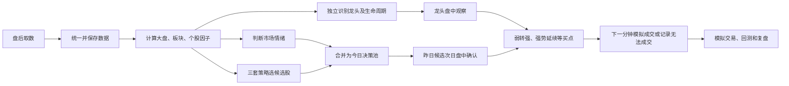

# 当前系统全流程大白话说明

> 本文按当前代码实际运行逻辑编写，目标是不用量化术语，也能看懂系统每天取了什么数据、算了什么、为什么选出这些股票，以及盘中什么情况下才算出现买点。

## 1. 先用一句话说清楚系统在做什么

当前系统不是直接猜“明天哪只股票会涨”，而是分成五步：

1. 盘后把当天市场数据一次性取回来并保存。
2. 把原始数据加工成大盘、板块和个股证据。
3. 用三套短线规则筛出次日值得观察的候选股。
4. 单独识别近期真正有市场地位的龙头股。
5. 次日盘中读取实时分钟行情，等明确买点出现后才确认交易。

## 2. 最重要的时间关系：T 日选股，T+1 日确认

这是理解整个系统的关键。

- **T 日收盘后**：系统使用 T 日及以前的数据计算因子、判断情绪并生成候选股。
- **T+1 日盘中**：系统观察这些候选股的当日实时行情，判断是否出现弱转强或强势延续买点。
- **确认后的下一分钟**：回测和模拟交易才使用下一分钟开盘价模拟成交。
- **当日收盘后才公布的数据**：只能从下一个交易日开始使用。例如 T 日龙虎榜只能增强 T+1 的判断，不能反过来参与 T 日早盘交易。

因此，页面上的“候选日”和“行情日”本来就应该相差一个交易日。候选股只是观察名单，不等于当天已经可以买入。

---

## 3. 第一步：盘后取数

### 3.1 取哪些数据

系统会把后续计算需要的数据提前取回本地，主要包括：

| 数据 | 大白话解释 | 后面用来做什么 |
| --- | --- | --- |
| 全市场日线 | 每只股票当天的开高低收、涨跌幅、成交量、成交额 | 看走势、强弱、放量和流动性 |
| 股票基础信息 | 股票名称、代码、上市状态、市场板块 | 统一代码和识别主板、创业板、科创板等 |
| 每日基础指标 | 市值、换手率等 | 判断股票大小和成交条件 |
| 指数日线 | 上证、深证、创业板等指数表现 | 判断大盘趋势和计算个股超额表现 |
| 官方涨停池 | 当天真实涨停、连板高度、封板时间、炸板次数 | 判断首板、连板和封板质量 |
| 官方跌停池 | 当天真实跌停股票 | 判断市场亏钱效应和风险 |
| 板块及成分股 | 概念、行业以及各自包含哪些股票 | 判断主线、板块扩散和个股所属题材 |
| 板块日线 | 板块涨跌和成交额 | 判断板块强度、持续性和轮动 |
| 资金流 | 个股和板块资金流向 | 作为资金认可的辅助证据 |
| 龙虎榜 | 上榜股票、机构和席位买卖明细 | 判断机构净买入、资金认可和拥挤风险 |
| 龙头/KPL信号 | 市场已有的龙头、核心、连板标签 | 辅助确认龙头身份，不能单独决定买入 |
| 两融、大宗、关注度等 | 杠杆、机构交易、市场关注变化 | 作为增强或风险证据 |

### 3.2 为什么要先保存，不在页面打开时现取

这样做有四个好处：

1. **快**：页面只读本地结果，不必每次等待远程接口。
2. **稳**：避免多人打开页面时重复请求 Tushare，触发接口限频。
3. **可复现**：同一个交易日重新计算时使用同一份原始数据，结果不会前后变化。
4. **不偷看未来**：历史回测能明确知道某条数据当时是否已经公布。

### 3.3 数据进入系统后做什么统一

原始数据写入 Silver 数据层前会做基础清洗：

- 股票代码统一成系统使用的格式。
- 交易日期统一成 `YYYYMMDD`。
- 金额、成交量和百分比统一单位。
- 去掉重复记录。
- 对关键字段做完整性检查。
- 涨停、跌停只认官方涨跌停数据，不用 `涨幅 >= 9.5%` 之类的猜测规则。

如果某天的关键数据已经完整保存，再次运行取数时应直接复用，不重复访问接口。

---

## 4. 第二步：因子计算

### 4.1 “因子”到底是什么

因子并不神秘，它就是把原始数据翻译成可以比较的证据。

例如：

- 原始数据说“某股成交额是 12 亿元”。
- 因子会进一步回答“它比自己过去 5 天活跃多少”“在全市场处于什么位置”“是不是已经过热”。

系统中的多数因子会被换算到 0 到 100 分，方便横向比较。但要注意：

> 因子 100 分不代表有 100% 概率上涨，只代表它在这一项证据上相对更突出。

### 4.2 当前计算顺序

系统按以下顺序计算，前面的结果会提供给后面的计算使用：

1. 大盘因子。
2. 龙虎榜因子。
3. 龙头、关注度、资金流等信号因子。
4. 板块因子。
5. 个股因子。

每一类计算完成后都会写入 DuckDB 因子库。生产选股直接读取已经计算好的因子，不会在筛选时重新请求行情。

### 4.3 大盘因子算什么

| 因子 | 怎么理解 | 为什么需要 |
| --- | --- | --- |
| 上涨宽度 | 全市场上涨股票占比 | 判断赚钱是普遍现象还是少数股票独舞 |
| 趋势强度 | 全市场平均涨跌和主要指数表现 | 判断市场整体向上还是向下 |
| 量能强度 | 当日全市场成交额相对近 5 日水平 | 判断有没有新增资金参与 |
| 情绪强度 | 官方涨停家数与跌停家数的对比 | 判断短线赚钱效应和亏钱效应 |
| 市场总分 | 趋势、量能、宽度、情绪各占一部分 | 给市场环境一个统一参考值 |
| 炸板率 | 开板股票数占涨停股票数的比例 | 炸板越多，说明追高容错率越低 |
| 梯队完整性 | 一板、二板、三板及更高板是否衔接 | 判断短线情绪结构是否健康 |
| 昨日涨停溢价 | 昨日涨停股今天平均表现 | 判断打板资金次日是否容易赚钱 |
| 昨日首板高开比例 | 昨日首板今天有多少高开 | 判断低位首板是否有接力价值 |
| 情绪背离 | 指数表现与涨跌停情绪是否相反 | 指数涨但短线很差时要防止误判强市 |
| 周期持续天数 | 当前情绪阶段已经持续多久 | 高潮持续太久时提示退潮风险 |

当前市场总分的基础组成是：趋势、量能、上涨宽度和涨跌停情绪各占 25%。它不是主观判断“今天感觉不错”，而是由当日市场数据计算出来。

### 4.4 板块因子算什么

板块因子回答的是两个问题：

1. 现在真正强的是哪个题材或行业？
2. 这只股票的上涨是自己单打独斗，还是整个板块一起走强？

| 因子 | 大白话解释 | 为什么需要 |
| --- | --- | --- |
| 板块动量 | 板块当天涨得有多强 | 找到市场资金正在攻击的方向 |
| 板块成交额分位 | 该板块成交额在所有板块中的位置 | 判断市场关注度 |
| 板块量比 | 当前成交额相对自身近 5 日水平 | 判断是否突然放量 |
| 板块持续性 | 近几天是否持续走强 | 区分一日游和持续主线 |
| 成分股宽度 | 板块内上涨股票占比 | 防止只靠一只权重股把板块拉红 |
| 涨停扩散 | 板块内有多少真实涨停股 | 判断短线资金是否形成集群 |
| 宽度加速 | 跟涨股票是否越来越多 | 判断题材是在扩散还是退潮 |
| 资金共振 | 价格上涨时是否同时有资金流入 | 判断上涨有没有资金支持 |
| 龙虎榜共振 | 板块内是否出现多只龙虎榜资金认可股票 | 辅助判断短线资金聚集程度 |
| 板块主线分 | 动量、成交、持续性、宽度和涨停扩散的组合 | 找出真正有交易意义的主线 |

#### 什么才叫“所属主线”

系统只允许**概念和行业题材**参与主线判断，并且会排除融资融券、沪深股通、指数成份股、机构重仓等属性标签。

所以主线应该类似“机器人、商业航天、固态电池、创新药”，而不是“融资融券”或“中证 500 成份股”。

### 4.5 个股因子算什么

个股因子大致分成八类。

#### A. 技术强弱

| 因子 | 计算什么 | 使用原因 |
| --- | --- | --- |
| 技术综合分 | 当日强度与股价在近 20 日的位置 | 短线优先找处于强势区而不是长期下跌的股票 |
| 20 日强势位置 | 当前价格距离近 20 日高点的位置 | 判断是临近突破还是已经严重透支 |
| 相对板块强度 | 个股表现相对所属板块成员的强弱 | 真龙头通常要跑赢同板块其他股票 |

#### B. 成交和流动性

| 因子 | 计算什么 | 使用原因 |
| --- | --- | --- |
| 5 日成交量比 | 当日成交量相对近 5 日 | 判断交易是否突然活跃 |
| 5 日成交额比 | 当日成交额相对近 5 日 | 判断真金白银是否明显增加 |
| 流动性分位 | 成交额在全市场的位置 | 过滤难买、难卖或滑点过大的股票 |

成交额并不是越大越好。太低说明没人参与，突然过热也可能代表一致性过强或资金出货，因此系统更偏向合理区间评分。

#### C. 涨停和身位

| 因子 | 计算什么 | 使用原因 |
| --- | --- | --- |
| 涨停进度 | 当日涨幅已经完成自身涨停幅度的多少 | 兼容 10%、20% 和 30% 不同涨跌停制度 |
| 连板高度 | 官方涨停池中的几连板 | 判断市场辨识度和所处高度 |
| 打板身位 | 连板高度、封板时间和市值适配 | 区分首板、二板和高位接力的风险收益 |
| 封板综合质量 | 首封时间、炸板次数、封单与成交额关系 | 区分强封板与勉强封住的涨停 |

股票是否真实涨停、是否首板或连板，以官方涨停池为准，不根据收盘涨幅硬猜。

#### D. 首板与板块共振

首板策略不能只看“今天第一次涨停”，还要判断它是不是题材启动时的先锋。

| 因子 | 大白话解释 |
| --- | --- |
| 首板板块同步 | 个股首板时，板块涨幅、涨停数和成交额是否一起放大 |
| 首板领先度 | 它封板是否早于大多数同板块股票 |
| 首板集群强度 | 同板块当天是否同时出现多只首板 |
| 首板板块宽度 | 同板块涨幅超过 5% 的股票是否足够多 |
| 首板量价共振 | 个股和板块是否同时放量 |
| 新题材启动 | 该题材此前几天沉寂，今天是否首次集中启动 |

这些证据会合成为“首板板块共振”。因此，一个处在新题材启动节点的先锋首板，可以优于单纯身位更高但已经拥挤的股票。

#### E. 行为阶段

系统把短线资金行为拆成五个阶段：

| 阶段 | 大白话解释 | 交易含义 |
| --- | --- | --- |
| 注意形成 | 题材首次异动、成交额突然增加、排名上升 | 资金刚开始注意，适合寻找启动机会 |
| 一致加速 | 涨势加快、板块扩散、封板质量提高 | 主升阶段，但要防止买在一致高潮 |
| 分歧释放 | 炸板放量、板块宽度下降、资金意见不一 | 风险释放，也可能为后续修复创造条件 |
| 弱转强修复 | 分歧后重新走强、量价和板块恢复 | 是弱转强策略的重要基础 |
| 拥挤衰退 | 高位反复、跟风减少、资金流出 | 所有策略都应重点回避 |

#### F. 板块关系

- 板块共振：个股与板块是否同时强。
- 板块主线地位：个股所在题材是否属于当前主线。
- 板块持续性：题材是否连续多日有资金参与。
- 板块轮动动量：题材近期是在升温还是降温。

#### G. 龙虎榜和资金流

龙虎榜、机构净买入和多源资金流目前主要作为**增强证据或否决项**，不是所有候选股必须上榜。

- 净买入和机构共识较好：同分时可以优先。
- 板块内多只股票获得资金认可：增强板块共振。
- 席位过度集中、反复上榜、换手过热：增加拥挤风险。
- 当天收盘后公布的龙虎榜，只在下一交易日生效。

#### H. 基础综合分

个股层仍会计算一个基础综合分，当前大致由以下部分组成：

- 技术强弱 25%。
- 量能 12%。
- 流动性 13%。
- 板块共振 30%。
- 涨停身位和封板质量 20%。

资金流、龙虎榜、关注度和事件风险可再做有限度的加减分。但生产选股不会只按这个总分从高到低买，而是使用下面三套独立规则。

---

## 5. 第三步：判断大盘情绪

### 5.1 为什么选股前先看市场

同一只股票、同一个形态，在不同市场环境中的成功率完全不同。

- 强市里，资金愿意追高，首板和主线龙头容易获得溢价。
- 震荡市里，轮动快，追一致容易吃面，更适合资金共振和弱转强。
- 弱市里，市场容错率低，应减少出手数量和仓位。

所以市场情绪不是用来预测指数点位，而是决定：**今天哪些策略可以工作、最多出手几只、仓位要不要缩小。**

### 5.2 当前市场状态

基础市场状态按市场总分划分：

| 市场总分 | 状态 | 大白话解释 |
| --- | --- | --- |
| 70 分及以上 | 强市 | 趋势、量能、宽度和情绪整体较好 |
| 50 到 70 分 | 中性市场 | 有机会，但不是普遍赚钱 |
| 50 分以下 | 弱市 | 赚钱效应不足，应收缩交易 |

系统还会结合分数变化、炸板率、涨跌停家数和情绪背离，进一步标记：

- **冰点**：市场分很低，跌停明显多，极端亏钱效应。
- **回暖**：冰点后开始修复，但稳定性仍不足。
- **活跃**：主线和赚钱效应较清楚。
- **高潮**：涨停很多、周期持续较久，赚钱效应强但接近拥挤。
- **退潮**：市场分回落、炸板增加、情绪走弱。

### 5.3 不同阶段启用哪些策略

| 情绪阶段 | 当前重点策略 | 原因 |
| --- | --- | --- |
| 冰点 | 弱转强修复、少量主线龙头观察 | 只找最强的逆势股，仓位很低 |
| 回暖 | 首板启动、弱转强修复 | 新题材和修复机会开始出现 |
| 活跃 | 三套策略都可用 | 市场容错率较高 |
| 高潮 | 主线龙头、首板启动 | 保留核心和低位补涨，防止盲目追高 |
| 退潮 | 弱转强修复或空仓 | 等分歧释放后的真实修复 |

情绪阶段还会调整总仓位。冰点和退潮会明显降仓，活跃期才允许提高仓位。周期过长、情绪背离、梯队断层或昨日涨停溢价太差时，系统会再次收紧。

---

## 6. 第四步：三套生产策略选股

### 6.1 当前真正参与生产决策的策略

当前生产链只启用三套规则策略：

1. 主线龙头。
2. 弱转强修复。
3. 首板启动。

模型训练已经与生产选股解耦。也就是说，即使模型未训练或不可用，这三套规则仍可正常产出候选股。

### 6.2 先理解四类规则

每套策略都由四部分组成：

| 类型 | 大白话解释 |
| --- | --- |
| 必选门槛 | 不满足就不是这类股票，直接淘汰 |
| 排除条件 | 即使优点很多，只要风险过高也不参与 |
| 增强证据 | 有更好，没有也不一定淘汰 |
| 排序因子 | 对通过门槛的股票进行先后排序 |

这种设计避免了“总分高就能掩盖致命缺点”。例如一只股票板块很强，但已经明显衰退，不能靠其他高分把衰退风险抵消掉。

### 6.3 策略一：首板启动

#### 这套策略想找什么

寻找刚刚启动、处于低位、与板块一起爆发的先锋首板，而不是随便买一只涨停股。

#### 当前必选门槛

| 门槛 | 当前默认值 | 为什么要用 |
| --- | ---: | --- |
| 涨停进度 | 至少 95% | 确保接近真实涨停状态 |
| 官方连板高度 | 必须等于 1 | 只做真实首板，不把二板以上混进来 |
| 注意形成 | 至少 55 | 要有新资金关注和题材启动迹象 |
| 流动性分位 | 至少 35 | 避免成交太差、难以买卖 |
| 封板质量 | 至少 50 | 过滤反复炸板或勉强封住的股票 |
| 市场总分 | 至少 35 | 极端冰点不做首板 |
| 当日涨停家数 | 至少 20 | 市场要有基本短线赚钱效应 |

#### 排除条件

- 拥挤衰退达到 70：说明更像周期末端，不像新启动。
- 龙虎榜拥挤风险达到 75：说明席位和资金过度拥挤。

#### 主要排序证据及原因

1. **首板板块共振**：判断是不是板块启动先锋，而不是孤立涨停。
2. **弱转强修复**：有分歧后重新走强的股票承接更真实。
3. **封板质量**：越早、越稳、炸板越少越好。
4. **近 5 日拥挤衰减**：反复涨停过多会逐步降分。
5. **注意形成**：新关注度有利于次日接力。
6. **板块共振和轮动动量**：题材正在升温才有跟随资金。
7. **成交额比和流动性**：确保交易活跃且可成交。

#### 次日怎么买

首板启动允许等待“弱转强”或“强势延续”两种盘中确认。候选排名靠前也不能直接按次日开盘价买。

### 6.4 策略二：弱转强修复

#### 这套策略想找什么

寻找前一天或开盘阶段存在分歧，但有板块支持、有流动性，并可能重新转强的股票。

#### 当前必选门槛

| 门槛 | 当前默认值 | 为什么要用 |
| --- | ---: | --- |
| 弱转强修复 | 至少 55 | 股票本身必须具备修复基础 |
| 板块共振 | 至少 50 | 个股修复不能脱离板块支持 |
| 流动性分位 | 至少 40 | 盘中确认后要能真实成交 |
| 市场总分 | 至少 25 | 弱市可以试仓，但极端冰点仍要回避 |

#### 排除条件

- 拥挤衰退达到 70：说明所谓修复可能只是高位反抽。

#### 主要排序证据及原因

1. **修复强度**：这是策略最核心的证据。
2. **板块共振和主线地位**：板块越强，修复越容易获得跟随资金。
3. **封板质量**：此前有真实资金承接比单纯反弹更可靠。
4. **技术强弱和相对板块强度**：优先选择板块内更主动的股票。
5. **成交额、资金共识和板块轮动**：确认修复不是无量拉升。
6. **流动性**：保证确认后有可执行性。

#### 次日怎么买

这套策略只接受“弱转强”分钟确认。没有收复昨收、没有站回分时均价或板块不同步，就继续观察或取消。

### 6.5 策略三：主线龙头

#### 这套策略想找什么

寻找处于真实主线题材、持续跑赢板块、具有市场辨识度和资金认可的核心股票。

它不是“候选股排名前三”，也不是“今天涨得最多”。

#### 当前必选门槛

| 门槛 | 当前默认值 | 为什么要用 |
| --- | ---: | --- |
| 板块主线分 | 至少 55 | 所属题材必须有主线基础 |
| 板块共振 | 至少 55 | 不能只有个股单独上涨 |
| 相对板块强度 | 至少 50 | 龙头应跑赢大多数同板块股票 |
| 市场总分 | 至少 40 | 市场太冷时主线接力容错率不足 |
| 跌停家数 | 不超过 30 | 亏钱效应不能过强 |
| 炸板率 | 不超过 35% | 追高资金必须有基本封板成功率 |

#### 排除条件

- 拥挤衰退达到 70。
- 龙虎榜拥挤风险达到 80。

#### 主要排序证据及原因

| 证据 | 当前权重 | 为什么要用 |
| --- | ---: | --- |
| 板块主线地位 | 15% | 先确认题材是不是市场主攻方向 |
| 板块共振 | 14% | 判断板块成员是否一起响应 |
| KPL 龙头质量 | 14% | 用市场龙头、核心、连板标签补充身份确认 |
| 板块持续性 | 12% | 一日游题材很难支撑龙头接力 |
| 相对板块强度 | 12% | 龙头必须比跟风更强 |
| 打板身位 | 11% | 连板高度和市场辨识度的重要来源 |
| 封板质量 | 10% | 判断筹码和资金承接质量 |
| 一致加速 | 7% | 判断是否处于主升阶段 |
| 龙虎榜板块共振 | 5% | 辅助确认短线资金认可 |

#### 次日怎么买

主线龙头允许等待“弱转强”或“强势延续”确认。龙头身份高不等于任何价格都可以买，盘中条件不成立仍不交易。

---

## 7. 第五步：生成“今日决策池”

### 7.1 为什么还要合并一次

同一只股票可能同时命中主线龙头、弱转强和首板启动。如果每个策略都重复展示一次，会增加复盘压力。

因此系统会把三套策略结果合并、去重，最终只保留一份生产决策池。

### 7.2 合并后看什么

每只股票首屏只需要回答六件事：

1. 一句话结论。
2. 命中了哪些策略，以及策略共识数。
3. 所属主线和板块强度。
4. 次日适合等待哪种入场模式。
5. 什么情况出现后判断失效。
6. 确认后最多参考多少仓位。

### 7.3 行动分组

| 分组 | 含义 | 当前处理 |
| --- | --- | --- |
| 重点确认 | 多策略共识、证据较完整、风险可控 | 次日优先盯盘，满足分钟条件才交易 |
| 盘中观察 | 有优势，但还缺修复、板块或成交确认 | 等盘中进一步验证 |
| 暂不参与 | 数据不足、规则不适用或风险过高 | 不主动交易 |

同一只股票会计算证据数量、策略共识、板块强度和综合排序。系统最多保留约 3 只重点确认、5 只盘中观察，避免把几十只股票同时推给用户。

### 7.4 建议仓位怎么来

仓位不是因为“评分高”就无限增加，而是受以下限制共同约束：

- 当前市场状态和情绪阶段。
- 股票属于重点确认还是观察。
- 每套策略的单票上限。
- 周期是否过热、情绪是否背离。
- 是否存在组合集中风险。

当前规则中，主线龙头的单票上限高于弱转强和首板；弱市、冰点、退潮以及观察组会进一步压低仓位。

决策池文件是生产系统的统一入口。实时确认和回测都应读取同一份结果，避免页面一套逻辑、回测另一套逻辑。

---

## 8. 第六步：独立计算龙头池

### 8.1 龙头池和候选股池不是一回事

- **候选股池**回答：“明天有哪些股票可能出现可交易买点？”
- **龙头池**回答：“近期哪些股票曾经或正在拥有市场地位？”

龙头池不会把候选股前三名直接叫作核心龙头。它会同时读取候选股、全量官方涨停池、强势板块和历史龙头记录，避免漏掉没有进入候选策略但确实有市场地位的股票。

### 8.2 龙头评分看哪些方面

| 方面 | 大白话解释 | 大致占比 |
| --- | --- | ---: |
| 板块地位 | 所属题材是否主线、持续、共振 | 30% |
| 市场辨识度 | 连板、封板、KPL、涨停进度和行为加速 | 25% |
| 身份持续性 | 近期是否多次成为候选或龙头 | 20% |
| 资金认可 | 龙虎榜、机构和多源资金是否认可 | 15% |
| 接力安全度 | 成交是否健康、是否拥挤或衰退 | 10% |

### 8.3 龙头角色

一只股票可以同时拥有多个角色：

| 角色 | 怎么理解 |
| --- | --- |
| 连板龙头 | 依靠真实连板高度和封板表现建立辨识度 |
| 板块龙头 | 在所属题材中地位和相对强度领先 |
| 趋势龙头 | 不一定连续涨停，但持续跑赢板块和市场 |
| 情绪龙头 | 对市场短线情绪和高位接力有明显带动作用 |
| 核心龙头 | 板块、辨识度、持续性和资金认可都达到较高要求 |

核心龙头不是每天必须产生。如果当天没有股票满足角色门槛，系统应显示没有核心龙头，而不是为了凑数强行指定。

### 8.4 龙头生命周期

| 阶段 | 大白话解释 | 观察重点 |
| --- | --- | --- |
| 萌芽龙头 | 第一次带动板块，启动和封板较早 | 看次日是否继续扩大影响力 |
| 确认龙头 | 连续强于板块，辨识度和资金认可提升 | 等合适买点，不盲目追高 |
| 分歧龙头 | 炸板或放量分歧，但核心承接仍在 | 重点观察弱转强 |
| 衰退龙头 | 跟风减少、资金流出、相对强度下降 | 不再按龙头接力参与 |
| 近期龙头 | 当前不再强势，但过去一段时间做过龙头 | 保留历史身份，观察是否二次转强 |

页面会显示它是当日龙头、上一交易日龙头，还是若干交易日前的龙头。这样盘中观察能够保留市场记忆，而不是每天把历史龙头全部清空。

### 8.5 龙头池什么时候计算

龙头池在盘后选股阶段根据当天已经完成的因子和市场数据生成，同时更新生命周期记录。打开龙头页面时也会读取近期窗口进行回看。

它是独立的观察体系。成为龙头不代表自动买入，仍要进入下一步的盘中确认。

---

## 9. 第七步：T+1 盘中确认

### 9.1 为什么不能按开盘价直接买

低开不一定弱，高开也不一定强：

- 有些股票低开后快速收复，是典型弱转强。
- 有些股票高开后一路回落，是诱多。
- 有些高开接近涨停的股票根本买不到，不能在回测里假设成交。

所以系统把盘后选股与盘中买点分开。盘后只决定“盯谁”，盘中才决定“能不能买”。

### 9.2 分时均价 VWAP 是什么

VWAP 可以简单理解为当日截至当前的平均成交成本。

- 股价站在 VWAP 上方：当天大部分成交资金处于盈利或相对主动状态。
- 股价跌在 VWAP 下方：说明承接不足，不能只看一根瞬时拉升。

### 9.3 模式一：弱转强

适合开盘约在昨日收盘价的 -3% 到 +1% 区间的候选股。

系统按分钟顺序检查：

1. 前 5 分钟形成开盘高低点。
2. 后续不能有效跌破开盘前 5 分钟低点。
3. 股价收复昨日收盘价。
4. 股价站上当日 VWAP。
5. 突破前 5 分钟高点。
6. 所属行业或概念板块同步转强。
7. 成交进度处于合理区间，不能无量，也不能异常过热。

全部满足后，系统使用**下一分钟开盘价**模拟买入。10:00 前仍未确认，或已经跌破开盘低点、板块转弱，则取消信号。

### 9.4 模式二：强势延续

适合开盘约为 +1% 到 +5% 的候选股。

系统重点检查：

1. 如果有竞价数据，竞价成交必须达到基本活跃门槛。
2. 开盘后回踩 VWAP 能够重新站回，或者突破前 5 分钟高点。
3. 板块同步走强。
4. 成交进度合理。
5. 缺少竞价数据时，必须用更严格的分时停留和突破条件代替。

确认后同样按下一分钟开盘价模拟成交。

### 9.5 模式三：高开加速

适合 +5% 以上、接近涨停开盘的高辨识度龙头。

这类股票风险最高，只允许真正的主线核心或龙头观察：

- 必须有分钟成交证明可以买到。
- 必须有板块同步。
- 需要突破前 5 分钟高点或快速接近涨停。
- 如果开盘后直接封死且没有成交，只记录“信号正确但无法成交”，不能记成买入盈利。

当前三套生产策略主要使用弱转强和强势延续。高开加速更多用于龙头观察，不应因为身份是龙头就直接追板。

### 9.6 数据不足时怎么办

以下任一关键数据缺失，系统应降级为“数据不足”或“继续观察”，不能给确认信号：

- 当日分钟行情缺失。
- 昨日收盘价缺失。
- 板块同步数据缺失。
- 历史同一分钟成交进度无法计算。
- 股票封板且没有可成交记录。

### 9.7 盘中两个观察区的区别

| 区域 | 观察对象 | 关注重点 |
| --- | --- | --- |
| 昨日候选，当日确认 | T 日三套策略选出的股票 | 是否出现与命中策略一致的分钟买点 |
| 龙头转强观察 | 近期龙头池中的股票 | 分歧龙头、近期龙头是否重新弱转强 |

两者都读取 T+1 当日实时行情，但来源和身份不同，不能混成一份名单。

---

## 10. 第八步：实时行情、缓存和微信通知

### 10.1 实时行情怎么刷新

实时服务只需要在交易日 09:30 到 15:00 自动刷新。行情由后台统一获取并缓存，多个用户打开页面时读取同一份结果，不应各自重复请求行情源。

页面切换或刷新主要读取缓存，目的是减少：

- 行情接口重复调用。
- 多用户并发时的超时。
- Web 进程被实时任务拖慢。

### 10.2 什么情况下推送微信

微信推送只应针对新出现且真实确认的盘中信号，例如：

> 双环传动：弱转强已确认，当前 +2.3%，所属机器人主线同步走强，参考仓位 10%，失效条件为跌回 VWAP 下方。

同一股票、同一交易日、同一信号会做去重，避免每 5 秒重复发送。继续观察、数据不足和已取消状态不推送买入提醒。

---

## 11. 第九步：模拟交易和回测

### 11.1 回测使用什么数据

回测应与实时链路保持一致：

1. 读取 T 日生产决策池。
2. 读取 T+1 的一分钟行情。
3. 使用相同的策略 ID 和入场模式。
4. 按相同的分钟确认条件产生信号。
5. 使用下一分钟开盘价成交。
6. 封板买不到的信号记录为未成交。

如果回测绕过盘中确认，直接用日线开盘价买入，就无法代表当前真实策略。

### 11.2 买入后怎么退出

当前退出思路不是固定达到某个收益就全部卖出，而是：

- 首先保留硬止损，防止单笔亏损失控。
- 盈利达到一定幅度后启动高点回落止盈。
- 股票继续创新高就继续持有。
- 从持仓高点回落达到策略阈值时退出。
- 长时间不涨、机会成本过高时执行时间退出。

三套策略的风险容忍不同：

- 首板启动和弱转强的硬止损通常更紧，当前约为 -4%。
- 主线龙头允许更大波动，当前约为 -5%。
- 主线龙头的持有观察时间一般也比首板更长。

跳空跌破止损时，成交价应按真实可获得价格计算，不能假设总能按止损线卖出。

### 11.3 回测应该重点看什么

不能只看总收益，还要同时检查：

| 指标 | 说明 |
| --- | --- |
| 候选覆盖率 | 有多少候选真正进入盘中观察 |
| 信号成交率 | 确认信号中有多少真实可成交 |
| 胜率 | 平仓交易中赚钱的比例 |
| 平均盈利/平均亏损 | 判断盈亏比是否合理 |
| 最大回撤 | 最差连续亏损阶段有多深 |
| MFE | 买入后最大盈利空间 |
| MAE | 买入后最大不利波动 |
| 止损率 | 有多少交易最终触发止损 |
| 按策略表现 | 主线龙头、弱转强和首板分别是否有效 |
| 按市场表现 | 强市、中性和弱市中分别表现如何 |

“信号正确但无法成交”必须与真实成交分开统计，否则会虚高收益率。

---

## 12. 每天实际怎么使用

### 12.1 盘后

1. 先运行盘后取数，确认当天 Silver 数据完整。
2. 运行因子计算，生成大盘、板块和个股证据。
3. 运行选股策略，生成三套策略候选和去重后的决策池。
4. 查看市场情绪，先决定次日应积极、谨慎还是少出手。
5. 查看重点确认与盘中观察，不需要逐一浏览全部策略原始结果。
6. 查看龙头池，了解当前主线核心、分歧龙头和近期龙头。

### 12.2 次日 09:25 到 09:30

1. 查看候选股竞价状态。
2. 高开过多但没有成交支撑的股票只观察。
3. 低开股票不直接放弃，等待是否出现弱转强。
4. 检查所属主线和板块是否同步。

### 12.3 次日 09:30 到 10:00

1. 重点盯“重点确认”组和龙头转强观察组。
2. 等系统完成弱转强或强势延续确认。
3. 只有确认且真实可成交，才进入交易考虑。
4. 到时未确认、跌破开盘低点、板块转弱或数据不足，直接取消或继续观察。

### 12.4 收盘后

1. 记录哪些信号确认、哪些取消、哪些无法成交。
2. 检查持仓退出条件和当日最大浮盈、最大回撤。
3. 按策略和市场阶段归因，不只看单只股票输赢。
4. 用持续回测结果判断规则是否稳定，不因一两笔交易频繁改参数。

---

## 13. 为什么有时没有候选股或没有确认信号

### 没有候选股的常见原因

- 当天没有股票同时通过某策略的必选门槛。
- 市场环境不允许该策略运行。
- 官方涨停池、板块映射或关键因子数据缺失。
- 股票具备优势，但衰退、拥挤或市场风险触发了排除条件。
- 结果文件尚未生成，页面读取的是空快照。

### 有候选但没有盘中确认的常见原因

- 候选日和行情日不匹配。
- 分钟行情不是 T+1 当日数据。
- 股价没有收复昨收或 VWAP。
- 没有突破前 5 分钟高点。
- 所属板块没有同步转强。
- 成交进度过弱或过热。
- 10:00 前没有完成确认。
- 股票封死涨停，没有真实成交机会。

“没有买点”不等于系统出错。真正需要诊断的是：长期几乎没有候选、所有策略覆盖率长期为零，或明明有当日分钟数据却全部显示数据不足。

---

## 14. 页面里常见词语翻译

| 页面术语 | 大白话解释 |
| --- | --- |
| 因子 | 从原始数据计算出来的一项证据 |
| 分位 | 这只股票在同类股票中排在什么位置 |
| 板块共振 | 个股上涨时，所属题材也在一起走强 |
| 主线 | 当前有涨幅、量能、持续性和扩散的真实题材或行业 |
| 流动性 | 股票是否容易买入和卖出 |
| VWAP | 当天截至当前的平均成交成本 |
| MFE | 买入后曾经最多赚到多少 |
| MAE | 买入后曾经最多亏到多少 |
| 炸板 | 触及涨停后又打开 |
| 情绪背离 | 指数和短线赚钱效应方向不一致 |
| 策略共识 | 同一只股票同时命中几套独立策略 |
| 数据不足 | 缺少做出可靠结论所必需的数据 |
| 信号正确但无法成交 | 判断方向可能对，但实际没有可以买到的成交机会 |

---

## 15. 当前系统的边界

1. 因子和规则只能提高决策一致性，不能保证单笔交易盈利。
2. 候选股不是荐股，也不是开盘买入名单。
3. 龙头身份是市场地位，不等于任意价格都值得追。
4. 历史回测不能代表未来，特别是规则在同一小段历史上反复调参时容易过拟合。
5. 数据缺失时系统应明确放弃判断，而不是用默认值制造确定性。
6. 生产链当前以三套规则策略为主，模型训练不参与每日生产决策。
7. 系统真正要解决的是“少看、看懂、等买点、能执行”，而不是每天输出很多高分股票。

## 16. 对应代码位置

这部分供后续维护和核对使用，普通使用者可以跳过。

| 流程 | 主要代码 |
| --- | --- |
| 每日取数、因子、选股总流程 | `core/etl/daily_pipeline.py` |
| 因子任务顺序 | `core/factors/jobs/runner.py` |
| 大盘因子 | `core/factors/jobs/market_factor_job.py` |
| 板块因子 | `core/factors/jobs/sector_factor_job.py` |
| 个股及首板因子 | `core/factors/jobs/stock_factor_job.py` |
| 龙虎榜因子 | `core/factors/jobs/lhb_factor_job.py` |
| 市场状态和情绪阶段 | `core/models/market_state.py` |
| 三套策略配置 | `config/strategy_combinations.yaml` |
| 规则筛选引擎 | `core/screening/screening_engine.py` |
| 今日决策池 | `core/portfolio/decision_pool_service.py` |
| 龙头角色与生命周期 | `core/realtime/leader_pool_service.py` |
| 盘中分钟买点 | `backtest/minute_entry.py` |
| 实时候选叠加 | `core/realtime/overlay_service.py` |
| 主线题材过滤 | `core/factors/sector_taxonomy.py` |

