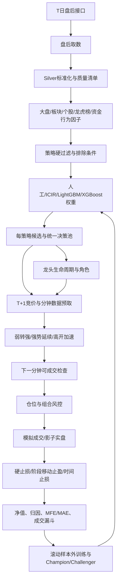

# 当前系统详细逻辑、模块审计与收益优化计划

> 审计日期：2026-07-18  
> 审计目标：在不牺牲时间可得性、可成交性和风险约束的前提下，提高候选股质量、模拟盘期望收益和未来实盘可复制性。  
> 重要说明：本文中的“提高收益率”是提高样本外期望收益和风险调整后收益，不构成收益承诺。

## 0. 重构实施状态（2026-07-20）

第一阶段“短线决策收敛”已完成：

1. 生产策略由 11 个收敛为 3 个：`mainline_leader`、`weak_to_strong`、`first_board_launch`。
2. 资金共振、龙虎榜、量价修复、板块持续性和封板质量不再单独制造候选列表，改为三类生产策略的增强证据。
3. 候选股、实时确认和回测默认读取同一组已启用生产策略；旧策略继续作为实验模板保留，但默认停用。
4. 每日决策池最多展示 3 只重点确认和 5 只盘中观察，其余股票折叠到“暂不参与”。
5. 模型健康与股票机会等级已分离。模型回退只显示“已回退”，不会把规则证据充分的股票连带降为 D。
6. 规则回退可以形成 B/C 级机会，但预期超额低于 `0.3%` 时最多进入盘中观察，不能进入重点确认。
7. 候选首屏只保留一句话结论、策略共识、所属主线、次日确认、失效条件和建议仓位；概率、区间、漂移和样本信息下沉到专业证据。

下一阶段应在新口径下重新生成历史策略产物，然后分别回测三类生产策略。旧的 `strategy_runs_*.json` 仍可用于页面兼容验证，但不能作为新策略收益结论。

第二阶段“生产执行链路统一”已完成：

1. 每日选股结束后新增唯一生产产物 `webdata/screening/decision_pool/decision_pool_YYYYMMDD.json`，三策略重复股票在此合并。
2. 合并结果保留全部命中策略、允许入场模式、行动分组、数据完整度、失效原因和执行仓位上限。
3. 实时行情默认优先读取“今日决策池”，逐股使用自己的执行契约，不再用一个策略参数覆盖整页股票。
4. 组合回测同时选择三类生产策略时，自动读取相同决策口径；`暂不参与`不会进入撮合，重点确认和盘中观察才会产生入场尝试。
5. 实时、策略训练和回测统一使用 `MinuteEntryEvaluator`，并统一归一化 `weak_to_strong/continuation/acceleration` 等策略别名。
6. 模型样本不足与行情数据缺失已拆分：模型回退且数据完整时，B/C级规则机会仍可进入观察；只有真实数据完整度不足才硬拦截。
7. 多策略命中同一股票时只生成一笔目标计划，入场模式取各策略并集，仓位上限取更保守值。

历史产物必须重新运行“选股策略”阶段才能生成决策池；无需重新取数或重算已经存在的因子。

## 1. 执行摘要

当前系统已经形成较完整的短线研究闭环：

```text
盘后取数 -> 标准化仓库 -> 因子计算 -> 多策略候选
        -> T+1分钟确认 -> 组合风控 -> 模拟成交
        -> 止损/移动止盈 -> 回测归因 -> 模型训练与发布
```

系统最有价值的部分不是某一个评分，而是以下基础已经打通：

1. 盘后数据、因子、选股三阶段解耦，历史数据可以重复使用。
2. T 日候选在 T+1 使用分钟行情确认，避免把盘后评分直接当成买点。
3. 弱转强、强势延续、高开加速具有统一的实时与回测判断器。
4. 涨跌停名单采用官方 `limit_list_d`，高开涨停但无法成交会记录为未成交信号。
5. 龙头不再等同于候选排名前三，而是按板块、辨识度、持续性、资金认可和风险识别。
6. 回测包含 T+1、费用、滑点、硬止损、移动止盈、时间止损、仓位和组合约束。
7. 模型具备滚动样本外、Purged split、概率校准、收益区间、漂移和发布闸门。

当前制约收益率的主要问题不是缺少更多算法，而是四条链路尚未完全闭合：

1. **策略配置多，真正训练成功的策略少。** 配置了多类策略，但当前本地仅发现 `default` 和 `short_term_alpha` 模型目录，其他策略多数只能使用人工权重或回退权重。
2. **训练样本与真实成交样本仍不完全等价。** 策略模型支持分钟真实买点标签，但默认模型仍可能使用次日开盘日线标签；两种口径不能混合比较。
3. **配置存在双重口径。** `risk_control.yaml` 声称是唯一风控来源，但 `BacktestConfig.from_risk_config()` 对市场阈值、止损和移动止盈进行了二次覆盖。
4. **成交漏斗过窄。** 最近可审计回测中，333 个候选只有 16 笔成交，分钟组合成交覆盖率约 4.8%。这可能过滤掉噪声，也可能因为分钟数据、板块同步、竞价数据或阈值过严错失机会，必须拆分原因验证。

因此，最优改造顺序应当是：

```text
统一口径与成交审计
-> 为每个策略重建真实成交标签
-> 分策略、分市场做样本外验证
-> 优化因子和入场阈值
-> 优化退出与组合分配
-> 影子盘验证后再用于实盘
```

## 2. 当前可用数据与基线事实

### 2.1 本地数据规模

截至审计日，DuckDB 中主要表的覆盖如下：

| 表 | 行数 | 日期范围 | 交易日数 |
| --- | ---: | --- | ---: |
| `stock_daily_silver` | 1,477,467 | 20250603-20260714 | 271 |
| `limit_up_pool_silver` | 19,071 | 20250512-20260714 | 286 |
| `limit_down_pool_silver` | 2,714 | 20250603-20260714 | 259 |
| `factor_market_wide` | 271 | 20250603-20260714 | 271 |
| `factor_sector_wide` | 383,729 | 20250603-20260714 | 271 |
| `factor_stock_wide` | 1,477,467 | 20250603-20260714 | 271 |
| `factor_value_long` | 61,133,849 | 20250603-20260714 | 271 |
| `factor_lhb_stock_wide` | 19,805 | 20250603-20260714 | 271 |
| `factor_signal_stock_wide` | 1,540,576 | 20250603-20260714 | 271 |

结论：日线和盘后因子样本已经足以支持规则统计、IC/IR 和基础机器学习；但一分钟行情、竞价、真实板块分钟宽度的覆盖率才决定“真实买点模型”是否有足够样本。日线行数多不等于可成交训练样本多。

### 2.2 当前模型状态

当前本地模型目录只发现：

- `default`
- `short_term_alpha`

`default/weights_20260707.json` 的状态为：

- `model_type = prior_fallback_unstable_dynamic_model`
- LightGBM 未通过样本外闸门。
- 当前实际使用先验或回退权重，不应把它解释成有效的 LightGBM 预测。

`short_term_alpha/weights_20260604.json` 的状态为：

- `model_type = ic_ir_constrained_blend`
- LightGBM 候选模型状态为 `rejected_oos_gate`。
- Rank IC 约 `0.0031`，区分能力很弱。
- 验证期仅 12 个交易日，其中强市 0 天、中性 6 天、弱市 6 天。
- Top decile 样本外超额收益约 `0.87%`，但市场状态覆盖不完整，不能直接发布。

这说明“模型降级”是合理保护，不应为了页面出现 A/B 评级而放松发布标准。真正要做的是增加策略真实成交样本和更合理的训练/验证折，而不是强行提高模型输出概率。

### 2.3 最近可审计回测基线

最近一份本地产物 `backtest_summary_20260711_143916.csv` 为主线龙头策略对照回测：

| 指标 | 结果 |
| --- | ---: |
| 区间 | 20250601-20260711 |
| 初始资金 | 200,000 |
| 总收益率 | +3.11% |
| 年化收益率 | +2.90% |
| 最大回撤 | -1.95% |
| Sharpe | 0.76 |
| 已平仓交易 | 16 |
| 胜率 | 37.5% |
| 盈亏比 | 2.90 |
| 候选数 | 333 |
| 分钟组合成交数 | 16 |
| 成交覆盖率 | 4.8% |
| 硬止损/跳空止损 | 10 笔 |
| 移动止盈 | 4 笔 |
| 时间止损 | 2 笔 |

该批次关闭了组合风控，且只运行 `mainline_leader`，因此不能代表整个系统的最终能力。但它暴露出三个事实：

1. 胜率偏低，但盈亏比尚可，不能简单改成更紧止盈来追求表面胜率。
2. 止损占已平仓交易的 62.5%，入场确认或候选质量仍需提高。
3. 成交样本只有 16 笔，任何按排名、市场状态或因子得出的结论都不稳定。

## 3. 完整业务逻辑



### 3.1 盘后取数

入口为 `ETLDailyPipeline.fetch_data()`：

1. 检查当日接口清单和 Silver 表是否完整，完整时跳过远端请求。
2. 一次性获取涨停、跌停、全市场日线、股票基础、每日指标、指数、板块、资金流、龙虎榜、热度、融资、大宗交易和事件数据。
3. 股票代码、板块代码、日期和金额单位在数据层统一。
4. 写入 DuckDB，并保留 Parquet/CSV 降级文件和质量清单。
5. 页面查询只读本地数据，实时行情是唯一允许盘中更新的数据域。

### 3.2 因子计算

`FactorJobRunner` 按顺序执行：

1. `MarketFactorJob`：市场趋势、量能、宽度、涨跌停、情绪与周期。
2. `LHBFactorJob`：个股龙虎榜、机构、席位、重复上榜、拥挤和板块龙虎榜共振。
3. `ShortSignalFactorJob`：多源资金流、热度、KPL、融资、事件风险和板块资金价格共振。
4. `SectorFactorJob`：板块动量、成交额、量能、持续性、主线、轮动和行为阶段。
5. `StockFactorJob`：技术、流动性、趋势位置、成交额目标区间、身位、板块映射、相对强度和行为阶段。

结果同时保存在宽表和 `factor_value_long`。因子计算已经与模型训练解耦，月首不会隐式训练模型。

### 3.3 策略筛选

`ScreeningEngine` 对每个启用策略执行：

1. 从 `factor_stock_wide` 读取当日全量股票。
2. 判断市场状态：强市、震荡/中性、弱市。
3. 应用策略适用市场，不适用时输出空候选而不是硬凑股票。
4. 应用股票池、必选条件和排除条件。
5. 使用候选池分位排名，减少因子接近 100 分的饱和问题。
6. 按人工、IC/IR、LightGBM 或 XGBoost权重排序。
7. 叠加龙虎榜、资金流、热度和风险调整。
8. 计算概率、预期总收益/超额收益、止损概率、区间、可信等级和模型状态。
9. 每策略落盘独立结果，再合并成去重后的“今日决策池”。

当前主要策略包括默认综合、精选接力、主线龙头、超短打板、首板启动、资金共振、量价修复、弱转强、趋势主升、震荡防守和弱市试仓。

### 3.4 龙头识别

`LeaderPoolService` 使用最近若干交易日的候选、涨停池和板块成分，计算：

- 板块地位：主线、持续性、共振。
- 市场辨识度：身位、封板、KPL、热度和行为加速。
- 身份持续性：历史龙头事件和候选出现次数。
- 资金认可：龙虎榜、机构和多源资金流。
- 接力安全：量能健康、席位拥挤、事件风险和衰退程度。

龙头按角色区分为核心龙头、板块龙头和情绪龙头，并保留萌芽、确认、分歧、修复、衰退等生命周期标签。

### 3.5 T+1盘中确认

盘中观察的是 T 日盘后候选，但价格必须使用 T+1 当日行情：

- **弱转强**：开盘约 -3% 到 +1%，不破前 5 分钟低点，收复昨收、站上 VWAP、突破前 5 分钟高点、板块同步、成交进度合理。
- **强势延续**：开盘约 +1% 到 +5%，竞价量额合格，回踩 VWAP 承接或突破前 5 分钟高点，板块同步、成交进度合理。
- **高开加速**：高开超过 +5%，只允许龙头/主线核心，必须存在可成交分钟；封死涨停记为“信号正确但无法成交”。

信号在下一分钟开盘价撮合。缺分钟、竞价、板块或成交进度数据时返回“数据不足”，不能伪造确认。

### 3.6 仓位与组合风控

仓位支持固定账户风险和保守凯利：

- 固定风险根据止损距离反推仓位。
- 凯利只使用当时已经平仓的历史样本，样本不足时回退固定风险。
- 单票、总仓、现金、持仓数、板块集中度、流动性和相关持仓共同限制最终仓位。
- 弱市策略可以小仓试错，但不能用满仓弥补低胜率。

### 3.7 退出与净值

当前退出顺序：

1. 跳空跌破止损线时按开盘价止损。
2. 盘中触及硬止损线时按止损价成交。
3. 盈利达到激活线后，根据历史最高价和盈利阶段执行高点回落退出。
4. 持仓超过时间阈值且收益不足时执行时间止损。
5. 卖出计入滑点、佣金和印花税。

### 3.8 模型与可信度

模型训练采用：

- IC/IR 动态权重及反向因子识别。
- 高相关因子去重。
- LightGBM Ranker、三分类 Meta-Label、收益回归和独立止损模型。
- Purged monthly walk-forward，避免未来标签重叠泄漏。
- Platt 概率校准、Brier/ECE 和 Conformal 收益区间。
- 分市场漂移基准和模型自动回退。
- 收益分组单调、最近三个月至少两个月 Rank IC 为正等发布闸门。

可信度分为数据、模型、交易和组合四层。模型状态与股票等级分开：模型失效只停用对应模型，规则回退结果仍可产生 A/B/C/D，但必须使用回退模型自己的样本外证据。

## 4. 模块优缺点与改进计划

| 模块 | 优点 | 当前缺点/风险 | 改进计划 | 优先级 |
| --- | --- | --- | --- | --- |
| 盘后取数 | 接口集中、可跳过已完成日期、页面不重复调接口 | 增强接口缺失会使部分策略长期中性；缺少跨源一致性评分 | 为每个策略生成“必需数据覆盖率”；缺关键源时停用对应增强，不把 50 分当真实证据 | P0 |
| Silver仓库 | 日期、代码、金额统一；DuckDB 查询快 | `factor_value_long` 已超 6100 万行，批量训练内存和扫描成本高 | 按日期分区增量写；训练优先读宽表；长表只保留解释与稀疏因子；增加压缩和归档 | P0 |
| 因子计算 | 大盘、板块、个股、龙虎榜、行为因子较完整 | 大量 0-100 二次评分会损失原始量纲；缺失值 50 可能形成虚假中性共识 | 同时保留原值、分位和缺失标记；模型只使用点时可得原值/稳定变换；增加因子新鲜度 | P0 |
| 市场状态 | 已区分强/中/弱并按状态选参考样本 | 阈值状态、HMM状态和执行市场阈值并存；状态样本可能严重不均衡 | 建立唯一 `MarketStateSnapshot`；规则和模型共用；状态子模型样本不足时回退全局模型 | P0 |
| 策略配置 | 规则透明，可配置股票池、过滤、权重、市场和入场模式 | 策略数量多但训练产物少；多个策略使用相近因子，策略共识可能是假共识 | 每策略建立数据覆盖、训练状态、OOS表现卡；按因子族计算独立共识，不按策略数量简单投票 | P0 |
| 候选排序 | 分位排名、惩罚项和增强项可解释 | 排名目标与真实净收益不完全一致；默认模型仍可能用次日开盘标签 | 每策略只使用历史候选及真实分钟成交标签；排序目标改为扣费后收益/效用 | P0 |
| 模型训练 | 有Purged OOS、校准、区间、漂移和发布闸门 | 当前大部分模型未训练或未过闸；验证月份/市场状态不足；全量默认模型样本稀释 | 扩大按月训练折；先训练高覆盖策略；不足样本的策略明确保持规则模式 | P0 |
| 可信度 | 概率、基准、区间、止损和四层可信度可审计 | 数字过多；回退规则的历史证据可能与原模型证据混用 | 页面首屏只显示结论、优势、风险和确认条件；模型/规则分别校准和评级 | P1 |
| 龙头池 | 已取消“前三即龙头”，有角色、生命周期和风险 | 仍有候选结果依赖，真正全市场龙头可能不在候选策略中；部分权重仍为人工 | 以全量涨停池+板块成分为主宇宙；验证未来相对板块强度和带动宽度；学习角色概率 | P1 |
| 板块热度 | 有主线、持续性、轮动、资金和涨停梯队 | 板块映射多标签易稀释；实时同步在部分场景使用同伴股代替指数宽度 | 建立主板块归属置信度；使用真实板块指数+成分涨跌宽度+涨停扩散 | P0 |
| 分钟入场 | 三模式统一；下一分钟成交；封板不可买处理正确 | 条件组合严格导致成交覆盖低；固定成交进度区间未按策略/流动性充分分层 | 输出逐层失败原因；按流动性、策略、时间训练成交进度；阈值只用OOS搜索 | P0 |
| 实时缓存 | 避免多用户重复行情请求；只在交易窗口刷新 | 单进程缓存仍可能受部署Worker影响；数据源失败时可观测性不足 | Redis保存行情、任务状态和最后成功时间；显示数据源与延迟；多源质量切换 | P1 |
| 回测引擎 | T+1、分钟入场、费用、未成交、接力状态和归因较完整 | 统一风控声明与Backtest二次覆盖冲突；日线退出存在OHLC顺序不确定；批次可比性不足 | 风控参数单一来源；首日/退出日尽量用分钟撮合；保存代码、配置、数据版本hash | P0 |
| 退出策略 | 硬止损+阶段回撤，不固定封顶盈利 | 所有策略使用近似退出参数；短线接力、趋势主升不应共用持有周期和回撤距离 | 按策略训练退出；比较固定止损、ATR止损、结构止损和分段回撤；只用OOS选择 | P1 |
| 仓位管理 | 固定风险与1/4凯利并存，能限制单笔损失 | 样本少时凯利不可靠；组合相关性主要依赖板块标签 | 默认固定风险；凯利只对稳定策略开放；用收益相关矩阵和CVaR控制组合尾部 | P1 |
| 回测归因 | 有排名、因子、退出和入场模式报表 | 样本量小时仍容易产生看似明确的结论；缺完整漏斗 | 增加候选->数据->信号->成交->风控拒绝->退出漏斗，并显示贝叶斯区间 | P0 |
| 自动任务 | 内置18:30流水线、09:25竞价和自动报告 | 因子/回测仍可能占满低配服务器；调度与Web同进程会互相影响 | 重任务独立子进程/队列；资源限额、超时、心跳和可恢复分片 | P0 |
| Web产品 | 数据浏览、策略、回测、权限和用户管理完整 | 专业字段多，决策页信息负担仍高 | 普通用户只看决策池和行动组；专业证据折叠；所有结论附失效条件 | P1 |

### 4.1 实施验收状态（2026-07-18）

上述 18 个模块的工程改造已全部落地。这里的“完成”指代码路径、降级路径、审计字段、页面入口和测试契约已经存在；需要历史分钟样本的模型仍必须通过样本外发布闸门，不能因为工程完成就伪造 A/B 信号。

| 模块 | 已落地能力 | 主要验收位置 |
| --- | --- | --- |
| 盘后取数 | 记录增强数据源覆盖率、缺失源和新鲜度；缺源时只停用相应增强 | `StrategyDiagnosticsService.source_coverage`、`ScreeningEngine._disable_missing_source_enhancements` |
| Silver仓库 | 训练优先宽表；长表支持按日期归档、ZSTD压缩、校验后裁剪和在线瘦身，默认仅预演 | `core/etl/factor_store_maintenance.py`、`scripts/maintain_factor_store.py` |
| 因子计算 | 长表同时保存原值、评分、缺失标记和新鲜度；缺失可选源写NULL，不再写虚假中性分 | `FactorJobResult.source_coverage`、`make_long_record`、`StockFactorJob` |
| 市场状态 | 规则、筛选、漂移和训练统一使用强/中/弱点时快照 | `core/models/market_state.py` |
| 策略配置 | 每策略训练规格、数据覆盖、模型状态、OOS表现和独立证据族已解耦 | `strategy_profiles.py`、`strategy_diagnostics.py`、`strategy_allocator.py` |
| 候选排序 | 每策略使用自己的历史候选和真实分钟成交标签，以扣费后收益和排序效用训练 | `strategy_training.py`、`factor_library.py` |
| 模型训练 | Purged逐月滚动、市场状态回退、模型闸门、内存友好宽表读取和规则模式降级 | `scripts/train_factor_library.py`、`factor_library.py` |
| 可信度 | 模型状态与股票等级分离；规则回退独立评级；决策页首屏只保留行动信息 | `confidence_service.py`、`decision_pool_service.py` |
| 龙头池 | 使用涨停池、热点板块成分和强势补充宇宙，不再把候选前三等同龙头 | `leader_pool_service.py`、龙头结果标签与生命周期页面 |
| 板块热度 | 增加真实成分涨跌宽度、官方涨停扩散、宽度加速度和主板块归属证据 | `sector_factor_job.py` |
| 分钟入场 | 三模式逐层失败原因、按流动性成交进度、下一分钟成交和封板不可成交 | `minute_entry.py`、`minute_amount_profile.py`、`run_audit.py` |
| 实时缓存 | Redis共享行情和任务锁；记录最后成功时间、来源、延迟和错误；交易窗口外不轮询 | `shared_state.py`、`web/realtime_cache.py` |
| 回测引擎 | 风控单一来源；分钟顺序退出；日线降级路径显式；配置、代码和数据截止hash | `backtest_engine.py`、`run_audit.py` |
| 退出策略 | 支持策略默认、固定、ATR、结构、分段回撤和仅采用历史OOS通过版本；页面可选 | `exit_policy.py`、`scripts/compare_exit_policies.py` |
| 仓位管理 | 默认固定风险；凯利带样本门槛；组合加入收益相关矩阵、风险平价和CVaR报告 | `strategy_allocator.py`、`risk/portfolio_allocator.py` |
| 回测归因 | 候选到成交完整漏斗；排名和因子胜率增加Beta-Binomial区间 | `run_audit.py`、`attribution.py`、回测页面 |
| 自动任务 | 重任务隔离进程；线程限制、超时、阶段心跳、RSS限制和失败续跑进度 | `internal_scheduler.py`、`automation_daily_worker.py` |
| Web产品 | 决策池按重点确认/盘中观察/暂不参与分组；专业证据折叠；退出模型可选 | 候选页、回测页和复盘助手 |

### 4.2 不能被“工程完成”替代的数据验收

以下三项必须由真实历史数据生成，系统会拒绝用默认数值伪造：

1. 每个策略的已成交分钟训练样本、逐月样本外预测和校准曲线。
2. `exit_policy_oos.json` 中按策略发布的退出方案；没有通过OOS时回退策略默认参数。
3. 龙头角色概率和板块同步成功率；样本不足时只显示规则证据和数据不足。

完成历史补算后，应按“数据覆盖 -> 训练 -> 回测 -> 发布”顺序验收，而不是手工提高概率或放宽A/B阈值。

## 5. 直接影响收益率的核心问题

### 5.1 候选质量和成交质量尚未分开评价

应同时计算两套指标：

**候选层**：不考虑买点，统计未来 1/3/5 日相对大盘和板块的收益、MFE、MAE。  
**交易层**：只统计真实分钟确认且下一分钟可成交的样本，计算扣费后收益。

候选层好、交易层差，说明入场/退出需要改；候选层也差，才说明因子和策略需要改。不能用最终收益直接否定所有上游模块。

### 5.2 策略共识可能重复计算同一信息

主线龙头、资金共振、超短接力都使用板块共振、相对强度、量能和龙虎榜。一个股票命中 4 个策略，不等于有 4 份独立证据。

建议把证据归并成独立因子族：

1. 市场和情绪。
2. 板块主线与扩散。
3. 个股相对强度和结构。
4. 成交与流动性。
5. 资金流和龙虎榜。
6. 行为生命周期。
7. 可成交性和风险。

“策略共识”应改成“独立证据共识”，并使用各策略在当前市场状态下的样本外权重。

### 5.3 分钟确认覆盖率过低

必须为每个候选记录唯一失败原因：

```text
缺分钟数据
缺竞价数据
缺板块同步数据
开盘不在策略模式
跌破开盘低点
未收复昨收
未站上VWAP
未突破前5分钟高点
成交进度过弱
成交进度过热
板块未同步
确认后封板无法成交
仓位/现金/组合风控拒绝
```

只有这样才能判断应该补数据、放宽哪条规则，还是保持拒绝。不能把所有未成交统一解释成“没有买点”。

### 5.4 退出参数没有充分策略化

建议按策略区分：

| 策略 | 主要退出目标 |
| --- | --- |
| 首板/超短接力 | 快速识别失败，结构破坏优先，持有1-3日 |
| 弱转强/资金共振 | 允许正常回踩，观察3日内兑现 |
| 主线龙头 | 以板块地位和高点回落为主，允许利润奔跑 |
| 趋势主升 | ATR/均线结构止损，持有5-10日 |
| 弱市试仓 | 更小仓位、更快失败退出，不靠放宽止损提高胜率 |

### 5.5 当前训练样本并不足以支持全部策略模型

建议模型发布最低条件：

- 至少 60 个有真实成交样本的交易日。
- 至少 200 笔真实成交样本；不足时只允许规则模式。
- 至少 3 个样本外月份。
- 最近 3 个样本外月份中至少 2 个月正收益或正 Rank IC。
- Top 组长期优于第 2、3 组。
- 扣费后 Profit Factor 大于 1.2。
- Brier 不差于历史基准概率。
- 漂移时自动停用模型，不停用规则策略。

市场状态子模型样本不足时，不应硬训练三套模型；应使用全局模型加市场状态特征，等单状态样本充足后再拆分。

## 6. 收益优化实施路线

### Phase 0：建立不可争议的基线（1周）

1. 统一 `RiskConfig` 和 `BacktestConfig`，删除市场阈值、止损和移动止盈的隐式二次覆盖。
2. 每次回测保存代码版本、策略版本、配置hash、模型版本、数据截止日和成本参数。
3. 建立完整成交漏斗和缺失数据报表。
4. 分别固定运行所有策略的规则基线，不启用机器学习。
5. 输出按月、市场状态、策略、入场模式和退出原因的净收益。

验收标准：同一数据和配置重复运行结果完全一致；所有候选都能追溯到唯一未成交/退出原因。

### Phase 1：重建策略真实标签（1-2周）

1. 为每个策略缓存 T+1 一分钟、竞价和板块宽度数据。
2. 仅使用“确认后下一分钟真实可成交”的样本训练交易模型。
3. 未确认和封板买不到的股票保留在信号评估中，但不进入已成交收益标签。
4. 分策略使用不同周期：接力1-2日、修复3日、趋势5-10日。
5. 同时生成总收益、超额收益、MFE、MAE、先止损概率和交易成本。

验收标准：每个模型产物明确写出候选数、分钟覆盖数、信号数、可成交数、排除原因和有效标签数。

### Phase 2：策略与因子实验（2-4周）

按以下矩阵逐月滚动验证：

| 市场 | 主策略 | 辅助策略 | 仓位原则 |
| --- | --- | --- | --- |
| 强市 | 主线龙头、超短接力、首板启动 | 资金共振 | 3-5只，按风险预算分配 |
| 中性 | 弱转强、资金共振、量价修复 | 主线龙头 | 2-3只，只做确认信号 |
| 弱市 | 震荡防守、弱市试仓 | 独立强势龙头 | 1-2只，单票5%-8% |

每个策略比较：

- 人工权重基线。
- IC/IR动态权重。
- LightGBM排序。
- XGBoost排序。
- 规则+模型Meta-Label。

模型目标优先使用扣费后收益排序和期望效用，而不是只优化“是否强势”的分类准确率：

```text
期望值 = 成功概率 × 平均盈利
       - 失败概率 × 平均亏损
       - 交易成本
       - 尾部风险惩罚
```

### Phase 3：入场与退出优化（2周）

入场仅对训练区间搜索阈值，在下一个月验证：

- 开盘分层边界。
- 确认截止时间。
- VWAP停留时间。
- 假突破次数。
- 成交进度区间。
- 板块宽度阈值。
- 竞价量额阈值。

退出对照：

- 固定硬止损。
- ATR动态止损。
- 开盘结构/前低止损。
- 分段移动回撤。
- 板块转弱退出。
- 时间止损。

验收必须同时看胜率、平均收益、Profit Factor、最大回撤、Calmar、MFE捕获率和MAE，不能只挑总收益最高参数。

### Phase 4：组合分配器（1-2周）

1. 同一股票只保留一笔目标仓位，合并不同策略证据。
2. 策略权重由当前市场状态下的滚动样本外表现决定。
3. 对同板块、同概念和收益高度相关股票限仓。
4. 默认固定风险仓位；稳定策略才允许1/4凯利。
5. 使用CVaR或历史压力场景限制尾部风险。

### Phase 5：影子实盘和生产发布（至少1个月）

1. 每日09:25生成竞价预警，09:30-10:00记录所有信号和未成交原因。
2. 不下单，只记录当时真实可见数据和下一分钟可成交价格。
3. 比较模拟回放与实时影子盘是否一致。
4. 连续至少20个交易日无时间穿越、无数据回填、无成交差异后，才允许小资金人工跟随。
5. 新模型作为 Challenger，连续通过样本外和影子盘闸门后替换 Champion。

## 7. 页面应该如何服务交易决策

普通用户首屏只需要三层：

### 7.1 今日决策池

去重后只展示 5-8 只：

- 一句话结论。
- 独立证据共识。
- 所属主线和板块强度。
- 明日适合的入场模式。
- 确认条件与失效条件。
- 建议风险仓位。
- 模型状态和股票等级分开显示。

### 7.2 行动分组

| 分组 | 条件 |
| --- | --- |
| 重点确认 | A/B级、预期超额≥0.3%、数据完整、策略适配 |
| 盘中观察 | C级，或预期超额不足但结构有优势 |
| 暂不参与 | D级、数据不足、不可成交、策略不适用或风险过高 |

### 7.3 专业证据

因子、SHAP、Brier/ECE、PSI/KS、样本区间、原始指标和模型版本全部下沉到展开区。专业证据用于复核，不应让用户在几十个指标中自行拼答案。

## 8. 建议的核心指标看板

### 8.1 候选层

- Top 1/3/5未来1、3、5日总收益和超额收益。
- 十分位收益单调性。
- 候选覆盖交易日比例。
- 相对板块强度和主线命中率。

### 8.2 交易层

- 候选数、信号数、可成交数和成交覆盖率。
- 净胜率、平均盈利、平均亏损、盈亏比、Profit Factor。
- MFE、MAE、MFE捕获率。
- 止损率、跳空止损率、移动止盈率、时间止损率。
- 分钟数据、竞价和板块数据完整率。

### 8.3 组合层

- 总收益、年化、最大回撤、Sharpe、Calmar。
- 单月收益分布和亏损月份比例。
- 板块集中度、相关持仓、资金利用率。
- Monte Carlo亏损概率和回撤区间。

### 8.4 模型层

- OOS Rank IC、NDCG和Top组净收益。
- Brier、ECE和概率校准曲线。
- PSI/KS漂移及生效/降级时间线。
- 每策略真实成交样本数和市场状态覆盖。
- Champion与Challenger的样本外差异。

## 9. 建议立即执行的五项工作

1. **统一风控和回测参数来源。** 这是所有历史结果可比较的前提。
2. **建设成交漏斗。** 先解释333个候选为何只成交16笔，再决定是否放宽规则。
3. **只训练样本够用的策略。** 优先 `short_term_alpha`、弱转强和资金共振；其余先保持规则模式。
4. **重跑全策略规则基线。** 使用相同区间、成本和风控，生成策略×市场状态矩阵。
5. **把退出策略按策略拆分。** 当前高止损占比需要判断是入场错误还是统一退出参数不适合。

## 10. 最终判断

当前系统适合作为“可审计的短线研究和交易确认平台”，但还不应把某个模型概率或综合评分直接当作稳定买入依据。它的工程基础已经明显强于普通复盘工具，下一阶段不应继续堆叠页面和因子，而应把资源集中在：

```text
真实成交标签
+ 分策略样本外验证
+ 配置口径统一
+ 成交漏斗诊断
+ 策略化退出
+ 组合风险预算
```

当系统能够稳定回答以下五个问题时，模拟盘和未来实盘才具备持续提高的基础：

1. 这只股票为什么进入候选，证据是否相互独立？
2. 次日是否出现真实、可成交、可复现的买点？
3. 当前市场状态下，该策略历史样本外是否有正期望？
4. 买入后失效条件是什么，最大可承受损失是多少？
5. 这笔交易加入现有组合后，是否提高组合期望值而不是只增加风险？

## 11. 改进计划实施状态（2026-07-18）

本节记录本轮已经落到代码中的改造，以及仍需通过历史重训和影子盘验证的工作。代码完成不等于收益已经得到证明；模型、参数和策略只有通过样本外闸门后才允许成为正式版本。

### 11.1 已完成的工程改造

| 模块 | 已实施内容 | 主要产物/诊断 |
| --- | --- | --- |
| 配置与审计 | 风控、市场状态、回测参数统一从 `risk_control.yaml` 投影，不再由回测层暗中覆盖；每次回测保存代码、配置、模型、数据截止日和成本口径 | `backtest_manifest_*.json` |
| 成交漏斗 | 对候选、市场门槛、数据缺失、分钟确认、不可成交、仓位、现金和组合约束逐层计数；补齐固定基线与分钟模式的稳定失败原因码 | `backtest_entry_funnel_*.csv`、回测页“候选到成交漏斗” |
| 分钟标签 | 策略候选按 T+1 分钟顺序确认，下一分钟开盘成交；缺分钟、竞价、板块和成交进度时明确排除；使用有界缓存和单一只读 DuckDB 连接 | 策略训练审计中的候选数、成交样本数、排除原因 |
| 策略训练 | 各策略使用独立候选、入场模式和收益周期；正式策略因子优先直接读取物化宽表，不再扫描 6100 万行因子长表；全策略训练按子进程串行执行，单策略结束后由操作系统回收内存 | 独立策略模型目录、训练报告 |
| 标签与基准 | 使用真实市场基准；所属板块收益按“交易日+板块名称”去重后连接，避免板块代码口径不一致导致全量回退 | 总收益、市场收益、板块收益、超额收益、MFE/MAE |
| 模型发布 | 增加训练天数、真实成交样本、OOS 月份、Profit Factor、Brier、分组单调性和最近月份闸门；未通过模型只能作为 Challenger | `publication_gate` 及拒绝原因 |
| 市场状态 | 大盘环境、筛选、可信度和回测统一使用同一市场状态快照与阈值 | `market_state_snapshot` |
| 因子质量 | 原始缺失值不再伪装成中性值；长表记录 `is_missing` 和 `freshness_date` | 因子覆盖率和新鲜度诊断 |
| 退出策略 | 止损、移动回撤、时间退出按策略配置，不再强迫所有短线模式共用一套退出参数 | 策略档案 `execution.exit` |
| 组合分配 | 同股多策略证据合并，按独立证据族计数；增加单票尾部损失与组合压力损失预算 | 分配结果中的证据族、尾部损失和累计压力损失 |
| 调度稳定性 | 18:30 日任务改为独立子进程，日志和结果原子落盘，失败时保留具体阶段，不再把 Web 进程内存一并拖垮 | `logs/automation_YYYYMMDD.log` |
| 页面 | 回测页增加成交漏斗；策略实验室展示因子、分钟数据覆盖率、训练样本、OOS 月份、运行模式和诊断结论 | 页面诊断区 |

### 11.2 推荐运行顺序

1. 先完成原始数据获取和当日因子计算，确认 DuckDB 数据截止日一致。
2. 对历史区间运行策略独立训练，4GB 服务器必须使用串行子进程模式：

```bash
python3 scripts/train_factor_library.py \
  --start 20250603 \
  --end 20260714 \
  --all-strategies \
  --walk-forward \
  --train-months 12
```

3. 查看每个策略报告中的真实成交样本、OOS 月份和 `publication_gate`。未通过闸门时继续使用规则/IC-IR Champion，不应强行启用 LightGBM。
4. 使用同一历史区间、成本和风控参数重跑回测，先查看成交漏斗，再比较策略表现。
5. 新模型至少运行 20 个交易日影子盘，确认实时信号、分钟回放和下一分钟成交一致后，再考虑小资金人工跟随。

### 11.3 4GB 服务器建议配置

```env
DUCKDB_MEMORY_LIMIT=1400MB
DUCKDB_THREADS=1
AUTOMATION_DAILY_TIMEOUT=21600
```

同时应配置 4-8GB swap，并确保 DuckDB 临时目录位于剩余空间充足的磁盘。训练与因子计算不应和批量回测并行；Web 服务可以继续运行，但重任务必须通过独立子进程串行执行。

### 11.4 尚需数据验证的事项

- 重新生成历史真实分钟成交标签；没有 T+1 分钟数据的策略不能声称完成模型训练。
- 用相同口径重跑全策略规则基线，形成“策略 × 市场状态”矩阵。
- 检查候选十分位收益单调性、月度样本外 Profit Factor、最大回撤和成交覆盖率。
- 对策略化退出做参数对照，只允许训练期选择参数，并在后续月份验证。
- 连续至少 20 个交易日执行影子盘；任何时间穿越、数据回填或成交差异都应重新计时。

因此，本轮已经完成的是“可复现、可审计、可诊断的优化基础设施”。是否提高模拟盘和未来实盘收益，最终由滚动样本外结果、成交漏斗和影子盘决定，而不是由训练集内收益决定。
