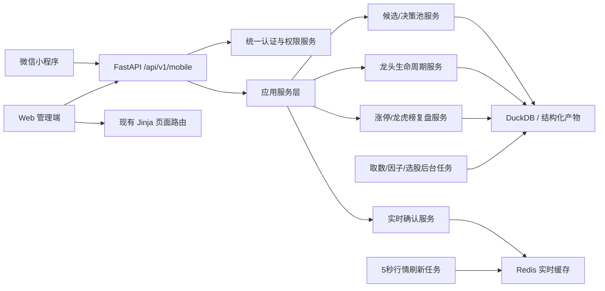
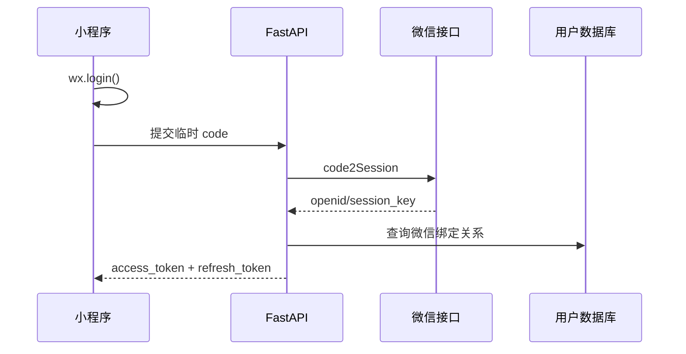
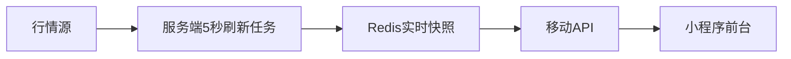

# A股短线系统微信小程序改造计划

## 1. 改造目标

在保留现有 Web 管理端的前提下，新增微信小程序客户端，让用户在手机上完成高频查看与盘中决策。

本次改造遵循四个原则：

1. **业务逻辑只保留一套**：候选股、龙头池、涨停梯队、盘中确认和风险结论均由现有 Python 后端计算。
2. **小程序只消费结果**：小程序不直接访问 Tushare、行情源、DuckDB 或原始文件。
3. **管理与交易决策分离**：数据任务、因子配置、策略研究、回测和用户管理继续留在 Web 管理端。
4. **默认只读**：普通小程序用户只能查看已生成的数据、接收提醒和记录个人关注，不允许运行取数、因子或选股任务。

## 2. 产品边界

### 2.1 小程序首版保留

| 模块 | 功能 |
| --- | --- |
| 今日 | 市场状态、今日决策池、重点确认、盘中观察、风险提示 |
| 候选股 | 三类核心策略结果、策略共识、主线题材、次日确认条件 |
| 实时确认 | 昨日候选的当日行情、弱转强、强势延续、高开加速状态 |
| 龙头池 | 连板龙头、趋势龙头、板块龙头、情绪龙头及历史时效 |
| 涨停复盘 | 涨停梯队、概念连板梯队、炸板与跌停概览 |
| 龙虎榜 | 按股票、按知名席位查看客观交易明细 |
| 个股详情 | 日K、分时、所属行业/概念、命中策略、交易条件 |
| 我的 | 账号状态、到期日、设备会话、关注列表、消息设置 |

### 2.2 小程序首版不做

- 盘后取数、批量取数。
- 因子计算和历史重算。
- 策略组合编辑与因子权重研究。
- 模型训练、发布和训练诊断。
- 模拟交易参数配置和完整回测实验。
- 用户、角色、权限矩阵管理。
- 原始数据表和专业因子宽表浏览。
- 系统日志和服务器运维。

这些功能继续由 Web 管理端承载。小程序可提供“在电脑端管理”的只读提示，不嵌入后台页面。

## 3. 推荐总体架构



### 3.1 不采用的方案

**不建议使用 WebView 直接嵌入现有网站作为正式方案。**

WebView 只能快速验证页面，但存在登录态、导航体验、审核、屏幕适配和性能问题，也无法形成自然的小程序交互。可在内部演示阶段临时使用，正式版应调用 JSON API。

## 4. 后端改造

## 4.1 提取应用服务层

当前部分业务组装逻辑仍在 `web/app.py` 的路由函数内。应逐步提取为与客户端无关的应用服务：

```text
core/application/
├─ dashboard_service.py
├─ candidate_service.py
├─ intraday_decision_service.py
├─ leader_view_service.py
├─ limitup_review_service.py
├─ lhb_view_service.py
├─ stock_detail_service.py
└─ user_profile_service.py
```

Web 页面和小程序 API 调用同一服务，禁止分别实现候选排序、龙头分类或盘中状态判断。

## 4.2 新增版本化移动 API

建议新增独立路由：

```text
web/api/mobile/
├─ router.py
├─ auth.py
├─ dashboard.py
├─ candidates.py
├─ realtime.py
├─ leaders.py
├─ limitup.py
├─ lhb.py
├─ stocks.py
└─ profile.py
```

统一前缀：

```text
/api/v1/mobile/*
```

建议接口：

| 方法 | 路径 | 说明 |
| --- | --- | --- |
| POST | `/api/v1/mobile/auth/wechat` | 使用 `wx.login` 的临时 code 登录 |
| POST | `/api/v1/mobile/auth/bind` | 绑定现有付费账号 |
| POST | `/api/v1/mobile/auth/refresh` | 刷新访问令牌 |
| POST | `/api/v1/mobile/auth/logout` | 退出当前设备 |
| GET | `/api/v1/mobile/bootstrap` | 当前用户、权限、交易日、市场状态 |
| GET | `/api/v1/mobile/dashboard` | 今日首页聚合数据 |
| GET | `/api/v1/mobile/candidates` | 今日决策池 |
| GET | `/api/v1/mobile/candidates/{code}` | 候选证据详情 |
| GET | `/api/v1/mobile/realtime` | 当日实时确认列表 |
| GET | `/api/v1/mobile/leaders` | 近期龙头池 |
| GET | `/api/v1/mobile/limitup` | 涨停与概念连板梯队 |
| GET | `/api/v1/mobile/lhb` | 龙虎榜股票/席位视图 |
| GET | `/api/v1/mobile/stocks/{code}` | 个股概览 |
| GET | `/api/v1/mobile/stocks/{code}/minute` | 当日分时 |
| GET | `/api/v1/mobile/stocks/{code}/daily` | 日K |
| GET | `/api/v1/mobile/profile` | 订阅和设备状态 |
| PUT | `/api/v1/mobile/watchlist/{code}` | 关注股票 |
| DELETE | `/api/v1/mobile/watchlist/{code}` | 取消关注 |

## 4.3 统一响应格式

所有移动 API 使用稳定结构：

```json
{
  "ok": true,
  "data": {},
  "meta": {
    "trade_date": "20260730",
    "generated_at": "2026-07-30 18:35:20",
    "source_status": "ready",
    "is_realtime": false,
    "cache_age_seconds": 0,
    "request_id": "..."
  },
  "error": null
}
```

错误响应不能返回 HTML，避免小程序把 `Internal Server Error` 当 JSON 解析：

```json
{
  "ok": false,
  "data": null,
  "error": {
    "code": "SUBSCRIPTION_EXPIRED",
    "message": "服务已到期"
  }
}
```

## 4.4 DTO 与字段治理

新增 `web/api/schemas/`，使用 Pydantic 定义移动端 DTO。不要把 DuckDB 整行或内部诊断字典直接返回前端。

候选股首屏 DTO 只保留：

- 股票代码、名称。
- 行业、核心题材。
- 行动分组。
- 命中策略与策略共识数。
- 一句话结论。
- 次日确认条件。
- 失效条件。
- 建议仓位。
- 数据时间和状态。

专业因子放入 `evidence` 子对象，按需加载。

## 5. 登录、订阅与权限

## 5.1 微信登录流程



要求：

- `AppSecret` 只能保存在服务器环境变量，不能放进小程序代码。
- 小程序不复用浏览器 Cookie，改用短期访问令牌。
- 访问令牌建议 30 分钟，刷新令牌建议 7 天。
- 服务端保存令牌哈希、设备标识、IP、最后访问时间。
- 沿用现有“新设备登录踢旧设备/拒绝登录”和最大会话数策略。

## 5.2 现有账号绑定

首版推荐“微信身份 + 现有付费账号”双层体系：

1. 用户微信登录。
2. 首次使用输入现有账号密码或后台生成的一次性绑定码。
3. 服务器把 `openid` 绑定到用户 ID。
4. 后续微信登录直接读取该账号的角色、到期日和禁用状态。

禁止只凭 `openid` 自动创建无限期账号。

## 5.3 权限模型

复用现有角色和权限矩阵，但新增客户端维度：

```text
permission_key
├─ web_visible
├─ mini_visible
├─ can_access
└─ forced_admin
```

后台任务、参数配置、因子管理、策略编辑、回测运行、用户管理始终为管理员专属，并且 `mini_visible=false`。

所有 `/api/v1/mobile/*` 路由必须统一检查：

- 登录状态。
- 账号是否禁用。
- 订阅是否过期。
- 会话是否被踢下线。
- 路径权限。
- 请求频率。

## 6. 小程序技术方案

## 6.1 框架选择

推荐优先级：

1. **原生微信小程序 + TypeScript**：体积小、平台能力稳定，适合当前只做微信端。
2. **Taro + React**：未来明确需要支付宝/抖音小程序时选择。
3. **uni-app**：团队更熟悉 Vue 时选择。

当前项目没有可直接复用的前端组件体系，建议首版使用原生 TypeScript，避免为了跨端引入额外复杂度。

目录建议：

```text
miniapp/
├─ miniprogram/
│  ├─ app.ts
│  ├─ app.json
│  ├─ api/
│  ├─ components/
│  ├─ pages/
│  ├─ stores/
│  ├─ utils/
│  └─ assets/
├─ project.config.json
├─ tsconfig.json
└─ package.json
```

## 6.2 页面结构

底部导航只保留四项：

```text
今日 | 行情 | 复盘 | 我的
```

页面映射：

```text
今日
├─ 市场状态
├─ 重点确认
├─ 盘中观察
└─ 风险提示

行情
├─ 实时确认
├─ 龙头池
└─ 个股详情

复盘
├─ 涨停梯队
├─ 概念连板
└─ 龙虎榜

我的
├─ 关注列表
├─ 消息设置
├─ 到期日
└─ 当前设备
```

## 6.3 交互原则

- 首屏不展示 IC、IR、PSI、KS、Brier、ECE 等模型术语。
- 不展示几十个因子格子。
- 股票卡片默认只显示结论、主线、确认条件、失效条件和仓位。
- “专业证据”进入二级详情。
- 涨停、跌停、风险颜色遵循 A 股习惯，但不能只靠颜色表达状态。
- 列表使用分页和骨架屏，不一次返回全部历史记录。
- 个股概念默认展示 3 至 5 个核心题材，过滤融资融券等泛标签。

## 7. 实时行情与缓存

## 7.1 数据流



小程序用户数量增加时，不能让每个用户触发行情源请求。所有用户只读取服务端统一缓存。

## 7.2 刷新策略

- 仅交易日 `09:25-15:00` 启用实时缓存任务。
- `09:25-09:30`：竞价预警，建议 3 至 5 秒刷新。
- `09:30-11:30`、`13:00-15:00`：行情与信号 5 秒刷新。
- 午休、收盘后：停止自动轮询，显示最后更新时间。
- 小程序退到后台后立即停止页面轮询。
- 页面重新进入前台时先请求一次，再恢复定时器。
- 单个接口超时不能清空旧缓存，应返回上一份快照并标注“可能延迟”。

首版采用前台轮询即可。用户量和推送需求增大后，再增加 WebSocket；不要让 WebSocket 阻塞首版交付。

## 8. 消息通知

分两类：

### 8.1 服务通知

- 盘后数据已生成。
- 账号即将到期。
- 每日复盘摘要已生成。

### 8.2 交易观察提醒

- 弱转强确认。
- 强势延续确认。
- 高开加速但不可成交。
- 龙头生命周期转为分歧或衰退。
- 关注股票触发失效条件。

通知必须包含：

- 股票名称和代码。
- 信号类型。
- 当前价格/涨幅。
- 所属主线。
- 触发时间。
- 风险提示。

推送只是提醒，不应宣称保证盈利，也不自动下单。

## 9. 数据与性能

## 9.1 移动端专用读模型

建议为小程序生成轻量聚合结果，而不是每次请求扫描大表：

```text
mobile_dashboard_snapshot
mobile_candidate_snapshot
mobile_realtime_snapshot
mobile_leader_snapshot
mobile_limitup_snapshot
```

可先用 Redis JSON 或按日 JSON 快照实现，后续用户量增加再迁移 PostgreSQL。

## 9.2 缓存建议

| 数据 | 缓存时间 |
| --- | --- |
| 首页盘后摘要 | 到下一次盘后生成 |
| 候选股 | 到下一次选股完成 |
| 龙头池 | 到下一次龙头任务完成 |
| 涨停/龙虎榜 | 到下一次盘后生成 |
| 实时行情 | 5 秒 |
| 日K | 盘中 1 分钟，收盘后按日 |
| 用户资料 | 1 至 5 分钟 |

所有快照必须包含 `trade_date`、`generated_at` 和数据完整度，防止把昨日行情误标为今日实时行情。

## 10. 安全、合规与发布

### 10.1 基础要求

- API 必须使用 HTTPS。
- 在小程序后台配置 `request` 合法域名；如启用 WebSocket，另配 `socket` 合法域名。
- 域名、证书、ICP备案、小程序备案和主体信息保持一致。
- 服务端设置 CORS 白名单，但不能把 CORS 当作鉴权。
- API 按用户、IP、设备和接口类型限流。
- 返回结果增加账号名、到期日和时间水印字段。
- 禁止小程序直接下载完整因子库、全量历史数据或数据库文件。

### 10.2 隐私

隐私政策只声明实际收集的数据：

- 微信身份标识。
- 登录 IP、设备和时间。
- 用户关注列表和消息偏好。
- 必要的访问日志。

不需要手机号就不要申请手机号权限，不需要通讯录和定位就不要申请。

### 10.3 金融内容表达

- 产品定位为数据复盘和辅助决策工具。
- 明示不构成投资建议、不承诺收益。
- 展示信号的时间、数据来源状态和失效条件。
- 历史回测与实时结果分开展示。
- “无法成交”“数据不足”“行情延迟”必须显式标注。

## 11. 分阶段实施计划

## Phase 0：准备与冻结契约（2-3 天）

> 实施状态（2026-07-30）：后端契约已完成。首版边界、DTO、统一错误码和
> `/api/v1/mobile` OpenAPI 已落地；小程序主体、AppID、备案及域名白名单仍需在
> 微信公众平台和云端环境完成。

工作：

- 确定小程序主体、AppID、域名和备案状态。
- 冻结首版功能范围。
- 给候选、龙头、涨停、龙虎榜和实时信号定义 DTO。
- 建立 `/api/v1/mobile` OpenAPI 契约。

验收：

- Web 与移动 API 对同一交易日返回同一股票集合和状态。
- 所有 API 都有明确错误码。

## Phase 1：统一应用服务和只读 API（5-8 天）

> 实施状态（2026-07-30）：已完成第一版。新增只读应用服务与本地仓储，完成首页、
> 候选、实时缓存、龙头、涨停、龙虎榜和个股接口；接入现有登录、订阅、角色权限、
> 限流和统一异常处理。详细契约见
> [微信小程序API契约](./微信小程序API契约.md)。

工作：

- 从 `web/app.py` 提取应用服务。
- 完成首页、候选、龙头、涨停、龙虎榜和个股接口。
- 增加分页、时间戳、缓存状态和数据完整度。
- 统一 JSON 异常处理。

验收：

- API 不依赖 Jinja 模板。
- API 请求不会触发 Tushare 或实时行情源。
- 普通用户无法访问后台任务 API。

## Phase 2：微信登录与订阅绑定（3-5 天）

工作：

- 接入 `wx.login` 服务端换取身份。
- 新增微信绑定表、令牌表、设备会话表。
- 对接现有用户到期、禁用和踢下线逻辑。
- 增加移动 API 限流与审计日志。

验收：

- 到期账号无法读取付费数据。
- 后台禁用或踢下线后，小程序会话立即失效。
- AppSecret 不出现在仓库和小程序包内。

## Phase 3：小程序 MVP（7-10 天）

工作：

- 完成四个底部导航。
- 完成今日决策、候选、实时、龙头、涨停和龙虎榜页面。
- 完成个股日K/分时详情。
- 完成加载、空数据、过期、延迟和错误状态。

验收：

- 主要页面在常见手机尺寸不横向溢出。
- 首屏请求控制在 3 个以内。
- 非交易时间不自动刷新实时行情。
- 页面不出现原始英文字段名和内部字典。

## Phase 4：实时与通知（4-6 天）

工作：

- 复用 Redis 统一实时快照。
- 增加竞价、盘中确认和风险提醒。
- 增加关注列表与提醒偏好。
- 必要时接入 WebSocket。

验收：

- 多个用户同时访问不会增加行情源请求次数。
- 通知能定位到对应股票详情。
- 过期行情有醒目标识。

## Phase 5：灰度、审核与上线（3-7 天）

工作：

- 配置生产域名和证书。
- 完成隐私政策、用户协议、风险提示。
- 准备审核账号和演示数据。
- 先向少量用户灰度。
- 建立 API 错误率、响应时间和登录异常监控。

验收：

- P95 只读接口响应时间小于 500ms。
- 实时接口缓存命中率大于 95%。
- API 5xx 比例低于 0.5%。
- 无越权、过期账号访问和 AppSecret 泄露。

## 12. 测试清单

### 后端

- DTO 契约测试。
- Web 与移动端结果一致性测试。
- 登录、刷新、过期、禁用、踢下线测试。
- 角色与路径权限测试。
- 限流测试。
- 实时缓存过期与降级测试。
- 交易日和非交易日刷新测试。

### 小程序

- 首次登录与账号绑定。
- 弱网、断网、接口超时。
- 订阅到期和会话失效。
- 空候选、空龙头、空龙虎榜。
- 前后台切换后轮询停止/恢复。
- 不同屏幕尺寸、深色模式和字号。
- 分享进入详情后的登录回跳。

## 13. 运维建议

生产环境建议拆成：

```text
Nginx
├─ /             -> FastAPI Web
└─ /api/v1/*     -> FastAPI API

FastAPI
├─ Web/API Worker
└─ 后台任务 Worker

Redis
├─ 实时行情快照
├─ 登录会话/令牌
├─ 限流
└─ 任务状态

DuckDB/文件产物
└─ 单写多读，后台任务负责写入
```

如果后续并发持续增长：

1. 用户与订阅数据从 SQLite 迁移 PostgreSQL。
2. DuckDB 保留分析计算，面向客户端的热点读模型同步到 PostgreSQL/Redis。
3. Web/API 横向扩容，后台任务保持独立单写。

## 14. 推荐首版里程碑

最小可售版本只需要完成：

1. 微信登录并绑定现有付费账号。
2. 今日决策池。
3. 昨日候选的当日实时确认。
4. 近期龙头池。
5. 涨停梯队与龙虎榜。
6. 个股日K、分时和主线题材。
7. 到期控制、设备限制、限流和水印。

首版不做策略编辑、模型训练和回测运行。这样可以把小程序定位为“随身复盘与盘中确认端”，Web 则继续作为“完整研究与管理端”。

## 15. 实施顺序结论

优先顺序应为：

```text
统一业务服务
→ 移动 API
→ 微信登录与订阅绑定
→ 小程序只读 MVP
→ 实时缓存与提醒
→ 灰度审核
→ 用户增长后再扩容数据库和 WebSocket
```

最重要的验收标准不是页面数量，而是：

- Web 和小程序对同一只股票给出完全一致的策略身份与交易条件。
- 小程序请求永远不会直接触发外部数据源。
- 账号过期、禁用和设备限制在两个客户端同时生效。
- 用户在手机首屏 30 秒内可以完成“今天是否值得出手、看哪几只、什么条件才买”的判断。

## 16. Phase 2 实施结果

Phase 2 已完成后端认证与账号绑定底座：

- 微信 `wx.login` 的 `js_code` 只在服务端调用 `jscode2session`。
- 未绑定微信返回 10 分钟有效的一次性绑定凭证。
- 使用现有系统账号和密码完成首次绑定，不创建第二套付费账号。
- Access Token 默认 15 分钟，Refresh Token 默认 30 天。
- Refresh Token 每次刷新都会轮换，旧 Access/Refresh Token 立即失效。
- Token 仅以 SHA-256 摘要保存，数据库不保存明文令牌。
- 微信 `session_key` 当前业务不需要，因此不落库。
- 同一设备重新登录会撤销旧移动令牌。
- 在线会话数遵循用户的 `max_sessions` 与 `APP_SESSION_POLICY`。
- 后台禁用账号、重置密码、踢下线会同时撤销 Web 会话和移动令牌。
- 移动认证日志记录用户、设备会话、IP、User-Agent、时间和动作。

新增认证表：

```text
wechat_bindings
wechat_login_tickets
mobile_devices
mobile_tokens
mobile_audit_logs
```

生产环境必须在服务进程环境变量中配置：

```bash
WX_MINIPROGRAM_APP_ID=微信小程序AppID
WX_MINIPROGRAM_APP_SECRET=微信小程序AppSecret
MOBILE_ACCESS_TOKEN_MINUTES=15
MOBILE_REFRESH_TOKEN_DAYS=30
APP_SESSION_POLICY=kick_oldest
```

`WX_MINIPROGRAM_APP_SECRET` 不能写入 Git、前端代码、小程序配置或接口响应。修改环境变量后需要重启 Web 服务。

登录时序：

```text
小程序 wx.login
→ POST /api/v1/mobile/auth/wechat
→ 已绑定：返回 Access/Refresh Token
→ 未绑定：返回 binding_ticket
→ POST /api/v1/mobile/auth/bind
→ 校验现有付费账号
→ 建立微信绑定并返回 Access/Refresh Token
```

后续受保护请求统一使用：

```http
Authorization: Bearer <access_token>
```

Access Token 过期后调用刷新接口。刷新失败、账号到期、账号禁用或会话被踢时，小程序必须清空本地令牌并返回登录页。

验证命令：

```powershell
.\.venv\Scripts\python.exe -m ruff check web\wechat_client.py web\mobile_auth_store.py web\mobile_auth_service.py web\api\mobile
.\.venv\Scripts\python.exe -m pytest tests\test_mobile_auth_phase2.py tests\test_mobile_api_phase1.py -q
```
