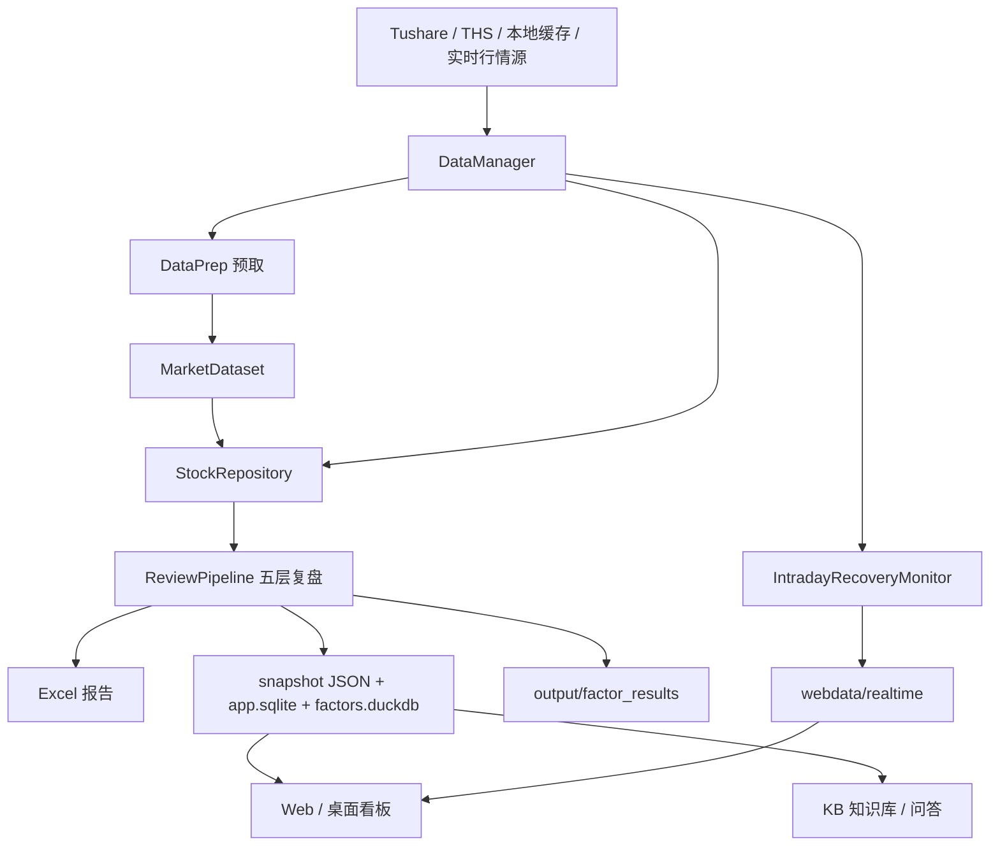

# 项目逻辑梳理、优化记录与实时功能设计

日期：2026-06-14  
范围：`G:\a_stock_sentiment_system` 当前代码库  
结论：项目主线已经从早期“零散分析脚本”收敛为“盘后五层复盘流水线 + 结构化快照 + Web/桌面看板 + 初步盘中转强监控”。后续实时功能应沿用现有 `DataManager -> StockRepository -> ReviewPipeline/Web` 的边界，不建议重写策略层。

## 1. 当前项目定位

本项目是一个 A 股短线情绪与板块轮动辅助系统，核心目标是：

1. 收盘后生成结构化复盘：大盘环境、板块主线、个股信号、交易计划、盘后统计。
2. 把复盘结果沉淀为多种产物：Excel、JSON 快照、SQLite/DuckDB 索引、知识库、Web 看板。
3. 在盘中对“走弱池/交易计划候选”做实时观测，先做提示和确认，不直接做自动交易。

当前最可信的业务入口是：

| 入口 | 职责 | 状态 |
|---|---|---|
| `main.py` | 收盘分析主入口，初始化 `SentimentSystem` 并调用五层流水线 | 主入口 |
| `run_manager.py` | 桌面管理工具入口，内嵌 Web 看板 | 推荐日常入口 |
| `run_web.py` | 只启动 FastAPI/Jinja2 Web 看板 | 已清理为纯 Web 入口 |
| `scheduler.py` | 每日 15:40 调 `main.py` | 可用但较简单 |
| `run_batch.py` | 批量重跑历史交易日 | 可用 |
| `run_backtest.py` | 回测/风控演示入口 | 可用 |
| `scripts/build_kb.py` | 回填快照知识库 | 已从 `run_web.py` 拆出 |

## 2. 总体数据流



关键原则：

1. `DataManager` 是唯一外部取数外观，下面由多个 Mixin 组合。
2. `DataPrep` 尽量提前批量取数，装入 `MarketDataset`。
3. 业务层优先通过 `StockRepository` 读本次数据集；未命中时在迁移期回退 `DataManager`。
4. 策略层不应关心具体数据源是 Tushare、eltdx、pqquotation 还是 easyquotation。

## 3. 数据层现状

`core/data/data_manager_main.py` 通过多重继承组合：

| 模块 | 主要职责 |
|---|---|
| `data_manager_market.py` | daily_basic、指数日线、涨停/跌停池、最强板块、连板天梯 |
| `data_manager_stock.py` | 个股日线、全市场日线、分时、K 线、集合竞价、实时快照 |
| `data_manager_sector.py` | 同花顺板块列表、板块成分、板块日线、板块资金 |
| `data_manager_concept.py` | 股票概念、概念成分 |
| `data_manager_moneyflow.py` | 个股资金流、龙虎榜、北向、两融、筹码 |
| `repository.py` | 只读仓库门面，负责预取命中与回退 |
| `market_dataset.py` | 一日分析所需数据的内存容器 |
| `data_prep.py` | 分析前批量预取入口 |

缓存目录集中在 `data/cache`，结构化输出集中在 `webdata` 和 `output`。

本次已补强实时行情源：

1. 新增 `core/data/providers/quotation_provider.py`。
2. `DataManager.get_quote_snapshot(s)` 现在优先走 `pqquotation/easyquotation`，失败再回退 `eltdx`。
3. `get_stock_tick()` 和 `get_kline()` 增加 `AshareProvider` 兜底。
4. `get_stock_daily()` 的盘中当日日线兜底改为统一实时快照，不再只绑定 eltdx。
5. 新增 `core/realtime` 服务层：个股实时快照、板块行情、全市场行情、健康检查。

本地 `.venv` 已确认安装：

| 包 | 版本 | 推荐用途 |
|---|---:|---|
| `pqquotation` | 0.8.5 | 第一实时快照源，批量 `stocks/real` |
| `easyquotation` | 0.7.7 | 第二实时快照源，API 与 pqquotation 接近 |
| `adata` | 2.9.5 | 指数、板块、资金、分钟/日 K 辅助源，不建议作为最高频主轮询源 |

注意：系统默认 `python` 未必装了这些包，实时功能应使用项目虚拟环境：`.venv\Scripts\python.exe`。

## 4. 五层复盘流水线

正式调用链：

1. `main.py -> SentimentSystem.__init__()`
2. 初始化 `DataManager / IndustryMapper / ReportGeneratorV2 / ReviewPipeline`
3. `SentimentSystem.run_daily_analysis(date)`
4. `ReviewPipeline.execute(trade_date)`
5. 报告、快照、知识库、交易建议输出

### L1 看大盘

模块：`core/pipeline/layer1_market_env.py`

计算内容：

1. 多指数趋势：上证、深成指、创业板、科创 50、北证 50。
2. 量能：全市场成交额、5 日均量、量比。
3. 市场宽度：上涨/下跌/平盘家数。
4. 涨停连续性：昨日涨停/首板今日高开、收红比例。
5. 输出综合评分、风险等级、建议仓位。

### L1.5 基础数据

模块：`ReviewPipeline._fetch_base_data()`

职责：

1. 拉取当日涨停池、跌停池。
2. 构建涨停股行业/概念层级。
3. 将今日涨停、昨日涨停、前日涨停纳入 daily universe 补预取。
4. 组装 `StockRepository` 给后续层复用。

### L2 看板块

模块：`core/pipeline/layer2_sector_analysis.py` + `core/analysis/sector_analysis_orchestrator.py`

计算内容：

1. 热点概念、热点行业。
2. 概念/行业持续性。
3. 概念-行业共振形成市场主线。
4. 概念连板梯队。
5. 给 L3 提供热点板块缓存，供首板突破等策略使用。

### L3 看个股

模块：`core/pipeline/layer3_stock_selection.py`

计算内容：

1. 情绪周期：`emotion_cycle_engine.py` 调 `emotion_phase_model.py`，输出权威 `cycle_name`。
2. 模式识别：`PatternRecognition.scan_all_patterns()` 聚合弱转强、二板定龙、首板突破、龙二波。
3. 龙头池/走弱池：弱转强策略维护 `dragon_pools.json`。
4. 信号优先级：弱转强 > 二板定龙 > 龙二波 > 首板突破。
5. 板块地位、个股综合评分、资金流、筹码、D/E 因子。
6. 因子 profile 会根据情绪周期或 Web 覆盖生效。

本次已修正一个情绪相位误判：

当核按钮、炸板、赚钱效应同时恶化时，模型不再把连板高度和昨日溢价误读为“发酵”。对应修改在 `core/analysis/emotion_phase_model.py`。

### L3.45 龙虎榜 / 游资资金

模块：`core/factors/jobs/lhb_factor_job.py`、`web/lhb_view.py`

职责：

1. 分析当日上榜股与板块游资共识。
2. 使用净买入、机构席位、持续性和拥挤度生成客观指标。
3. 计算板块龙虎榜资金共振。
4. 失败时降级，不阻断主流水线。

### L3.6 情绪相位

模块：`core/analysis/emotion_phase.py`

职责：

1. 消费 `phase_model`。
2. 输出相位早中晚、转换预警、下一可能周期。
3. 用于报告展示和后续前瞻判断。

### L4 定交易计划

模块：`core/pipeline/layer4_trade_plan.py`

计算内容：

1. 将排序信号转为交易计划。
2. 生成仓位等级、仓位比例、竞价条件、入场区间、止损止盈。
3. 可读取 `config/kelly_sizing.json`，用回测标定仓位覆盖启发式仓位。
4. 落盘到 `output/trade_plans`，兼容回测。

### L4.5 风控闸门

模块：`core/pipeline/layer4_5_risk_gate.py` + `risk/*`

职责：

1. 读取虚拟账户状态 `data/cache/portfolio_state.json`。
2. 检查账户级熔断、单票/组合仓位、现金比例、集中度等。
3. 对交易计划标记通过、降级、拒绝。
4. 结果透传到报告和快照。

### L5 盘后总结

模块：`core/pipeline/layer5_review.py`

计算内容：

1. 统计信号 T+1/T+2/T+3/T+5 表现。
2. 若今日 T+1 未发生，则回看历史因子结果，避免给出误导性 0。
3. 情绪趋势、参数敏感度、综合建议。

### L5.5 周期 × 模式胜率

模块：`core/analysis/cycle_pattern_matrix.py`

职责：

1. 从 `output/factor_results` 统计周期与模式的胜率矩阵。
2. 为后续仓位标定和策略取舍提供依据。

### 流水线后置

1. `FactorCollector` 写 `output/factor_results/factor_results_{date}.json`。
2. `similar_day_finder` 查历史相似日。
3. `ReportGeneratorV2` 写 Excel。
4. `SnapshotWriter` 写 `webdata/snapshots/{date}.json`、`webdata/app.sqlite`、`webdata/factors.duckdb`。
5. `kb.ingest_snapshot` 写 `webdata/kb.sqlite`。

## 5. Web / 桌面 / 内容层

| 模块 | 说明 |
|---|---|
| `web/app.py` | FastAPI + Jinja2，看板、配置、运行、日志、股票详情、盘中转强 API |
| `desktop/manager.py` | pywebview 桌面壳 |
| `desktop/runner.py` | Web 页面触发收盘分析，线程执行并回传日志 |
| `desktop/status.py` | 首页健康检查、最新快照、龙头池、日志 |
| `kb/*` | 快照入库、检索、问答、胜率矩阵 |
| `recap/*` | 复盘短视频/文案/分镜相关 |
| `core/publish/*` | 微信发布、LLM 报告 |

盘中已有入口：

1. 页面：`/intraday`
2. 手动运行：`POST /api/intraday/run`
3. 状态查询：`GET /api/intraday/status`
4. 后端：`core/execution/intraday_recovery.py`
5. 策略：`WeakToStrongStrategy.scan_weakening_intraday()`
6. 结果：`webdata/realtime/{date}.json`

## 6. 本次已实施优化

| 类型 | 文件 | 说明 |
|---|---|---|
| 修正逻辑 | `core/analysis/emotion_phase_model.py` | 发酵相位增加风险压力约束，退潮样本不再误判为发酵 |
| 实时源适配 | `core/data/providers/quotation_provider.py` | 新增 `pqquotation/easyquotation` 统一实时快照 adapter |
| 实时源接入 | `core/data/data_manager_stock.py` | `get_quote_snapshot(s)` 接入新 adapter，eltdx 兜底；K 线/分时增加 Ashare 兜底 |
| 入口清理 | `run_web.py` | 删除误混入的知识库回填脚本，恢复为纯 Web 启动入口 |
| 脚本归位 | `scripts/build_kb.py` | 新增独立知识库回填脚本 |
| 示例更新 | `examples/demo_usage.py` | 替换过期导入，改为当前 `ReviewPipeline` 最小示例 |
| 删除陈旧代码 | `examples/execution_usage.py` | 删除引用已移除 `UnifiedExecutionEngine` 且语法破损的旧示例 |
| 测试隔离 | `tests/test_phase4_factor_panel.py` | 默认值测试改读纯默认参数，避免被 Web 运行期覆盖污染 |
| 新增测试 | `tests/test_quotation_provider.py` | 覆盖实时快照字段归一化 |
| 模拟交易修复 | `backtest/backtest_engine.py`、`backtest/replay_engine.py`、`backtest/trade_simulator.py` | 买入前必须确认早盘高开；低开、平开、缺开盘/昨收数据均放弃 |
| 实时服务 | `core/realtime/*`、`web/app.py` | 新增实时个股、板块、全市场、健康检查 API |
| 新增测试 | `tests/test_simulation_open_gap_rule.py`、`tests/test_realtime_services.py` | 覆盖高开买入规则和实时服务字段归一化 |

验证结果：

```text
$env:PYTHONPATH='.'; python -m pytest -q
87 passed
```

## 7. 暂不删除但建议后续治理的内容

| 对象 | 判断 |
|---|---|
| `core/data/data_manager_extensions.py` | 已废弃但作为兼容 shim 存在，当前不建议删；等确认没有外部脚本引用后再删 |
| `core/pattern/signal_priority.py` 中未启用策略枚举 | 不是文件级死代码，仍用于统一优先级表达；可保留 |
| `docs/architecture_design.md` | 明显滞后，仍引用不存在的 `execution_engine.py` 和旧示例；建议后续重写或标记为历史文档 |
| `run_backtest.py` 与 `main.py --mode backtest` | 有功能重叠，但入口面向不同使用场景，暂不合并 |
| `recap/video` 相关 | 与复盘内容生产有关，不属于核心交易流水线，暂不删 |

## 8. 主要问题与优化建议

### P0：实时功能要走统一行情源，不要把库调用散落到策略里

已开始处理。后续所有实时取价都应只通过：

1. `DataManager.get_quote_snapshot(code)`
2. `DataManager.get_quote_snapshots(codes)`
3. `DataManager.get_minute_bars_live(code, date)`
4. `DataManager.get_auction_data(code, date)`

策略层只消费标准字段，不直接 import `pqquotation/easyquotation/adata`。

### P1：盘后与盘中数据要分层

盘后复盘强调可复现，应该优先 Tushare + 本地缓存 + `MarketDataset`。

盘中实时强调新鲜度，应该：

1. 不写入盘后日线缓存。
2. 只写入 `webdata/realtime` 或内存 TTL 缓存。
3. 明确 `source/update_time/stale_seconds`。
4. 收盘后用 Tushare 正式数据覆盖，避免实时快照污染历史。

### P1：配置覆盖与测试隔离

`webdata/config_overrides.json` 是运行期真实状态。测试如检查源码默认值，应使用 `get_default_params()`；检查实际运行值才用 `get_params()`。

### P2：文档需要收敛

旧 `docs/architecture_design.md` 已不能代表当前代码。建议以后以本文为新基线，再逐步拆成：

1. `docs/current_architecture.md`
2. `docs/realtime_design.md`
3. `docs/operations.md`

### P2：数据层 strict 模式还未真正收口

`StockRepository(strict=False)` 仍会在未预取时回退 `DataManager`。这保证了稳定，但也让性能和可复现性不完全可控。

建议路径：

1. 先记录每次 fallback 的 domain 和调用频率。
2. 将高频 fallback 补进 `DataPrep`。
3. 对回测/回归场景启用 strict。
4. 盘中实时场景继续允许非 strict，因为实时数据天然不可复现。

### P3：模拟交易入场口径必须和竞价建议一致

已修复：模拟买入统一遵循“早盘竞价高开才买入”。执行日如果 `open <= pre_close`，或无法取得有效开盘价/昨收价，直接放弃该买点；只有 `open > pre_close` 才进入后续涨停、目标价、滑点、仓位检查。

覆盖范围：

1. `BacktestEngine._check_buy_conditions()`
2. `ReplayEngine._process_entries()`
3. `TradeSimulator.simulate_trade_execution()`

## 9. 实时功能设计思路

### 9.1 行情源分工

| 数据类型 | 首选 | 备选 | 说明 |
|---|---|---|---|
| 个股实时快照 | `pqquotation` | `easyquotation`、`eltdx` | 高频批量轮询，已接入 DataManager |
| 集合竞价 09:25 | `eltdx` | 分时 09:25、日线开盘价兜底 | pq/easy 一般不提供可靠历史竞价量 |
| 实时分时 | `eltdx` | `AshareProvider`、`adata.stock.market.get_market_min` | 用于分时走强/走弱判定 |
| 日 K / 分钟 K 展示 | `eltdx` | `AshareProvider`、`adata` | 前端个股详情使用 |
| 指数/板块实时 | `adata` | Tushare/THS 缓存 | 可补市场宽度、板块强度、指数分钟变化 |
| 资金流/概念辅助 | `adata` | Tushare | 不建议放到秒级轮询，适合分钟级刷新 |

### 9.2 标准实时快照字段

所有源统一输出：

```python
{
    "code": "000001",
    "ts_code": "000001.SZ",
    "name": "平安银行",
    "open_price": 11.00,
    "pre_close": 10.94,
    "last_price": 11.24,
    "high_price": 11.25,
    "low_price": 10.88,
    "bid1": 11.23,
    "ask1": 11.24,
    "vol_hand": 2032355.0,
    "amount_yuan": 2263042930.0,
    "change_pct": 2.74,
    "date": "2026-06-12",
    "time": "15:00:00",
    "source": "pqquotation_sina"
}
```

后续建议增加：

1. `received_at`：本机收到时间。
2. `stale_seconds`：行情源时间与本机时间差。
3. `is_stale`：是否过期。
4. `source_rank`：本次使用的数据源优先级。

### 9.3 实时服务分层

建议新增或扩展为：

```text
core/realtime/
  models.py              # QuoteSnapshot / RealtimeSignal / WatchItem
  quote_service.py       # 多源行情聚合、TTL、健康检查
  watchlist_builder.py   # 从交易计划、走弱池、龙头池生成监控列表
  signal_engine.py       # 实时信号判定：竞价确认、盘中转强、失效
  store.py               # webdata/realtime 落盘与读取
```

当前 `IntradayRecoveryMonitor` 可以逐步迁到该结构，第一阶段不必大拆。

### 9.4 盘中监控对象

第一批只监控三类，避免系统过早复杂化：

1. `dragon_pools.json` 的走弱池：做弱转强回流。
2. 最新快照的 `trade_plans`：做竞价确认、开盘确认、取消条件。
3. 当日热点板块核心票：由 L2 主线 + L3 排序信号生成。

### 9.5 事件生命周期

实时信号不应只保存“当前命中”，要保存生命周期：

| 状态 | 含义 |
|---|---|
| `new` | 第一次命中 |
| `active` | 持续命中 |
| `weakened` | 曾命中但强度下降 |
| `expired` | 本轮未命中或超过观察期 |
| `confirmed` | 竞价/开盘/分时条件二次确认 |
| `cancelled` | 触发取消条件 |

当前 `IntradayRecoveryMonitor` 已有 active/expired 雏形，可继续扩展。

### 9.6 Web/API 设计

已有：

1. `GET /intraday`
2. `POST /api/intraday/run`
3. `GET /api/intraday/status`

已新增基础行情 API，后续再补 watchlist/run/events：

| API | 用途 |
|---|---|
| `GET /api/realtime/quote/{code}` | 单票实时快照 |
| `GET /api/realtime/quotes?codes=000001,000002` | 批量取标准实时快照 |
| `GET /api/realtime/sectors?codes=BK0001,BK0002&source=east` | 板块实时行情；不传 codes 时尝试自动拉榜单 |
| `GET /api/realtime/market?codes=000001,600000` | `adata` 全市场实时行情 |
| `GET /api/realtime/health?probe=false` | 个股/板块行情源健康、缓存、最近错误 |
| `GET /api/realtime/watchlist` | 获取今日监控池 |
| `POST /api/realtime/run` | 跑一轮全部实时监控 |
| `GET /api/realtime/events` | SSE 推送实时事件 |

### 9.7 轮询策略

建议先做“手动 + 轻轮询”，不要一开始上复杂守护进程：

| 时段 | 频率 | 监控重点 |
|---|---:|---|
| 09:15-09:25 | 3-5 秒 | 竞价价格、竞价量、撤单变化 |
| 09:25-09:35 | 2-3 秒 | 开盘确认、弱转强、取消条件 |
| 09:35-11:30 | 10-15 秒 | 盘中转强、分时走强 |
| 13:00-14:30 | 15-30 秒 | 延续/失效 |
| 14:30-15:00 | 5-10 秒 | 尾盘回封、跳水、风险提示 |

### 9.8 先不做的事

1. 暂不接券商自动下单。
2. 暂不把实时 tick 写入 `app.sqlite` 大表。
3. 暂不让实时行情覆盖盘后快照。
4. 暂不把所有模式实时化，先做“竞价确认 + 弱转强 + 交易计划取消/确认”。

## 10. 推荐实施路线

### 第一步：稳定实时行情源

已完成初版：

1. 新增 `QuotationProvider`。
2. `DataManager.get_quote_snapshot(s)` 接入 pq/easy。
3. 新增 `RealtimeQuoteService`：批量实时快照、TTL、健康检查、过期标记。
4. 新增 `RealtimeSectorService`：通过 `adata` 获取板块/全市场实时行情。
5. Web 已暴露 `/api/realtime/quote(s)`、`/api/realtime/sectors`、`/api/realtime/market`、`/api/realtime/health`。
6. 单测覆盖字段归一化和缓存。

下一步：

1. 给 `QuotationProvider` 增加 source 配置：`pq_sina -> pq_tencent -> easy_sina -> easy_tencent -> eltdx`。
2. 为板块行情补充真实 `adata` 版本兼容矩阵和样例字段。
3. 让 `/api/realtime/health` 记录最近一次成功源和耗时。

### 第二步：实时监控池

1. 从最新快照读取交易计划。
2. 从 `dragon_pools.json` 读取走弱池。
3. 合并去重，生成 `webdata/realtime/watchlist_{date}.json`。
4. 每个监控对象记录来源：`trade_plan / weakening_pool / dragon_pool / manual`。

### 第三步：竞价确认

复用 `core/execution/auction_confirm.py`：

1. 09:25 后读取交易计划。
2. 调 `get_auction_data()` 获取竞价价、量、额。
3. 判断是否满足 L4 竞价条件。
4. 输出 `confirmed/cancelled/watch`。

### 第四步：盘中弱转强

扩展现有 `IntradayRecoveryMonitor`：

1. 使用统一 `DataManager.get_quote_snapshots()`。
2. 对命中票补分时趋势。
3. 增加板块确认：同板块是否同步走强。
4. 输出强度评分，而不只是涨幅阈值。

### 第五步：Web 实时页

1. 当前 `/intraday` 页面保留。
2. 新增综合实时页 `/realtime`。
3. 卡片分组：竞价确认、弱转强、计划取消、行情源健康。
4. 用 SSE 做增量刷新，避免手动频繁点击。

## 11. 最终建议

1. 盘后主流程已经比较完整，不建议再把大逻辑塞回 `main.py`；新增能力应挂到 Pipeline layer 或独立 service。
2. 实时功能不要追求一步到位，先把“行情源稳定 + 字段统一 + 监控池 + 手动跑一轮”做扎实。
3. 旧文档和旧示例要继续清理，否则会反复误导后续开发。
4. `webdata/config_overrides.json` 是真实运行状态，测试和文档要明确区分“默认值”和“当前生效值”。
5. 自动交易不是下一阶段重点；下一阶段应该是“实时确认/提醒/失效”，确保信号解释清楚、来源可追踪。
